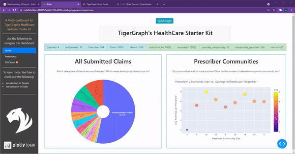

#Exquisite Examples 🥳

We've established the  power of dashboards and TigerGraph.  To further solidify
these claims, we can take a look at the **following dashboards** put together
using TigerGraph and Plotly Dash 😊.
> New feature, coming soon! If you wish to feature your dashboards here, make sure to be on the
lookout for a submission form under the ***Community*** tab. Currently in the works!  

&nbsp; &nbsp;

### Healthcare Referrals

This interactive dashboard visualizes TigerGraph's Healthcare Starter Kit. Simply
by **following the twelve chapters** outlined in ***Quick Start***
or ***Adventure***, you can learn how to create your own!

???+ tip "TigerGraph's Healthcare Starter Kit"

    
 {width=800} 

&nbsp; &nbsp;

### COVID-19 in South Korea

This interactive dashboard visualizes TigerGraph's COVID-19 Starter Kit. It comes alongside a
[Google Colab Notebook](https://colab.research.google.com/drive/1ElzCA9BXJsNuJxn7yq7Mgfmvwtvf-lag?usp=sharing)
 as well as a [Medium Blog Post](https://towardsdatascience.com/mapping-covid-19-cases-with-plotly-and-tigergraph-f529f32c1a40)
for users to follow along closely.

Check out this YouTube video of the dashboard in action!

???+ tip "TigerGraph's COVID-19 Starter Kit"

    <iframe width="100%" height="425px" src="https://www.youtube.com/embed/s8d5xFrzm8g" frameborder="0" allow="accelerometer; autoplay; encrypted-media; gyroscope; picture-in-picture" allowfullscreen></iframe>

&nbsp; &nbsp;

### Movie Reviews Starter Kit

This interactive dashboard visualizes TigerGraph's Movie Starter Kit. It comes alongside a
[Google Colab Notebook](https://colab.research.google.com/drive/1eF7SY_2D9ynAEHjmU3xjOLI7xWSR7FH0#scrollTo=Nxhp_9GZ0MQL)
 as well as a [Medium Blog Post](https://advit-deepak.medium.com/visualizing-movie-recommendations-using-plotly-and-tigergraph-4052eae27d82)
for users to follow along closely.

Check out this YouTube video of the dashboard in action!

???+ tip "TigerGraph's Movie Starter Kit"

    <iframe width="100%" height="425px" src="https://www.youtube.com/embed/wHUr3NLw_wg" frameborder="0" allow="accelerometer; autoplay; encrypted-media; gyroscope; picture-in-picture" allowfullscreen></iframe>

&nbsp; &nbsp;

### New York's Energy and Weather

This interactive dashboard visualizes New York's Energy and Weather data. It comes alongside a
[Google Colab Notebook](https://colab.research.google.com/drive/1R8P6V8AGd7eumoIA6Poqh0Dy8BuKIThi?usp=sharing)
for users to follow along closely and was presented at a webinar.

???+ tip "Energy + Weather Dataset"

    <iframe width="100%" height="425px" src="https://www.youtube.com/embed/otMVqqsMYEg" frameborder="0" allow="accelerometer; autoplay; encrypted-media; gyroscope; picture-in-picture" allowfullscreen></iframe>

&nbsp; &nbsp;

Want to learn how to create your own? Make sure to check out either the ***Quick Start*** or the
***Adventure*** tabs. While both cover the same content, the Dashboarding Adventure is wrapped
around a story to help make the learning journey more immersive!  

Either way, happy dashboarding! 🥳🥳🥳

&nbsp; &nbsp;
