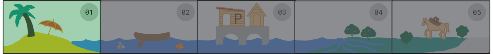
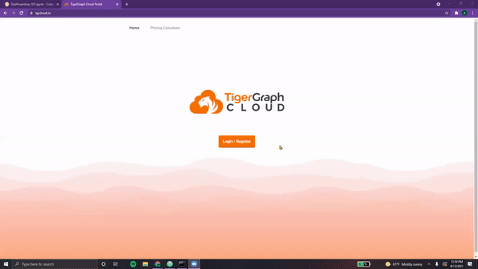
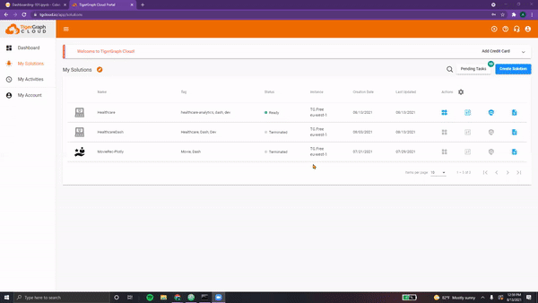
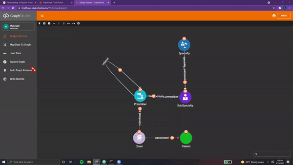

# Installation Island 🏝️

<center> {width=800} </center>

*As the moon melts on the horizon, we wake up to find ourselves in a strange place.*

There are a few lonely palm trees, coconuts littered across the sand, and miles of
ocean stretching out as far as the eye can see. Turning around, we find an
<font color="brown"> ancient scroll next to us: </font>

&nbsp;
&nbsp;

<center>

  <span style="font-family:Papyrus; font-size:2em;">
  On a quest, you must embark with speed. </span>

  <span style="font-family:Papyrus; font-size:2em;">
  Learning how to create dashboards with ease. </span>


  <span style="font-family:Papyrus; font-size:2em;">
  On this island, find the tools you'll need. </span>

  <span style="font-family:Papyrus; font-size:2em;">
  With TigerGraph and Plotly, you shall succeed. </span>

</center>

&nbsp;
&nbsp;

Sitting next to the scroll, there’s an <font color='#DD6E0F'> orange box </font>
with a strange laptop resting upon it...

&nbsp;
&nbsp;

## The TigerGraph Toolbox

<font color='#DD6E0F'>*“Every dashboard starts with the data!”* </font>
reads the white engraving on the laptop.

Opening the box fully reveals three strange manuscripts, each detailing the steps
needed to begin harnessing the **Power of TigerGraph**. Eagerly, we open up the laptop
and begin to examine each.

&nbsp;
&nbsp;

???+ info "Mysterious Manuscript 01"

    ### Creating our Solution

    **Welcome to Step 1 of the Beginner’s Guide to Dashboarding!**

    In order to load and store the data for our dashboard, we must create a new TigerGraph solution.

    To do this, we can:

    1. Navigate to [**TigerGraph’s Cloud Portal**](https://tgcloud.io/)
    2. **Login/Register** for free using our email address
    3. Click on the blue **“Create Solution”** button
    4. Nagvigate to the Healthcare tab
    5. Select **“Healthcare Engine”** Starter Kit

    > NOTE: For the purposes of learning dashboarding, we will be using TigerGraph’s
    Healthcare Engine Starter Kit. This Starter Kit comes with over # vertices, # edges,
    and [still need to finish researching this] data attributes.

    &nbsp;
    &nbsp;

    <center> {width=800} </center>

    &nbsp;
    &nbsp;


    Next, we must enter the details for our solution.

    1. <font color='#DD6E0F'> Name </font> - This we can simply keep as **"Healthcare Engine"**
    2. <font color='#DD6E0F'> Tags </font> - We can add "Dashboard", **"Healthcare"**
    3. <font color='#DD6E0F'> Password </font> - By default, it's **"tigergraph"**
    4. <font color='#DD6E0F'> Subdomain </font> - This can be **"healthcare-dash"**

    > NOTE: Make sure that your subdomain name is unique! (two solutions cannot have the same subdomain at the same time.
    This subdomain name is used to access your solution (via GraphStudio, for example)

    &nbsp;
    &nbsp;

    <center> {width=800} </center>

    &nbsp;
    &nbsp;

    Once this has been completed, click **“Next”** and then **“Submit”**.

    And voila, in a few seconds, our <font color='#DD6E0F'> solution should go from “Uninitialized” to “Ready”! </font>


After reading through the first manuscript, we reach for the second one...

&nbsp;
&nbsp;

???+ info "Mysterious Manuscript 02"

    ### Loading our Data

    **Ahh, you've reached Step 2 of the Beginner’s Guide to Dashboarding!**

    Next up, it’s time to load in our data. To do this, we need to:

    1. Open <font color='#DD6E0F'> GraphStudio </font> by selecting it from the **Applications tab**
    2. Click on **MyGraph**. This is the graph we’ll be using

    > NOTE: Additional graphs can be added, deleted, and modified as desired by
    the user. For the purposes of this dashboard, we will be using the default
    graph the Healthcare Engine Starter Kit comes with.

    &nbsp;
    &nbsp;

    Time to take a look at our schema! Navigate over to the **“Design Schema”** tab on the right.

    <font color='#DD6E0F'> This is our schema, the blueprint of our graph. </font> It consists of vertices connected to one
    another via edges. Each vertex can be of a different type and contain different attributes.
    Similarly, edges can be directional, undirected, and even reversed. Each edge can contain
    different attributes as well, each with multiple datatypes.

    Hovering over each component, we see that our schema in this Starter Kit consists of:

    &nbsp; &nbsp;

    <center> {width=800} </center>

    &nbsp; &nbsp;


    > NOTE: This schema can be modified by switching to “Global View” and editing
    the properties of each vertex and edge. Additionally, vertices and edges may
    be added and deleted. For a comprehensive guide on creating your own schemas,
    make sure to check out these resources:
    [TigerGraph Docs](https://docs.tigergraph.com/start/gsql-101/define-a-schema),
    [YouTube GSQL 101](https://www.youtube.com/watch?v=him2Uy3Nn7Y)


    Next, we can navigate to the <font color='#DD6E0F'> “Map Data to Graph” </font> tab. This section ensures that the raw CSV data files are imported correctly into our graph. Each column is mapped to the appropriate attribute in the appropriate vertex/edge.

    In order to modify this mapping, we can simply click the <font color='#DD6E0F'> “Edit Data Mapping” </font> icon at the top and select the file and component(s) we wish to map. Next, we click on the source column in the CSV file and match it to the corresponding attribute. When we’re all finished, we can click the <font color='#DD6E0F'> “Publish Data Mapping” </font> icon at the top left corner.

    &nbsp;
    &nbsp;

    <center> {width=800} </center>

    &nbsp;
    &nbsp;

    Everything here looks good!

    Next up, we can navigate to the <font color='#DD6E0F'> “Load Data” </font> tab. Simply press on the white play icon at the top left corner and the loading job should begin automatically. The graph on the right-side displays the progress with respect to time.

    When the loading has finished, **all CSV files should say “finished”**.


Only one manuscript left in the box...

&nbsp;
&nbsp;

???+ info "Mysterious Manuscript 03"

    ### Connecting with pyTG

    **Surprised you made this far, eh? Step 3 of the Beginner’s Guide to Dashboarding!**

    In order to interface with our Graph, we will utilize <font color='#DD6E0F'> **pyTigerGraph** </font>.

    To begin, we can simply install this package by running the following command.

    ```python
    !pip install -q pyTigerGraph

    import pyTigerGraph as tg
    ```

    &nbsp; &nbsp;

    Next, we need to use our solution information from before.

    ```python
    TG_SUBDOMAIN = "healthcare-dash"
    TG_HOST = "https://" + TG_SUBDOMAIN + ".i.tgcloud.io" # GraphStudio link

    TG_USERNAME = "tigergraph" # This should remain the same...
    TG_PASSWORD = "tigergraph"  # Shh, it's our password!
    TG_GRAPHNAME = "MyGraph" # The name of the graph
    ```

    >NOTE: As mentioned in the previous document, **subdomain names should be unique!**

    &nbsp;
    &nbsp;

    Now, we can run the following lines to <font color='#DD6E0F'> establish a connection with our solution. </font>

    ```python
    conn = tg.TigerGraphConnection(host=TG_HOST, username=TG_USERNAME, password=TG_PASSWORD, graphname=TG_GRAPHNAME)
    conn.apiToken = conn.getToken(conn.createSecret())

    print("Connected!")
    ```
    &nbsp;
    &nbsp;

    Voila, we’re in!

As we put down the <font color='brown'> three manuscripts </font>, we hear a rumbling from the beach!

After quickly bookmarking [TigerGraph Cloud](https://tgcloud.io/) and our <font color='#DD6E0F'> solution’s subdomain </font>, we close the laptop, grab the box and the manuscripts, and make our way to the source of the commotion...

&nbsp;
&nbsp;

## The Plotly Pirates

***“RRRR” comes a gruff voice.***

Standing on the shore, we're surprised to see two strange pirates standing next
to their <font color='brown'> rather shabby brown canoe. </font> As we walk towards them, they turn and look at us with a wry grin.

&nbsp;
&nbsp;

*"Ahh, that orange box ya got there, you've begun your quest?"* questions the first.

*"Well then, better come with us back to <font color='#DD6E0F'> Port Plotly.</font>”* finishes the second.

&nbsp;
&nbsp;

Well, not many other options for leaving the island...

Clutching the laptop and orange box, we cautiously climb into the canoe as the two pirates sit in front of us. While one of them paddles, the other gestures to our strange new laptop.

*“Might wanna open that up lad’. It’s time y'all learned a few things bout’ our namesake…”*

<font color='#DD6E0F'> As the island shrunk in the distance, the pirates began to explain the **Power of Plotly…** </font>

&nbsp;
&nbsp;

[^1]: All code segments from this chapter can be found in this
[Colab Notebook](https://colab.research.google.com/drive/1RRirZeUi_zSBEDS9lDJw1dsxth_V0f-9#scrollTo=6DlebXT4DMCf).
Feel free to follow along!

[^2]: Everything we've installed so far (prerequistes for next section):
```python
!pip install -q pyTigerGraph
import pyTigerGraph as tg

TG_SUBDOMAIN = 'healthcare-dash'
TG_HOST = "https://" + TG_SUBDOMAIN + ".i.tgcloud.io" # GraphStudio Link

TG_USERNAME = "tigergraph" # This should remain the same...
TG_PASSWORD = "tigergraph" # Shh, it's our password!
TG_GRAPHNAME = "MyGraph" # The name of the graph

conn = tg.TigerGraphConnection(host=TG_HOST, graphname=TG_GRAPHNAME, username=TG_USERNAME, password=TG_PASSWORD, beta=True)
conn.apiToken = conn.getToken(conn.createSecret())
```
