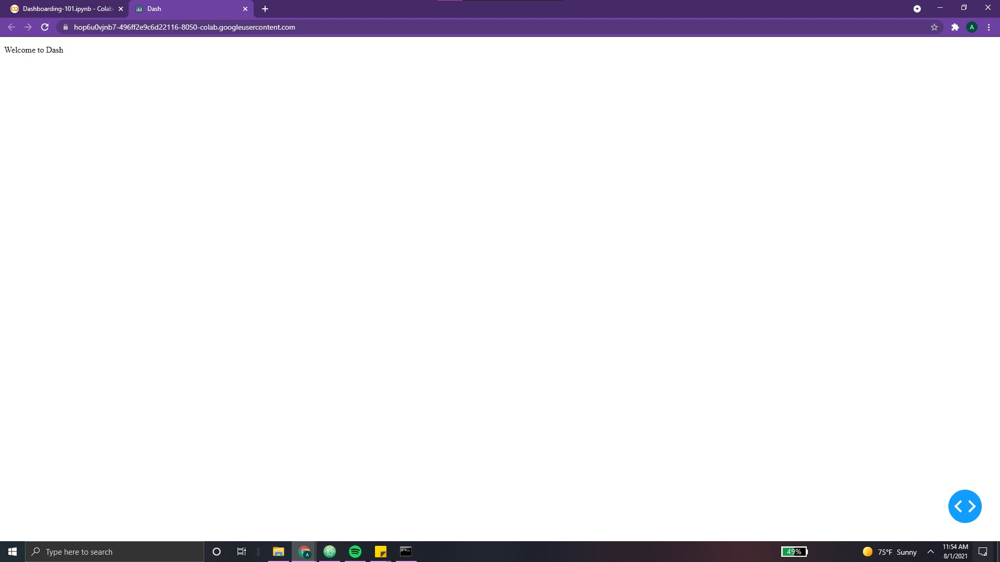
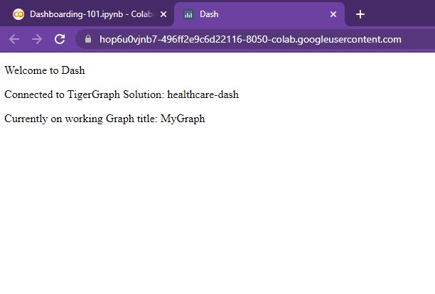
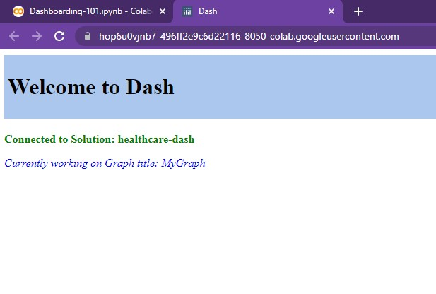
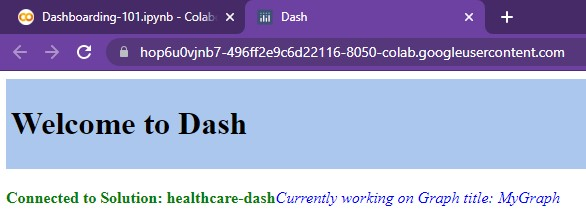

# Sailing through Setup Sea 🌊

<center> {width=800} </center>

*“Long ago, <font color='#DD6E0F'> avid data scientists and developers sought for a way to visualize their vast collections of information. </font> Various complicated systems were all used throughout the land. But then, in 2012, a group of four Canadian explorers discovered the power of a tool called Plotly.*

*Plotly transformed life for every creator. Dashboards and visualizations could be put together in mere minutes, all in Python. Gone were the days of laboring for weeks learning out how to create intricate, multi-layered applications. With Plotly, <font color='#DD6E0F'>anyone could create a dashboard.</font>”*


The pirates turn and point to our laptop.

*“Every dashboarder needs to learn how to harness the power of Plotly.* ***Creating your first dashboard isn’t as hard*** *as you may think. Follow along lads, and we’ll tell you what we know.”*

Eager to learn more, we begin to jot down their words…

&nbsp; &nbsp;

???+ info "Plotly Pirates' Notes 01"

    ## Proper Prerequisites   

    While <font color='#DD6E0F'>TigerGraph’s Cloud Portal</font> provides the solution, data, and queries
    needed to analyze our graph, we need the help of another tool to create our
    dashboard. With **Plotly**, the task of doing so is made simple, intuitive, and easy.

    To begin, we must first install the proper packages.

    When running Plotly via a *Google Colab*, we will first need to use the following command:

    ```python
    !pip install -q jupyter-dash
    ```

    Jupyter-dash allows the dashboard to be configured for **modification via a**
    **Python Notebook**. This way, the dashboard is updated in real-time with the
    modification of any cells. Without using the `jupyter-dash` package, every
    change made to the dashboard would have to be followed by a recompilation
    of the app *(quite tedious)*.

    Now, we can import our Python libraries with the following line:

    ```python
    import dash
    from jupyter_dash import JupyterDash
    import dash_html_components as html
    ```

    The library `dash_html_components` allows for access to Plotly Dash’s HTML
    components, allowing us to display HTML elements such as text and linebreaks.
    We'll cover more of these in the ensuing sections!


At this point, the pirates pause.

*“We only know these packages for now. Pilaging doesn’t leave much*
*time to learn further. At Port Plotly, ya’ll find what you need from the locals.*
*Theys’ a lot more knowledgeable.”* explains the first.

*“But that’s okay”*, finishes the second, <font color='#DD6E0F'>*“these two packages are quite powerful...”*</font>


&nbsp; &nbsp;


???+ info "Plotly Pirates' Notes 02"

    ## Functioning First App

    In order to create our first app, we can simply run the following lines:

    ```python
    app = JupyterDash(__name__)

    app.layout = html.Div(children=[
        html.P(children='Hello Dash'),

    ])

    app.run_server(mode='external')
    ```

    Running the following produces the following output:

    ```python
    Dash App running on:
    http://127.0.0.1:8050/
    ```

    Clicking on the link takes us to our first dashboard!

    <center>  </center>

    Great! Albeit, quite simple 😅.

    Breaking it down, we can see that our first line initialized the dash app.
    Since we are running from the Google Colab Notebook, we will use the
    JupyterDash() constructor instead of the standard `app=dash.Dash()` constructor.

    Next, we define the app’s layout.

    Using an HTML .Div() element, we can **divide our content** into different
    sections. It is simply a <font color='#DD6E0F'>container used to hold other components and
    establish a structure in our dashboard.</font> For example, our Div element
    currently contains one element, represented by the attribute `children
    = [...]`. Any components contained in the attribute “children” will
    belong to this `html.Div()` element. Each
    children component must be separated by a comma.

    &nbsp; &nbsp;


    We can try adding another `html.P` (a simple paragraph) to our app:

    {width=300, align=right}

    ```python                             
        app.layout = html.Div(children=[
            html.P(children='Hello Dash'),
            html.P(‘Guess who’s back?’),
        ])
    ```      

    Running this will produce the following output to the right:

    Ahh, you might have noticed that we’ve omitted the children attribute in
    the second html.P() statement. This is because ‘children’ is optional and
    does not to be specified. For example,

    &nbsp; &nbsp;

    {width=300, align=right}

    ```python
    app.layout = html.Div([
        html.P('Hello Dash'),
        html.P(‘Guess who’s back?’),
    ])
    ```

    Running this will produce the following output to the right:

    See, same result as above!

    > NOTE: For more information on .Div(), make sure to check out the following resources:
    [`html.Div()`](https://dash.plotly.com/dash-html-components/div)


The pirates grin upon seeing our wide-eyed surprise. <font color='#DD6E0F'>*“Now, let’s tie it together*
*with those TigerGraph texts”*</font>, they exclaim, pointing at our three manuscripts from
the island.


&nbsp; &nbsp;

???+ info "Plotly Pirates' Notes 03"

    ## Using Layout Functions  

    We can create a <font color='#DD6E0F'>function to return information</font> to be displayed in our app.
    This will help make our layout **cleaner, more readable, and easier to scale**.
    All content can simply be wrapped in an `html.Div()` element.

    To begin, we can add the following functions and change our layout:

    ```python
    def setup_TG():
      row = html.Div([
                  html.P("Connected to TigerGraph Solution Subdomain:", TG_SUBDOMAIN)
                  html.P("Currently working on Graph title:", TG_GRAPHNAME)
      ])
      return row


    app.layout = html.Div([
    	html.P(“Welcome to Dash”)
    	setup_TG()
    ])
    ```

    And voila, as seen, our app now looks like the following:

    <center> {width=700} </center>

    These functions can come in quite handy when creating complicated layouts.


The pirates turn and point. In the distance, the faint outline of a port can be seen.

*“Land ho! Well lads, time to finish up with the last section for today… <font color='#DD6E0F'>adding a little bit of flavor</font>.”*

&nbsp; &nbsp;

???+ info "Plotly Pirates' Notes 04"

    ## Transforming Text

    Dash’s text elements are **quite powerful**. Here are a few simple ways to spice it up!

    We can modify our simple app as follows:

    ```python linenums="1"
    TITLE_STYLE = {
        "background-color": "#abc7ed",
        "margin-bottom": "20px",
        "padding":"5px"
    }

    def setup_TG():
      row = html.Div([
                      html.P(html.B("Connected to Solution: " + TG_SUBDOMAIN), style={'color':'green'}),
                      html.P(html.I("Currently working on Graph title: " + TG_GRAPHNAME), style={'color':'blue'})
                    ])
      return row


    app = JupyterDash(__name__)

    app.layout = html.Div([
        html.Div(html.H1("Welcome to Dash"), style=TITLE_STYLE), # Adding style, header
        setup_TG() # Adding style, bold, italics
    ])

    app.run_server(mode='external')
    ```
    Here's the resulting output:

    <center> {width=800} </center>

    Let's break it down, component by component!

    &nbsp; &nbsp;

    ### **HTML Headers**

    One of the easiest ways to spice up one's dashboard is to <font color='#DD6E0F'>vary the text styles</font>.
    This can be done using simple HTML header elements **(H1, H2, H3, H4, H5, H6)**.
    A table showing each one's output can be found below.

    <center>

    | Header 1  | Headers 4 - 6 | Header 3 | Header 4| Header 5 | Header 6 |
    |:----------------:|:-------------:|:--------:|:------:|:---:|:----:|
    |    <h1> What's Up? </h1> | <h2> Good Day. </h2> | <h3> Bless You! </h3> | <h4> Well done. </h4> | <h5> Happy Birthday! </h5>  | <h6> Goodbye? </h6>  |

    </center>

    The specific style of each will change based on the font. However, the *relative sizes* can be seen above.

    > NOTE: For more information on HTML, feel free to check out the following resources:
    [Dash Headers](https://dash.plotly.com/dash-html-components/header),
    [Dash HTML](https://dash.plotly.com/dash-html-components)

    &nbsp; &nbsp;

    In line 18 of our code snippet, we see that our `html.P()` element is now `html.H1()`.
    ```python linenums="18"
        html.Div(html.H1("Welcome to Dash"), style=TITLE_STYLE), # Adding style, header
    ```

    Pretty simple and effective! Ahh, you may have noticed the <font color='#DD6E0F'>`html.Div()` element that
    the header is wrapped in</font>. Let's take a closer look at the reason for this...

    &nbsp; &nbsp;


    ### **Style Dictionary**

    One of the <font color='#DD6E0F'>best ways to style a dashboard is to use a **style dictionary**</font>. In these dictionaries,
    one can specify attributes such as *background color, padding, margins, font style, font color, etc*.

    In lines 1- 5, we explicitly create a style dictionary titled `TITLE_STYLE`.

    ```python linenums="1"
    TITLE_STYLE = {
        "background-color": "#abc7ed",
        "margin-bottom": "20px",
        "padding":"5px"
    }
    ```

    This dictionary is then passed into the `html.Div()` element which contains our header. As a result,
    the header is given <font color='#DD6E0F'>extra padding, margin, and a light-blue background</font>. Pretty straightforward!

    This style dictionary *doesn't have to be stored in a variable*.

    In lines 9 and 10, we explicitly change the colors of each `html.P()` using the keyword `style`.

    ```python linenums="9"
    html.P(html.B("Connected to Solution: " + TG_SUBDOMAIN), style={'color':'green'}),
    html.P(html.I("Currently working on Graph title: " + TG_GRAPHNAME), style={'color':'blue'})
    ```

    >NOTE: Color can take both keywords (ex. common colors like red, orange) as well as hex values (ex. 'DD659F')


    This brings us to our next point, the `html.B()` and `html.I()` used in lines 9 and 10.

    &nbsp; &nbsp;

    ### **Html.B(), Html.I()**

    In order to bold or italicize sections of text, we can simply use `html.B()` and `html.I()`


    These elements can stand on their own without being wrapped in `html.P()` elements. However, this **removes**
    **the division between two lines**. For example, the following two lines produce the following output:

    ```python linenums="9"
    html.B("Connected to Solution: " + TG_SUBDOMAIN, style={'color':'green'}),
    html.I("Currently working on Graph title: " + TG_GRAPHNAME, style={'color':'blue'})
    ```


    <center> {width=800} </center>


    > NOTE: For more information on these two elements, feel free to check out the following:
    [html.B()](https://dash.plotly.com/dash-html-components/b),
    [html.I()](https://dash.plotly.com/dash-html-components/i)

    &nbsp; &nbsp;

    There are so many more ways to transform text! We'll cover other methods in *Chapter 05 - Sheriff Styles*!

&nbsp; &nbsp;

As we pull into Port, the pirates help us get out of their canoe.  

*“Here, you lads will learn more about Plotly. <font color='#DD6E0F'>Pay careful attention and make sure to note everything down in there,</font>"*
advises the first, pointing to our laptop. The second tips his hat to us,

*“Fair winds to thee good friends! Cast off!”*

&nbsp; &nbsp;

And with that, the peculiar pirates had left. Turning around, a large sign greets us,

<font color='#DD6E0F'>**“Welcome to Port Plotly! A one-stop-shop for data analytics and visualization!”**</font>

&nbsp; &nbsp;

[^1]: All code segments from this chapter can be found in this
[Colab Notebook](https://colab.research.google.com/drive/1RRirZeUi_zSBEDS9lDJw1dsxth_V0f-9#scrollTo=UbjNoo58DQP9).
Feel free to follow along!

[^2]: Everything we've installed so far (prerequistes for next section):
```python
!pip install -q pyTigerGraph
import pyTigerGraph as tg

TG_SUBDOMAIN = 'healthcare-dash'
TG_HOST = "https://" + TG_SUBDOMAIN + ".i.tgcloud.io" # GraphStudio Link

TG_USERNAME = "tigergraph" # This should remain the same...
TG_PASSWORD = "tigergraph" # Shh, it's our password!
TG_GRAPHNAME = "MyGraph" # The name of the graph

conn = tg.TigerGraphConnection(host=TG_HOST, graphname=TG_GRAPHNAME, username=TG_USERNAME, password=TG_PASSWORD, beta=True)
conn.apiToken = conn.getToken(conn.createSecret())

!pip install -q jupyter-dash

import dash
import dash_html_components as html
from jupyter_dash import JupyterDash
```
