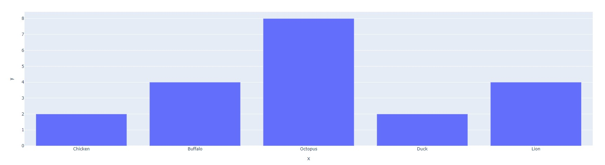
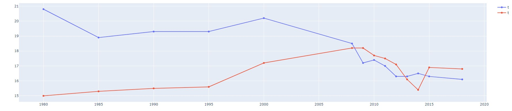

# Presenting Port Plotly 🧱

<center> {width=800} </center>

Looking around, there are hundreds of stalls set up throughout the port, each
with a different banner and symbol hung up next to them. A sign labelled <font color='#DD6E0F'> ***Visitor's Guide*** </font> catches our eyes. Approaching it, we find a
small box of pamphlets attached onto the sign. As we begin to read, we pull
out our laptop and once again begin to take note of the strange wisdom.

*"Welcome! In order to <font color='#DD6E0F'> fully experience Plotly</font>, we need to go over a few things..."*

???+ info "Plotly Pointers 01"

    ## Plotly Express and Pandas

    Before beginning to graph with Plotly, we need to **import Plotly Express!**

    Plotly Express is a <font color='#DD6E0F'>high-level wrapper that allows for the creation of
    simple visualizations</font> with minimal lines of code. It has numerous features,
    yet is still **intuitive and consistent** in terms of the
    syntax used across multiple chart types.

    To import the library, we run the following line:

    ```python
    import plotly.express as px
    ```

    Next, we need to import the **Pandas** library.

    Pandas allows for the creation of dataframes, structured storage systems
    that integrate easily with Plotly Express. These dataframes can be
    thought of as *data tables or spreadsheets*.

    To import the library, we run the following line:

    ```python
    import pandas as pd
    ```

    And that's it!

The last line of the Visitor's Guide reads,
*"Learn more by visiting the stalls at our marketplace!"*

With no other leads, we set off for the marketplace. First shop, *"Buster's Bar Charts"*.

&nbsp; &nbsp;

???+ info "Plotly Pointers 02"

    ## Bar Charts

    There are a few options to create a bar chart!

    ### Loading Data
    **With DataFrame**

    When creating a bar chart, we can use a *Pandas Dataframe*:

    ```python
    raw_data = {
        'Animals' : ['Chicken', 'Buffalo', 'Octopus', 'Duck', 'Lion'],
        'Counts'  : [2, 4, 8, 4, 2]
    }
    df = pd.DataFrame.from_dict(raw_data)

    bar = px.bar(raw_data, x='Animals', y='Counts')
    bar.show()  
    ```

    As seen, we <font color='#DD6E0F'>pass in the dataframe and specify the x and y column titles</font>.

    &nbsp; &nbsp;

    **Without DataFrame**

    Here, we can simply pass in two arrays, one for each of x and y.

    ```python
    animals = ['Chicken', 'Buffalo', 'Octopus', 'Duck', 'Lion']
    counts =  [2, 4, 8, 4, 2]

    bar = px.bar(x=animals, y=counts)
    bar.show()
    ```

    Even if we don't create a dataframe, Plotly will *perform this*
    *action under-the-hood* when generating the bar chart.

    &nbsp; &nbsp;

    In both cases, we get the same result. And voila, here are our two bar charts!

    <center> {width=800} </center>

    <center> {width=800} </center>

    Ahh, you may have noticed a small difference: **the axis labels!**

    When we passed in two arrays, we <font color='#DD6E0F'>never specified what the axes were to be
    titled</font>. How do we fix this and further style our charts? To that, we turn
    to *Plotly's myriad ways of customizing charts*.

    &nbsp; &nbsp;

    ### Styling Figure

    There are many ways to style a bar chart. Here are some of the most
    important ones!

    &nbsp; &nbsp;

    **Adding a Title, Axis Labels**

    We can add a title with the following function, `bar.update_layout()`:

    ```python
    animals = ['Chicken', 'Buffalo', 'Octopus', 'Duck', 'Lion']
    counts =  [2, 4, 8, 2, 4]

    bar = px.bar(x=animals, y=counts)

    bar.update_layout(
        title="Animals vs. Appendages", # Adding a title
        xaxis_title="The Amazing Animals", # Changing x-axis label
        yaxis_title="How many appendages?", # Changing y-axis label
        font=dict(
            family="Courier New, monospace", # The font style
            color="RebeccaPurple", # The font color
            size=18 # The font size
        )
    )

    bar.show()
    ```

    <center> {width=800} </center>

    &nbsp; &nbsp;

    **Adding Color**

    In order to individually select colors for our bar chart, we can use the following:

    ```python
    animals = ['Chicken', 'Buffalo', 'Octopus', 'Duck', 'Lion']
    counts =  [2, 4, 8, 2, 4]

    # As seen, each bar segment that hasn't had a discrete color entered will be shown in black
    bar = px.bar(x=animals, y=counts, color_discrete_sequence=[['#65ff31', '#4a4aff', '#aa00aa']])

    bar.show()
    ```

    <center> {width=800} </center>

    &nbsp; &nbsp;

    We can also use the following argument to make <font color='#DD6E0F'>each column visually represent its value</font>.

    ```python
    raw_data = {
        'Animals' : ['Chicken', 'Buffalo', 'Octopus', 'Duck', 'Lion'],
        'Counts'  : [2, 4, 8, 2, 4]
    }
    df = pd.DataFrame.from_dict(raw_data)

    # Creates a side color chart --> each color represents count
    bar = px.bar(df, x='Animals', y='Counts', color='Counts')
    bar.show()
    ```

    <center> {width=800} </center>


    As seen, it's just a matter of adding the **"color"** argument!

    &nbsp; &nbsp;

    **Changing Orientation**

    In order to make the bar chart horizontal, we can simply add the `orientation='h'` argument.

    ```python
    animals = ['Chicken', 'Buffalo', 'Octopus', 'Duck', 'Lion']
    counts =  [2, 4, 8, 2, 4]

    # Notice that we've had to switch the axes!
    bar = px.bar(x=counts, y=animals, orientation='h')

    bar.show()
    ```

    <center> {width=800} </center>

    > NOTE: As mentioned in the above comments, we've had to <font color='#DD6E0F'>switch the axes in this horizontal layout!</font>

    &nbsp; &nbsp;

    **Width and Height**

    These can be easily changed via the `width` and `height` keywords.

    ```python
    animals = ['Chicken', 'Buffalo', 'Octopus', 'Duck', 'Lion']
    counts =  [2, 4, 8, 2, 4]

    bar = px.bar(x=animals, y=counts, width=800, height=400)

    bar.show()
    ```

    <center> {width=800} </center>

    &nbsp; &nbsp;

    **All Put Together**

    Using these elements, we can create the following bar chart:

    ```python
    raw_data = {
        'Animals' : ['Chicken', 'Buffalo', 'Octopus', 'Duck', 'Lion'],
        'Counts'  : [2, 4, 8, 2, 4]
    }

    df = pd.DataFrame.from_dict(raw_data)
    bar = px.bar(df, x='Counts', y='Animals', orientation='h', color='Counts', width=800, height=400)

    bar.update_layout(
        title="Animals vs. Appendages", # Adding a title
        yaxis_title="The Amazing Animals", # Changing x-axis label
        xaxis_title="How many appendages?", # Changing y-axis label
        font=dict(
            family="Courier New, monospace", # The font style
            color="RebeccaPurple", # The font color
            size=18 # The font size
        )
    )

    bar.show()
    ```

    <center> {width=800} </center>

    > NOTE: For more information, make sure to check out the following:
    [Plotly Bar Charts](https://plotly.com/python/bar-charts/),
    [px.Bar()](https://plotly.com/python-api-reference/generated/plotly.express.bar)


The shopowner exclaims, *"There's your intro to bar charts! Next, I'd recommend*
*checking out <font color='#DD6E0F'>Lenny's Line Charts</font>. He's a cousin*
*of mine and our work is quite similar... "*

Walking over, we pull out our laptop and continue our notes...


???+ info "Plotly Pointers 03"

    ## Line Charts

    There are a few options to create a line chart!

    ### Loading Data

    Once again, we can either use a Pandas Dataframe or just proceed with arrays!

    **With DataFrame**

    ```python
    raw_data = {
        'Year' : [1980, 1985, 1990, 1995, 2000, 2008, 2009, 2010, 2011, 2012, 2013, 2014, 2015, 2018],
        'Carbon per Capita' : [20.8,	18.9,	19.3,	19.3,	20.2,	18.5,	17.2,	17.4,	17.0,	16.3,	16.3,	16.5,	16.3,	16.1]
    }

    df = pd.DataFrame.from_dict(raw_data)

    line = px.line(df, x='Year', y='Carbon per Capita')
    line.show()
    ```

    As seen, we <font color='#DD6E0F'>pass in the dataframe and specify the x and y column titles</font>.

    &nbsp; &nbsp;

    **Without DataFrame**

    Here, we can simply pass in two arrays, one for each of x and y.

    ```python
    year =  [1980, 1985, 1990, 1995, 2000, 2008, 2009, 2010, 2011, 2012, 2013, 2014, 2015, 2018]
    carbon = [20.8,	18.9,	19.3,	19.3,	20.2,	18.5,	17.2,	17.4,	17.0,	16.3,	16.3,	16.5,	16.3,	16.1]

    line = px.line(x=year, y=carbon)
    line.show()
    ```

    Even if we don't create a dataframe, Plotly will *perform this*
    *action under-the-hood* when generating the line chart.

    &nbsp; &nbsp;

    In both cases, we get the same result. And voila, here are our two line charts!

    <center> {width=800} </center>

    <center> {width=800} </center>

    ### Styling Figure

    The methods to style a line chart are very similar to styling a bar chart!
    However, one neat feature we haven't covered yet is traces. These are quite
    effective at visualizing multiple sets of data on the same set of axes.

    Let's take a closer look!

    &nbsp; &nbsp;

    **Multiple Traces**

    In order to add multiple traces, we turn to the Plotly Graph Objects library.

    To import this library, we use the following line:

    ```Python
    import plotly.graph_objects as go
    ```

    Next, we can create our traces with the `.add_trace()` function.

    ```python
    year =  [1980, 1985, 1990, 1995, 2000, 2008, 2009, 2010, 2011, 2012, 2013, 2014, 2015, 2018]
    carbon_USA = [20.8,	18.9,	19.3,	19.3,	20.2,	18.5,	17.2,	17.4,	17.0,	16.3,	16.3,	16.5,	16.3,	16.1]
    carbon_AUS = [15.0,	15.3,	15.5,	15.6,	17.2,	18.2,	18.2,	17.7,	17.5,	17.1,	16.1,	15.4,	16.9,	16.8]

    line = go.Figure()

    line.add_trace(go.Scatter(x=year, y=carbon_USA))
    line.add_trace(go.Scatter(x=year, y=carbon_AUS))

    line.show()
    ```
    Each trace adds a new line (the name `go.Scatter()` is a bit misleading!)

    <center> {width=800} </center>

    &nbsp; &nbsp;

    **Styling Traces**

    In order to style these traces and change their legend names from 't', we can add the following:

    ```python
    year =  [1980, 1985, 1990, 1995, 2000, 2008, 2009, 2010, 2011, 2012, 2013, 2014, 2015, 2018]
    carbon_USA = [20.8,	18.9,	19.3,	19.3,	20.2,	18.5,	17.2,	17.4,	17.0,	16.3,	16.3,	16.5,	16.3,	16.1]
    carbon_AUS = [15.0,	15.3,	15.5,	15.6,	17.2,	18.2,	18.2,	17.7,	17.5,	17.1,	16.1,	15.4,	16.9,	16.8]

    line = go.Figure()

    line.add_trace(go.Scatter(x=year, y=carbon_USA, marker = dict(color='MediumPurple'), name="USA Carbon Emissions (per capita)"))
    line.add_trace(go.Scatter(x=year, y=carbon_AUS, marker = dict(color='LightSeaGreen'), name="AUS Carbon Emissions (per capita)"))

    line.show()
    ```

    Adding the `marker=dict(color='MediumPurple')` dictionary allows us to change the color of the two traces.
    Additionally, the `name` argument lets us distinguish and label the two traces. Here's the result!

    <center> {width=800} </center>

    &nbsp; &nbsp;

    We can further style these traces by exploring the `marker` dictionary:

    ```python
    year =  [1980, 1985, 1990, 1995, 2000, 2008, 2009, 2010, 2011, 2012, 2013, 2014, 2015, 2018]
    carbon_USA = [20.8,	18.9,	19.3,	19.3,	20.2,	18.5,	17.2,	17.4,	17.0,	16.3,	16.3,	16.5,	16.3,	16.1]
    carbon_AUS = [15.0,	15.3,	15.5,	15.6,	17.2,	18.2,	18.2,	17.7,	17.5,	17.1,	16.1,	15.4,	16.9,	16.8]

    line = go.Figure()

    line.add_trace(go.Scatter(x=year, y=carbon_USA,
                              marker = dict(size=25, color='MediumPurple'),
                              name="USA Carbon Emissions (per capita)"))

    line.add_trace(go.Scatter(x=year, y=carbon_AUS,
                              marker = dict(size=25, color='LightSeaGreen', symbol='square'),
                              name="AUS Carbon Emissions (per capita)"))

    line.show()
    ```

    As seen below, the size and symbols for each trace can be customized as well!

    <center> {width=800} </center>

    &nbsp; &nbsp;

    **All Put Together**

    Using these elements and our stylings from the previous section, we can create the following:

    ```python
    year =  [1980, 1985, 1990, 1995, 2000, 2008, 2009, 2010, 2011, 2012, 2013, 2014, 2015, 2018]
    carbon_USA = [20.8,	18.9,	19.3,	19.3,	20.2,	18.5,	17.2,	17.4,	17.0,	16.3,	16.3,	16.5,	16.3,	16.1]
    carbon_AUS = [15.0,	15.3,	15.5,	15.6,	17.2,	18.2,	18.2,	17.7,	17.5,	17.1,	16.1,	15.4,	16.9,	16.8]

    line = go.Figure()

    line.add_trace(go.Scatter(x=year, y=carbon_USA,
                              marker = dict(size=25, color='MediumPurple'),
                              name="USA Carbon Emissions (per capita)"))

    line.add_trace(go.Scatter(x=year, y=carbon_AUS,
                              marker = dict(size=25, color='LightSeaGreen', symbol='square'),
                              name="AUS Carbon Emissions (per capita)"))

    line.update_layout(
        title = "Carbon Emissions since 1980 (per capita)",
        xaxis_title = "Year",
        yaxis_title = "Annual Emissions in Tons (per capita)",
        plot_bgcolor = 'DarkGrey',
        width=1600
    )

    line.show()
    ```

    <center> {width=800} </center>

    &nbsp; &nbsp;

    > NOTE: For more information, make sure to check out the following:
    [Plotly Line Charts](https://plotly.com/python/line-charts/),
    [px.line()](https://plotly.com/python-api-reference/generated/plotly.express.line)

Line charts, check ✅.

A delicious aroma catches our scent, drawing us away from the stall and towards a
round-shaped bakery. The shopowner smiles and beckons, <font color='#DD6E0F'>"Welcome to Pepé's Pie Charts!"</font>

Laptop opened, we begin to listen...


???+ info "Plotly Pointers 04"

    ## Pie Charts

    There are a few options to create a pie chart!

    ### Loading Data

    When creating a bar chart, we can use a *Pandas Dataframe*:

    ```python
    raw_data = {
        'Animals' : ['Chicken', 'Buffalo', 'Octopus', 'Duck', 'Lion', 'Horse', 'Pig'],
        'Counts'  : [9, 3, 1, 5, 4, 8, 8]
    }

    df = pd.DataFrame.from_dict(raw_data)

    pie = px.pie(raw_data, values='Counts', names='Animals')
    pie.show()
    ```

    As seen, we <font color='#DD6E0F'>pass in the dataframe and specify the x and y column titles</font>.

    &nbsp; &nbsp;

    **Without DataFrame**

    Here, we can simply pass in two arrays, one for each of x and y.

    ```python
    animals = ['Chicken', 'Buffalo', 'Octopus', 'Duck', 'Lion', 'Horse', 'Pig']
    counts =  [9, 3, 1, 5, 4, 8, 8]

    pie = px.pie(values=counts, names=animals)
    pie.show()
    ```

    Even if we don't create a dataframe, Plotly will *perform this*
    *action under-the-hood* when generating the pie chart.

    &nbsp; &nbsp;

    In both cases, we get the same result. And voila, here are our two bar charts!

    <center> {width=800} </center>

    <center> {width=800} </center>

    Unlike with bar charts and line charts, there are truly no differences between
    each!

    This is mainly because there are no axes which need labelling 😅.

    &nbsp; &nbsp;

    ### Styling Figure

    There are many ways to style a bar chart. Here are some of the most
    important ones!

    &nbsp; &nbsp;

    **Adding Title, Labels**

    In order to add a title, we can simply pass in the `title` argument. To change the
    percentages in each slice into labels, we can use the `.update_traces()` method. The
    width of the plot is simply changed via the `.update_layouts()` method, as done previously.

    ```python
    animals = ['Chicken', 'Buffalo', 'Octopus', 'Duck', 'Lion', 'Horse', 'Pig']
    counts =  [9, 3, 1, 5, 4, 8, 8]

    pie = px.pie(values=counts,
                 names=animals,
                 title="The Animals of Old McDonald's Farm",
                 )

    pie.update_traces(textposition='inside', textinfo='label')
    pie.update_layout(width=1000)
    pie.show()
    ```

    <center> {width=800} </center>

    The title can be centered with the `title_x` argument, which ranges from 0 to 1.
    Therefore, setting its value to 0.5 will result in a centered title. Additionally,
    the `.update_traces()` method can be modified to include percentages.

    ```python
    animals = ['Chicken', 'Buffalo', 'Octopus', 'Duck', 'Lion', 'Horse', 'Pig']
    counts =  [9, 3, 1, 5, 4, 8, 8]

    pie = px.pie(values=counts,
                 names=animals,
                 title="The Animals of Old McDonald's Farm",
                 )

    pie.update_traces(textposition='inside', textinfo='label+percent')
    pie.update_layout(width=1000)
    pie.update_layout(title_x=0.5)
    pie.show()
    ```

    And here's our centered title (relative to the pie chart).

    <center> {width=800} </center>

    &nbsp; &nbsp;

    ### Donuts, Slices

    Some neat extensions of pie charts includes donuts and slices!

    In order to create a donut chart, we simply need to add the `hole=0.2` argument.

    ```python
    animals = ['Chicken', 'Buffalo', 'Octopus', 'Duck', 'Lion', 'Horse', 'Pig']
    counts =  [9, 3, 1, 5, 4, 8, 8]

    pie = px.pie(values=counts,
                 names=animals,
                 title="The Animals of Old McDonald's Farm",
                 hole=0.2,
                 )

    pie.update_traces(textposition='inside', textinfo='label+percent')
    pie.update_layout(width=1000)
    pie.update_layout(title_x=0.5)
    pie.show()
    ```

    <center> {width=800} </center>

    &nbsp; &nbsp;

    In order to highlight specific slices or data values, we can use the `pull` argument.

    Here's an example highlighting the Pig slice!

    ```python
    animals = ['Chicken', 'Buffalo', 'Octopus', 'Duck', 'Lion', 'Horse', 'Pig']
    counts =  [9, 3, 1, 5, 4, 8, 8]

    pie = px.pie(values=counts,
                 names=animals,
                 title="The Animals of Old McDonald's Farm",
                 hole=0.2,
                 )

    pie.update_traces(textposition='inside',
                      textinfo='label+percent',
                      pull=[0,0,0,0,0,0,0.1],
                      )
    pie.update_layout(width=1000)
    pie.update_layout(title_x=0.5)
    pie.show()
    ```

    <center> {width=800} </center>

    The length of `pull` matches the length of `animals`.

    Similarly, each value corresponds to a
    specific animal, in matching result. For example, the last element of `pull` is 0.1, meaning
    that the last element of `animals`, 'Pig', will be pulled out by a factor of 0.1.

    Let's try applying this knowledge to pull out 'Chicken' and 'Buffalo' as well!

    ```python

    animals = ['Chicken', 'Buffalo', 'Octopus', 'Duck', 'Lion', 'Horse', 'Pig']
    counts =  [9, 3, 1, 5, 4, 8, 8]

    pie = px.pie(values=counts,
                 names=animals,
                 title="The Animals of Old McDonald's Farm",
                 hole=0.2,
                 )

    pie.update_traces(textposition='inside',
                      textinfo='label+percent',
                      opacity=0.9,
                      pull=[0.2,0.3,0,0,0,0,0.1],
                      )
    pie.update_layout(width=1000)
    pie.update_layout(title_x=0.5)
    pie.show()  
    ```

    <center> {width=800} </center>

    Neat! And with that, we have a rather fancy pie chart put together in less than a dozen lines of code!

    > NOTE: For more information, make sure to check out the following:
    [Plotly Pie Charts](https://plotly.com/python/pie-charts/),
    [px.Pie()](https://plotly.com/python-api-reference/generated/plotly.express.pie)

The shopowner looks at our laptop and points at our line charts from before,

*"Ahh! I see you've visited Lenny's Lines. Make sure to check out Sylvie's Scatter Plots. It's right next door!*
*That'll come in handy with data points that don't necessarily need to form a line!"*

&nbsp; &nbsp;

Walking over, we're greeted by a beaming clerk with the initials "S.S.".

*"Howdy y'all! I presume you're here to learn about the stunning power of scatter plots..."*


???+ info "Plotly Pointers 05"

    ## Scatter Plots

    As with most other plots, there are a few options to create a scatter plot!

    ### Loading Data

    Here, we'll explore a less-common method with several Star Wars Lego Sets. Each
    Lego Set is stored as an array of three values: price, piece count, and VIP points.
    These arrays are added to a list of all eight sets.

    Using two iterators, we can create a list of prices and pieces (ordered correctly).

    ```python
    rep_gunship = [349.99, 3292, 2275]; light_cruiser = [159.99, 1336, 1040]
    bad_batch_shuttle = [99.99, 969, 650]; meditation_chamber = [69.99, 663, 455]
    imperial_maurader = [39.99, 478, 260]; mandalorian_forge = [29.99, 258, 195]
    a_wing = [199.99, 1672, 1300]; razor_crest = [129.99, 1023, 845]

    sets = [rep_gunship, light_cruiser, bad_batch_shuttle, meditation_chamber, imperial_maurader, mandalorian_forge, a_wing, razor_crest]

    price = [sets[i][0] for i in range(len(sets))]
    pieces = [sets[i][1] for i in range(len(sets))]

    scatter = px.scatter(x=price, y=pieces)
    scatter.show()
    ```

    <center> {width=800} </center>

    Looking good, but let's add some style!

    &nbsp; &nbsp;

    ### Styling Figure

    &nbsp; &nbsp;

    **Size Attribute**

    One neat way to flavor our scatter plots is to modify the `size` attribute. Here,
    we can set the size of each datapoint to match a third attribute. In this case, the
    third dimension of data will be the number of VIP points earned per set.

    ```python
    # Lego Sets from 2021 (Price, Pieces, VIP Points)

    rep_gunship = [349.99, 3292, 2275]; light_cruiser = [159.99, 1336, 1040]
    bad_batch_shuttle = [99.99, 969, 650]; meditation_chamber = [69.99, 663, 455]
    imperial_maurader = [39.99, 478, 260]; mandalorian_forge = [29.99, 258, 195]
    a_wing = [199.99, 1672, 1300]; razor_crest = [129.99, 1023, 845]

    sets = [rep_gunship, light_cruiser, bad_batch_shuttle, meditation_chamber, imperial_maurader, mandalorian_forge, a_wing, razor_crest]

    price = [sets[i][0] for i in range(len(sets))]
    pieces = [sets[i][1] for i in range(len(sets))]
    points = [sets[i][2] for i in range(len(sets))]

    scatter = px.scatter(x=price, y=pieces, size=points)
    scatter.show()
    ```

    <center> {width=800} </center>

    And ta-da, we can easily visualize that larger sets give the most points!

    &nbsp; &nbsp;

    **Adding Color**

    As well as representing VIP points by size, we can also represent this data with color. We simply
    need to add the `color` argument inside of our `px.scatter()` function.

    ```python
    # Lego Sets from 2021 (Price, Pieces, VIP Points)

    rep_gunship = [349.99, 3292, 2275]; light_cruiser = [159.99, 1336, 1040]
    bad_batch_shuttle = [99.99, 969, 650]; meditation_chamber = [69.99, 663, 455]
    imperial_maurader = [39.99, 478, 260]; mandalorian_forge = [29.99, 258, 195]
    a_wing = [199.99, 1672, 1300]; razor_crest = [129.99, 1023, 845]

    sets = [rep_gunship, light_cruiser, bad_batch_shuttle, meditation_chamber, imperial_maurader, mandalorian_forge, a_wing, razor_crest]

    price = [sets[i][0] for i in range(len(sets))]
    pieces = [sets[i][1] for i in range(len(sets))]
    points = [sets[i][2] for i in range(len(sets))]

    scatter = px.scatter(x=price, y=pieces, size=points, color=points)
    scatter.update_coloraxes(colorbar_title="VIP Points")
    scatter.update_layout(width=1000) # For better view!
    scatter.show()
    ```

    <center> {width=800} </center>

    &nbsp; &nbsp;

    **Adding Trendline**

    Finally, one useful feature of `px.Scatter()` is the ability to add trendlines! All it takes
    is a simple `trendline="ols"`, where "ols" stands for Ordinary Least Squares regression.

    ```python
    # Lego Sets from 2021 (Price, Pieces, VIP Points)

    rep_gunship = [349.99, 3292, 2275]; light_cruiser = [159.99, 1336, 1040]
    bad_batch_shuttle = [99.99, 969, 650]; meditation_chamber = [69.99, 663, 455]
    imperial_maurader = [39.99, 478, 260]; mandalorian_forge = [29.99, 258, 195]
    a_wing = [199.99, 1672, 1300]; razor_crest = [129.99, 1023, 845]

    sets = [rep_gunship, light_cruiser, bad_batch_shuttle, meditation_chamber, imperial_maurader, mandalorian_forge, a_wing, razor_crest]

    price = [sets[i][0] for i in range(len(sets))]
    pieces = [sets[i][1] for i in range(len(sets))]
    points = [sets[i][2] for i in range(len(sets))]

    scatter = px.scatter(x=price, y=pieces, size=points, color=points, trendline="ols")
    scatter.update_coloraxes(colorbar_title="VIP Points")
    scatter.update_layout(width=1000) # For better view!
    scatter.show()
    ```

    <center> {width=800} </center>

    > NOTE: Non-linear regression lines can be added as well! For more information, check out:
    [Plotly Trendlines](https://plotly.com/python/linear-fits/)

    &nbsp; &nbsp;

    **All Put Together**

    Using these elements and our stylings from the previous section, we can create the following:

    ```python
    # Lego Sets from 2021 (Price, Pieces, VIP Points)

    rep_gunship = [349.99, 3292, 2275]; light_cruiser = [159.99, 1336, 1040]
    bad_batch_shuttle = [99.99, 969, 650]; meditation_chamber = [69.99, 663, 455]
    imperial_maurader = [39.99, 478, 260]; mandalorian_forge = [29.99, 258, 195]
    a_wing = [199.99, 1672, 1300]; razor_crest = [129.99, 1023, 845]

    sets = [rep_gunship, light_cruiser, bad_batch_shuttle, meditation_chamber, imperial_maurader, mandalorian_forge, a_wing, razor_crest]

    price = [sets[i][0] for i in range(len(sets))]
    pieces = [sets[i][1] for i in range(len(sets))]
    points = [sets[i][2] for i in range(len(sets))]

    scatter = px.scatter(x=price, y=pieces, size=points, color=points, trendline="ols")
    scatter.update_coloraxes(colorbar_title="VIP Points")

    scatter.update_layout(
       title = "Lego Star Wars Sets (2021)",
       xaxis_title = "Price (USD)",
       yaxis_title = "Total Piece Count",
       width=1000
    )

    scatter.show()
    ```

    <center> {width=800} </center>

    > NOTE: For more information, make sure to check out the following:
    [Plotly Scatter](https://plotly.com/python/line-and-scatter/)
    [px.Scatter()](https://plotly.com/python-api-reference/generated/plotly.express.scatter)

Sylvie turns to us and points at our laptop,

"Y'all have these fancy figures, but they're **not part of your dashboard** yet! Learning
how to add them in is an *ancient knowledge* you won't be able to find 'round here. Travel
past this Port towards Dash's Delta. There, y'all will find the next pieces of your quest."

We smile and wave goodbye, heading out past Port Plotly and down along the coast.

&nbsp; &nbsp;

[^1]: All code segments from this chapter can be found in this
[Colab Notebook](https://colab.research.google.com/drive/1RRirZeUi_zSBEDS9lDJw1dsxth_V0f-9#scrollTo=RIac6-HeDS1V).
Feel free to follow along!

[^2]: Everything we've installed so far (prerequistes for next section):
```python
!pip install -q pyTigerGraph
import pyTigerGraph as tg

TG_SUBDOMAIN = 'healthcare-dash'
TG_HOST = "https://" + TG_SUBDOMAIN + ".i.tgcloud.io" # GraphStudio Link

TG_USERNAME = "tigergraph" # This should remain the same...
TG_PASSWORD = "tigergraph" # Shh, it's our password!
TG_GRAPHNAME = "MyGraph" # The name of the graph

conn = tg.TigerGraphConnection(host=TG_HOST, graphname=TG_GRAPHNAME, username=TG_USERNAME, password=TG_PASSWORD, beta=True)
conn.apiToken = conn.getToken(conn.createSecret())

!pip install -q jupyter-dash

import dash
import dash_html_components as html
from jupyter_dash import JupyterDash

import plotly.express as px
import pandas as pd
import plotly.graph_objects as go
```
