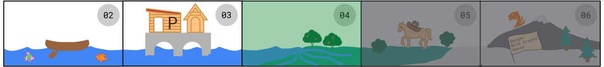
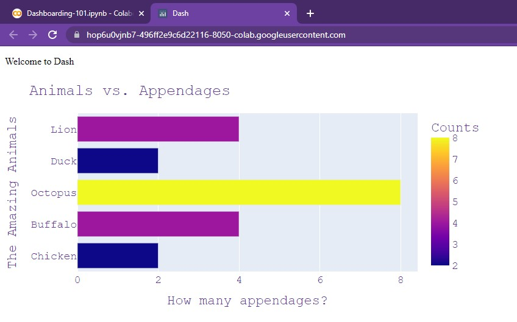
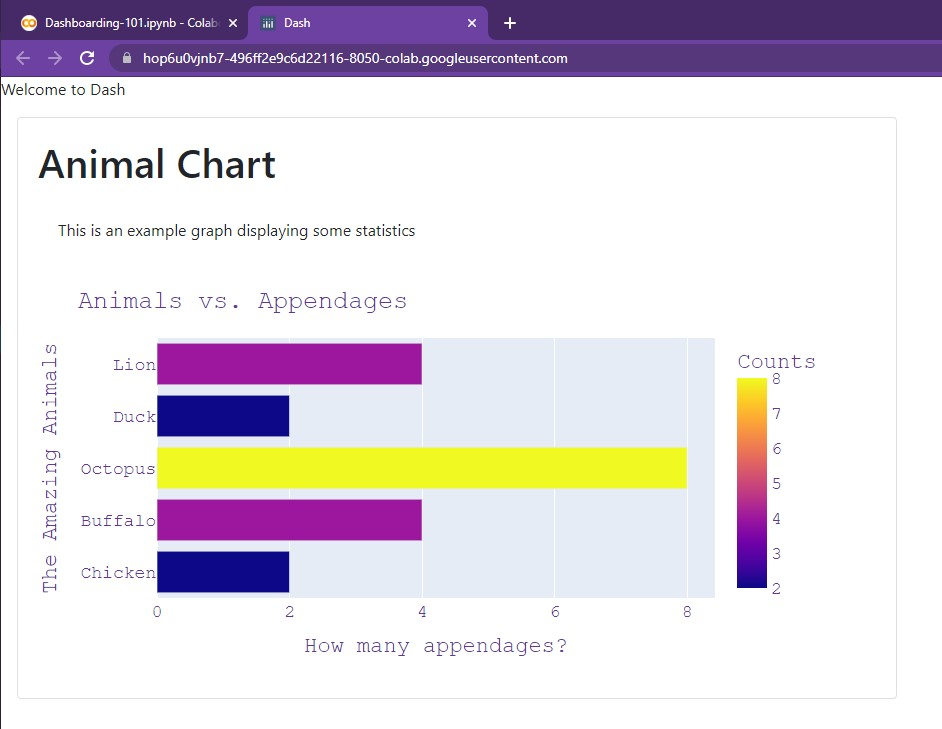
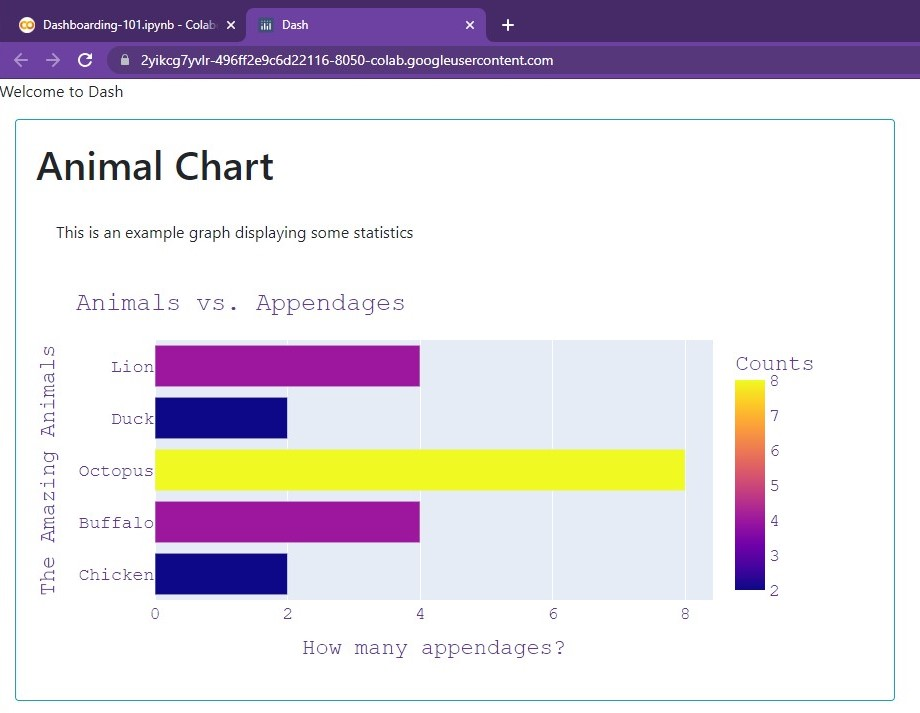
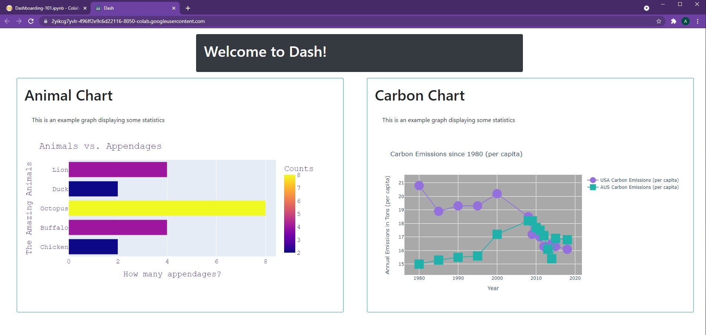
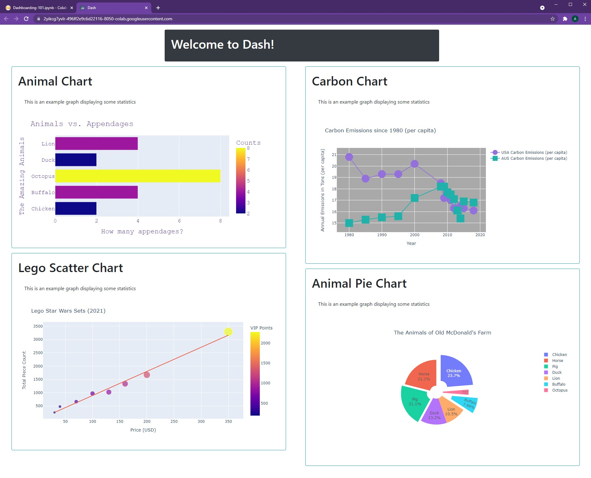

# Dash’s Delta 🌿

<center> {width=800} </center>

As we follow the meandering coastline, we catch sight of the mouth of the rivers heading inland.

A small wooden sign sits next to the wetlands: <font color='#DD6E0F'> *“Welcome to Dash’s Delta. EST 2013.’* </font>

Next to it, several large, strangely-shaped rocks have been arranged in a circular fashion. Taking a closer look, there are several paragraphs etched into each stone. Curious, we begin to read…

&nbsp; &nbsp;

<center> ***The power of Dash flows through these rivers.*** </center>

<center> ***Engraved into these stones lie the key to unlocking their secrets...*** </center>


???+ info "Dash's Delta Notes 01"

    ## Dash's Libraries

    To begin harnessing the power of Dash, we must import the necessary libraries

    ### Dash Core

    Dash's core components are a library of higher-level elements such as **tables, graphs,**
    **dropdowns, inputs, and links**. To use these components, we add the following line:

    ```python
    import dash_core_components as dcc
    ```
    > NOTE: For a full list of components, feel free to check out the following:
    [Dash Core Documentation](https://dash.plotly.com/dash-core-components)

    &nbsp; &nbsp;

    ### Bootstrap

    Dash allows for the inclusion of native Boostrap components via its Dash Boostrap
    library. These elements include **cards, lists, badges, and more**. To use these elements, we install and import the library via the following lines:

    ```python
    !pip install dash-bootstrap-components
    import dash_bootstrap_components as dbc
    ```

    > NOTE: For a full list of components, feel free to check out the following:
    [Dash Boostrap Documentation](https://dash-bootstrap-components.opensource.faculty.ai/)

    &nbsp; &nbsp;

    And voila, we're good to go!


We turn to the next stone and continue to read...

&nbsp; &nbsp;

???+ info "Dash's Delta Notes 02"

    ## Dash Graph

    The figures made from Plotly are dazzling, but *still need to be added into the dashboard!*

    In order to add these charts, we can utilize the `dcc.Graph()` element. First, we create a function:

    ```python
    def getAnimalChart():
      raw_data = {
      'Animals' : ['Chicken', 'Buffalo', 'Octopus', 'Duck', 'Lion'],
      'Counts'  : [2, 4, 8, 2, 4]
      }

      df = pd.DataFrame.from_dict(raw_data)
      bar = px.bar(df, x='Counts', y='Animals', orientation='h', color='Counts', width=800, height=400)

      bar.update_layout(
          title="Animals vs. Appendages", # Adding a title
          yaxis_title="The Amazing Animals", # Changing x-axis label
          xaxis_title="How many appendages?", # Changing y-axis label
          font=dict(
              family="Courier New, monospace", # The font style
              color="RebeccaPurple", # The font color
              size=18 # The font size
          )
      )
      return bar
    ```

    This function simply <font color='#DD6E0F'>returns our finalized bar chart</font> from the last chapter instead of displaying it.

    Now, we can add a `dcc.Graph()` component in our app via the following lines. And here's the result!

    ```python
    app = JupyterDash(__name__)

    app.layout = html.Div(children=[
        html.P(children="Welcome to Dash"),
        dcc.Graph(id='Animal Chart', figure=getAnimalChart())
    ])

    app.run_server(mode='external')
    ```

    <center> {width=800} </center>

    >NOTE: The `id` attribute is <font color='#DD6E0F'>optional, but it's a good practice to include a unique ID</font> for each component.
    This is especially true for updating figures, which will be covered in a later chapter, *"Confronted by Callbacks"*

    &nbsp; &nbsp;

    Pretty straightforward! Now, we can add our Plotly figures to our dashboard 😄 .

Continuing down the circle, we find the next stone, "Dash Cards"...

&nbsp; &nbsp;

???+ info "Dash's Delta Notes 03"

    ## Dash Cards

    These graphs we have created are amazing! But not the prettiest...

    With cards, <font color='#DD6E0F'>any component (especially text, images, and figures) can neatly be displayed within a bounded area.</font>
    These cards can be customized in **terms of style, size, color, outline, and more!**

    ### Basic Elements

    To get started, we'll create a simple card around our graph from earlier.

    ```python
    app = JupyterDash(__name__, external_stylesheets=[dbc.themes.BOOTSTRAP])

    app.layout = html.Div(children=[
        html.P(children="Welcome to Dash"),
        dbc.Card([
            dbc.CardBody([
                          html.H1("Animal Chart", className='card-title'),
                          html.P("This is an example graph displaying some statistics", className='card-body'),  
                          dcc.Graph(id='Animal Chart', figure=getAnimalChart())
                        ])
          ],
          style={
              "width":"55rem",
              "margin-left":"1rem"
              }
        )
    ])

    app.run_server(mode='external')
    ```

    Alright, let's break it down!

    At the very top, we must add the **Bootstrap external stylesheet** in order to utilize the Card component. This
    stylesheet *comes installed with the library* and is accessed with  `external_stylesheets=[dbc.themes.BOOTSTRAP]`

    > NOTE: We can add our own <font color='#DD6E0F'>custom external stylesheets!</font> We'll dive into this in *"Sheriff Styles"*

    &nbsp; &nbsp;

    With our `dbc.Card()`, we have a Card Body. this `dbc.CardBody()` contains a header, paragraph, and our graph.
    You may notice the `className` attribute. This is a custom CSS styling that was imported from the Bootstrap stylesheet.

    After this, the `dbc.Card()` itself contains a style dictionary. In here, we find two attributes:

    * **Width** - this is simply the width of the card. `rem` <font color='#DD6E0F'>is simply the percentage dimension of the screen.</font> As a result, `55rem` means
    that the card will span 55% of the screen's width.
    * **Margin** - in particular, the left-most margin has been set to 1% of the screen's width. `margin-bottom`, `margin-top`, and `margin-right`
    are all valid keywords that can be utilized as well to further adjust our card.

    &nbsp; &nbsp;

    And voila, here's our result:

    <center> {width=800} </center>

    Let's try changing some of the colors!

    &nbsp; &nbsp;

    ### Colors, Outlines

    In order to modify the visual appearance of our cards, we can use the `color` and
    `outline` attributes. `color` allows for several pre-built options:
    `primary`, `secondary`, `info`, `success`, `warning`, `danger`, `light`, and `dark`.

    For example, here's what `info` looks like (a light blue):

    ```python
    app = JupyterDash(__name__, external_stylesheets=[dbc.themes.BOOTSTRAP])

    app.layout = html.Div(children=[
        html.P(children="Welcome to Dash"),
        dbc.Card([
            dbc.CardBody([
                          html.H1("Animal Chart", className='card-title'),
                          html.P("This is an example graph displaying some statistics", className='card-body'),  
                          dcc.Graph(id='Animal Chart', figure=getAnimalChart())
                        ])
          ],
          outline=True,
          color='info', # Options include: primary, secondary, info, success, warning, danger, light, dark  
          style={
              "width":"55rem",
              "margin-left":"1rem"
              }
        )
    ])

    app.run_server(mode='external')
    ```

    <center> {width=800} </center>

    &nbsp; &nbsp;

    We can also create a card to hold our title (looks kind of strange by itself in the top corner 😅)

    ```python
    app = JupyterDash(__name__, external_stylesheets=[dbc.themes.BOOTSTRAP])

    app.layout = html.Div(children=[
        dbc.Card([
            dbc.CardBody([
                          html.H1("Welcome to Dash!", className='card-title'),
                        ])
          ],
          color='dark', # Options include: primary, secondary, info, success, warning, danger, light, dark
          inverse=True,   
          style={
              "width":"55rem",
              "margin-left":"1rem",
              "margin-top":"1rem",
              "margin-bottom":"1rem"
              }
        ),

        dbc.Card([
            dbc.CardBody([
                          html.H1("Animal Chart", className='card-title'),
                          html.P("This is an example graph displaying some statistics", className='card-body'),  
                          dcc.Graph(id='Animal Chart', figure=getAnimalChart())
                        ])
          ],
          outline=True,
          color='info', # Options include: primary, secondary, info, success, warning, danger, light, dark  
          style={
              "width":"55rem",
              "margin-left":"1rem"
              }
        )
    ])

    app.run_server(mode='external')
    ```

    <center> {width=800} </center>

    There we go, much better now!

    Ahh, you may have noticed the `inverse` argument! Setting this to `True` is
    helpful when dealing with dark backgrounds as it inverts all text color to white.
    As a result, we don't have to manually change the title color.

    > NOTE: For more information on dbc.Card(), feel free to check out the following:
    [dbc.Card()](https://dash-bootstrap-components.opensource.faculty.ai/docs/components/card/)

    &nbsp; &nbsp;

    Now, what if we want to add multiple cards, but not just continue to vertically stack them?

    For that, we must turn to rows and columns!

The stone adjacent to this one is titled "Dash Layout"...

&nbsp; &nbsp;

???+ info "Dash's Delta Notes 04"

    ## Dash Layout

    The best way to arrange components in our dashboard is via `dbc.Row()` and `dbc.Col()`.

    Let's take a closer look at their power!

    ### Creating Cards

    Before beginning, let's create a few cards for better readability:

    === "titleCard"

        ```python
        titleCard =  dbc.Card([
                        dbc.CardBody([
                                      html.H1("Welcome to Dash!", className='card-title'),
                                    ])
                      ],
                      color='dark', # Options include: primary, secondary, info, success, warning, danger, light, dark
                      inverse=True,   
                      style={
                          "width":"55rem",
                          "margin-left":"1rem",
                          "margin-top":"1rem",
                          "margin-bottom":"1rem"
                          }
                    )
        ```

    === "animalBarCard"

        ```python
        def getAnimalBarChart():
            raw_data = {
            'Animals' : ['Chicken', 'Buffalo', 'Octopus', 'Duck', 'Lion'],
            'Counts'  : [2, 4, 8, 2, 4]
            }

            df = pd.DataFrame.from_dict(raw_data)
            bar = px.bar(df, x='Counts', y='Animals', orientation='h', color='Counts', width=800, height=400)

            bar.update_layout(
                title="Animals vs. Appendages", # Adding a title
                yaxis_title="The Amazing Animals", # Changing x-axis label
                xaxis_title="How many appendages?", # Changing y-axis label
                font=dict(
                    family="Courier New, monospace", # The font style
                    color="RebeccaPurple", # The font color
                    size=18 # The font size
                )
            )
            return bar


        animalBarCard =  dbc.Card([
                          dbc.CardBody([
                                        html.H1("Animal Chart", className='card-title'),
                                        html.P("This is an example graph displaying some statistics", className='card-body'),  
                                        dcc.Graph(id='Animal Chart', figure=getAnimalBarChart())
                                      ])
                        ],
                        outline=True,
                        color='info', # Options include: primary, secondary, info, success, warning, danger, light, dark  
                        style={
                            "width":"55rem",
                            "margin-left":"1rem",
                            "margin-bottom":"1rem"
                            }
                      )
        ```

    === "carbonLineCard"

        ```python
        def getCarbonLineChart():
            year =  [1980, 1985, 1990, 1995, 2000, 2008, 2009, 2010, 2011, 2012, 2013, 2014, 2015, 2018]
            carbon_USA = [20.8, 18.9,   19.3,   19.3,   20.2,   18.5,   17.2,   17.4,   17.0,   16.3,   16.3,   16.5,   16.3,   16.1]
            carbon_AUS = [15.0, 15.3,   15.5,   15.6,   17.2,   18.2,   18.2,   17.7,   17.5,   17.1,   16.1,   15.4,   16.9,   16.8]

            line = go.Figure()

            line.add_trace(go.Scatter(x=year, y=carbon_USA,
                                      marker = dict(size=25, color='MediumPurple'),
                                      name="USA Carbon Emissions (per capita)"))

            line.add_trace(go.Scatter(x=year, y=carbon_AUS,
                                      marker = dict(size=25, color='LightSeaGreen', symbol='square'),
                                      name="AUS Carbon Emissions (per capita)"))

            line.update_layout(
                title = "Carbon Emissions since 1980 (per capita)",
                xaxis_title = "Year",
                yaxis_title = "Annual Emissions in Tons (per capita)",
                plot_bgcolor = 'DarkGrey',
                width=1600
            )

            return line


        carbonLineCard =  dbc.Card([
                            dbc.CardBody([
                                          html.H1("Carbon Chart", className='card-title'),
                                          html.P("This is an example graph displaying some statistics", className='card-body'),  
                                          dcc.Graph(id='Carbon Chart', figure=getCarbonLineChart())
                                        ])
                          ],
                          outline=True,
                          color='info', # Options include: primary, secondary, info, success, warning, danger, light, dark  
                          style={
                              "width":"55rem",
                              "margin-left":"1rem",
                              "margin-bottom":"1rem"
                              }
                        )
        ```

    === "animalPieCard"

        ```python
        def getAnimalPieChart():
            animals = ['Chicken', 'Buffalo', 'Octopus', 'Duck', 'Lion', 'Horse', 'Pig']
            counts =  [9, 3, 1, 5, 4, 8, 8]

            pie = px.pie(values=counts,
                        names=animals,
                        title="The Animals of Old McDonald's Farm",
                        hole=0.2,
                        )

            pie.update_traces(textposition='inside',
                              textinfo='label+percent',
                              opacity=0.9,
                              pull=[0.2,0.3,0,0,0,0,0.1],
                              )
            pie.update_layout(width=1000)
            pie.update_layout(title_x=0.5)

            return pie


        animalPieCard =  dbc.Card([
                            dbc.CardBody([
                                          html.H1("Animal Pie Chart", className='card-title'),
                                          html.P("This is an example graph displaying some statistics", className='card-body'),  
                                          dcc.Graph(id='Animal Pie Chart', figure=getAnimalPieChart())
                                        ])
                          ],
                          outline=True,
                          color='info', # Options include: primary, secondary, info, success, warning, danger, light, dark  
                          style={
                              "width":"55rem",
                              "margin-left":"1rem",
                              "margin-bottom":"1rem"
                              }
                        )
        ```

    === "legoScatterCard"

        ```python
        def getLegoScatterChart():
            rep_gunship = [349.99, 3292, 2275]; light_cruiser = [159.99, 1336, 1040]
            bad_batch_shuttle = [99.99, 969, 650]; meditation_chamber = [69.99, 663, 455]
            imperial_maurader = [39.99, 478, 260]; mandalorian_forge = [29.99, 258, 195]
            a_wing = [199.99, 1672, 1300]; razor_crest = [129.99, 1023, 845]

            sets = [rep_gunship, light_cruiser, bad_batch_shuttle, meditation_chamber, imperial_maurader, mandalorian_forge, a_wing, razor_crest]

            price = [sets[i][0] for i in range(len(sets))]
            pieces = [sets[i][1] for i in range(len(sets))]
            points = [sets[i][2] for i in range(len(sets))]

            scatter = px.scatter(x=price, y=pieces, size=points, color=points, trendline="ols")
            scatter.update_coloraxes(colorbar_title="VIP Points")

            scatter.update_layout(
              title = "Lego Star Wars Sets (2021)",
              xaxis_title = "Price (USD)",
              yaxis_title = "Total Piece Count",
              width=1000
            )

            return scatter


        legoScatterCard =  dbc.Card([
                            dbc.CardBody([
                                          html.H1("Lego Scatter Chart", className='card-title'),
                                          html.P("This is an example graph displaying some statistics", className='card-body'),  
                                          dcc.Graph(id='Lego Chart', figure=getLegoScatterChart())
                                        ])
                          ],
                          outline=True,
                          color='info', # Options include: primary, secondary, info, success, warning, danger, light, dark  
                          style={
                              "width":"55rem",
                              "margin-left":"1rem",
                              "margin-bottom":"1rem"
                              }
                        )
        ```

    There we go! Now we have five variables we can use:

    `titleCard`, `animalBarCard`, `carbonLineCard`, `animalPieCard`, `legoScatterCard`.

    Let's see what we can do using them!

    &nbsp; &nbsp;

    ### dbc.Row()

    The function `dbc.Row()` allows for the creation of rows, enabling horizontal arrangement of elements.

    For example, we can create two rows: one to hold our title, another to hold two charts.

    ```python

    app = JupyterDash(__name__, external_stylesheets=[dbc.themes.BOOTSTRAP])

    app.layout = html.Div(children=[
       dbc.Row([
                titleCard,
               ],
               style = {
                   "margin-left": "0.5rem"
               }
       ),
       dbc.Row([
                animalBarCard,
                carbonLineCard
               ],
               style = {
                   "margin-left": "0.5rem"
               }
      )
    ])

    app.run_server(mode='external')  
    ```
    <center> {width=800} </center>

    &nbsp; &nbsp;

    Woah, that looks pretty good!

    In order to adjust the elements of rows, we can use the `justify` argument.
    Possible options include: `start`, `center`, `end`, `between`, and `around`. For example, here we'll
    use `center` for the title card and `around` for the body cards.

    ```python
    app = JupyterDash(__name__, external_stylesheets=[dbc.themes.BOOTSTRAP])

    app.layout = html.Div(children=[
       dbc.Row([
                titleCard,
               ],
               justify = "center",
               style = {
                   "margin-left": "0.5rem"
               }
       ),
       dbc.Row([
                animalBarCard,
                carbonLineCard
               ],
               justify = "around",
               style = {
                   "margin-left": "0.5rem",
                   "margin-right":"0.5rem"
               }
      )
    ])

    app.run_server(mode='external')
    ```

    <center> {width=800} </center>

    Alright! That looks pretty good so far! Now, let's take a look at adding columns...

    &nbsp; &nbsp;

    ### dbc.Col()

    Let's say we want to add our Pie chart underneath our "Carbon Chart". In order to do this,
    we can simply use `dbc.Col`. To begin, we wrap our "Carbon Chart" in a column and
    include our Pie chart as part of that column:

    ```python
    app = JupyterDash(__name__, external_stylesheets=[dbc.themes.BOOTSTRAP])

    app.layout = html.Div(children=[
       dbc.Row([
                titleCard,
               ],
               justify = "center",
               style = {
                   "margin-left": "0.5rem"
               }
       ),
       dbc.Row([
                animalBarCard,
                dbc.Col([
                         carbonLineCard,
                         animalPieCard
                        ])
               ],
               justify = "around",
               style = {
                   "margin-left": "0.5rem",
                   "margin-right":"0.5rem"
               }
      )
    ])

    app.run_server(mode='external')
    ```

    <center> {width=800} </center>

    As seen, the row automatically expands in length in order to accommodate for the column's
    vertical height. In order to adjust the column's width, we can use the `width` argument.
    This is a value that **ranges between 0 and 12**.

    As a result, `width=4` would lead to a column approximately 1/3 of the width of its parent element.
    However, we will deal with this keyword and implement it into our dashboard in future chapters!

    For now, we can create another column to store our Lego Scatter Plot.

    ```python
    app = JupyterDash(__name__, external_stylesheets=[dbc.themes.BOOTSTRAP])

    app.layout = html.Div(children=[
       dbc.Row([
                titleCard,
               ],
               justify = "center",
               style = {
                   "margin-left": "0.5rem"
               }
       ),
       dbc.Row([
                dbc.Col([
                         animalBarCard,
                         legoScatterCard,
                        ]),
                dbc.Col([
                         carbonLineCard,
                         animalPieCard
                        ])
               ],
               justify = "around",
               style = {
                   "margin-left": "0.5rem",
                   "margin-right":"0.5rem"
               }
      )
    ])

    app.run_server(mode='external')
    ```

    <center> {width=800} </center>


    Our dashboard already looks quite stunning. All this, in just four quick chapters 🤩😄.

    Next up, a little more tidying...

    &nbsp; &nbsp;

    > NOTE: For more information on rows and columns, feel free to check out:
    [dbc.Layout()](https://dash-bootstrap-components.opensource.faculty.ai/docs/components/layout/)

As if on cue, we hear a voice, *"Howdy' there, you fellas lost?”*

Quickly turning around, we see the strangest individual: a horse in a star-studded hat...

&nbsp; &nbsp;

[^1]: All code segments from this chapter can be found in this
[Colab Notebook](https://colab.research.google.com/drive/1RRirZeUi_zSBEDS9lDJw1dsxth_V0f-9#scrollTo=bgzFFMkaMm-m).
Feel free to follow along!

[^2]: Everything we've installed so far (prerequistes for next section):
```python
!pip install -q pyTigerGraph
import pyTigerGraph as tg

TG_SUBDOMAIN = 'healthcare-dash'
TG_HOST = "https://" + TG_SUBDOMAIN + ".i.tgcloud.io" # GraphStudio Link

TG_USERNAME = "tigergraph" # This should remain the same...
TG_PASSWORD = "tigergraph" # Shh, it's our password!
TG_GRAPHNAME = "MyGraph" # The name of the graph

conn = tg.TigerGraphConnection(host=TG_HOST, graphname=TG_GRAPHNAME, username=TG_USERNAME, password=TG_PASSWORD, beta=True)
conn.apiToken = conn.getToken(conn.createSecret())

!pip install -q jupyter-dash

import dash
import dash_html_components as html
from jupyter_dash import JupyterDash

import plotly.express as px
import pandas as pd
import plotly.graph_objects as go

import dash_core_components as dcc

!pip install dash-bootstrap-components
import dash_bootstrap_components as dbc
```
