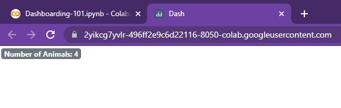

# Sheriff Styles ⭐️

<center> {width=800} </center>

*"I’m <font color='#DD6E0F'>Sheriff Styles</font>, in charge of all things related to design. Now see here, you fellers wouldn't happen to be on a <font color='#DD6E0F'>quest to create the ultimate dashboard</font>, now would yalls’?”*

We nod quietly as she beams at us and points to our laptop. *“Well then, show me whatcha got!”*

&nbsp; &nbsp;

As we show her our progress, from Installation Island to Dash’s Delta, she smiles.

*“Now, that’s great y’all. <font color='#DD6E0F'>But where’s the flavor? Where’s the heart? Where’s the style?</font>”*

She beckoned to a nearby treestump. *“Now take a seat and pay close attention to this advice...”*

???+ info "Sheriff Style's Notes 01"

    ## Badges

    Badges are an excellent way to better **display important information, especially numbers**. These elements can be accessed via the Dash Bootstrap components library and can easily be integrated into our dashboard.

    ### Basic Badge

    They can be used in conjunction with text, as shown below.

    ```python
    app = JupyterDash(__name__, external_stylesheets=[dbc.themes.BOOTSTRAP])

    app.layout = html.Div(children=[
        html.H1(["Number of Animals: ", dbc.Badge("4", className="ml-1")]),
        html.H3(["Number of Countries: ", dbc.Badge("19", className="ml-1")]),
        html.H5(["Number of Lego Sets: ", dbc.Badge("None Yet!", className="ml-1")])
    ])

    app.run_server(mode='external')
    ```

    <center> {width=800} </center>

    As seen, they match the size of the preceding text automatically. Additionally,
    they can include both numbers and words. When used by
    themselves, they default to the normal text size of `html.P()`, as shown below:

    ```python
    app = JupyterDash(__name__, external_stylesheets=[dbc.themes.BOOTSTRAP])

    app.layout = html.Div([
        dbc.Badge("Number of Animals: 4", className="ml-1")
    ])

    app.run_server(mode='external')
    ```

    <center> {width=800} </center>

    &nbsp; &nbsp;

    ### Coloring

    These badges can be colored as well. They come in a total of eight different pre-built
    color options, outlined here: `primary`, `secondary`, `success`, `warning`, `danger`, `info`, `light`.
    In this example, they've all been wrapped into a row (placed side-by-side) so that the differences in colors
    can easily be visualized.  

    ```python
    app = JupyterDash(__name__, external_stylesheets=[dbc.themes.BOOTSTRAP])

    colors = ['primary', 'secondary', 'success', 'warning', 'danger', 'info', 'light']

    app.layout = html.Div(
                      dbc.Row(
                            [html.H1(["", dbc.Badge(value, color=value, className="ml-1")]) for value in colors] ,

                      style = {
                          "margin-left":"1rem"
                      }
                )
    )

    app.run_server(mode='external')
    ```

    <center> {width=800} </center>

    By wrapping each in an empty `html.H1()`, the size of
    each badge can be easily increased (a nice little trick 😄).


    &nbsp; &nbsp;

    ### Pills, Links

    Badges can also be reshaped into pills (with ovalish corners) and have embedded links. The
    pills can be set simply via `pill=True` and the embedded link can be
    changed via the `href` argument.

    ```python
    app = JupyterDash(__name__, external_stylesheets=[dbc.themes.BOOTSTRAP])

    app.layout = html.Div(
                      dbc.Row([
                                html.H1(["", dbc.Badge("Click Me!", color='info', pill=True, href="https://google.com", className="ml-1")])
                              ],
                      style = {
                          "margin-left":"1rem"
                      }
                )
    )

    app.run_server(mode='external')
    ```

    <center> {width=800} </center>

    And those are the core functionalities of badges! As we'll see in the ensuing chapter (TigerGraph Tundra), they
    can come in quite handy when calling attention to text-based information...

    > NOTE: For more information, feel free to check out the following resources:
    [dbc.Badge()](https://dash-bootstrap-components.opensource.faculty.ai/docs/components/badge/)


The Sheriff continues onwards...

???+ info "Sheriff Style's Notes 02"

    ## HTML Elements

    We can further modify the layout of our dashboard, especially text, by using Dash’s HTML elements.

    ### Centering

    Going back to our title card from ***Dash's Delta***, we can easily center text using `html.Center()`.

    ```python
    titleCard =  dbc.Card([
                    dbc.CardBody([
                                  html.H1("Welcome to Dash!", className='card-title'),
                                ])
                  ],
                  color='dark', # Options include: primary, secondary, info, success, warning, danger, light, dark
                  inverse=True,   
                  style={
                      "width":"55rem",
                      "margin-left":"1rem",
                      "margin-top":"1rem",
                      "margin-bottom":"1rem"
                      }
                )

    app = JupyterDash(__name__, external_stylesheets=[dbc.themes.BOOTSTRAP])

    app.layout = html.Div([
       dbc.Row([
                html.Center(titleCard),
               ],
               justify="center",
               style = {
                   "margin-left": "0.5rem"
               }
       ),
    ])

    app.run_server(mode='external')
    ```

    <center> {width=800} </center>

    This can be used to center any component, beyond just text and cards!

    &nbsp; &nbsp;

    ### Horizontal Rule (Hr)

    The `html.Hr()` function creates a thin horizontal line that stretches across the page. This
    can be used to separate distinct sections from one another or for easy aesthetic design.

    For example,

    ```python
    app = JupyterDash(__name__, external_stylesheets=[dbc.themes.BOOTSTRAP])

    app.layout = html.Div([
                  html.Center(titleCard),
                  html.Hr(),
                  html.Center(html.P("Now, we can dive further into this topic...", style={'fontSize':20}))
    ])

    app.run_server(mode='external')
    ```

    <center> {width=800} </center>

    &nbsp; &nbsp;

    ### Line Break (Br)

    The `html.Br()` function creates a small line break that can be used to separate text,
    paragraphs, or components. The size of the line break can be seen below:

    ```python
    app = JupyterDash(__name__, external_stylesheets=[dbc.themes.BOOTSTRAP])

    app.layout = html.Div([
                  html.Center(titleCard),
                  html.Hr(),
                  html.Center(html.P("Now, we can dive further into this topic...", style={'fontSize':20})),
                  html.Br(),
                  html.Center(html.P("Before we begin, we need to put on our thinking caps!", style={'fontSize':20}))
    ])

    app.run_server(mode='external')
    ```

    <center> {width=350} {width=350}</center>

    And those are the core HTML components to help with style!

*"Next up, an easier way to format text!"* exclaims the Sheriff.

???+ info "Sheriff Style's Notes 03"

    ## dcc.Markdown()

    Markdown allows for the insert of Markdown into Dash (pretty intuitive naming 😅). It's quite straightforward!

    ```python
    app = JupyterDash(__name__, external_stylesheets=[dbc.themes.BOOTSTRAP])

    app.layout = html.Div([dbc.Col(
                  dcc.Markdown("""
                                # This is a title!
                                Hello There! This is in **bold** while this is in *italics*
                                * Neat, it's a list :)
                                * Woah, possible foreshadowing?

                                Check out [Google](https://google.com)
                               """
                              )
                  )
    ])

    app.run_server(mode='external')
    ```

    <center> {width=800} </center>    

    In order to create a title, we can simply use the `#`. **Bolded text** is performed using
    the `**` symbols, while *italics* are added via the `*` symbol. In order to create lists,
    we can use the `* ` symbol (asterisk with a space). Links are as simple as
    adding the visible text in square brackets and placing the link itself in parenthesis.

    > NOTE: For more information, feel free to check out the following resources:
    [dcc.Markdown()](https://dash.plotly.com/dash-core-components/markdown)


*"The last thing we need to cover are lists!"*

&nbsp; &nbsp;

???+ info "Sheriff Style's Notes 04"

    ## List Group

    Dash Bootstrap's List Groups allow for the creation of **stylish lists** with ease. These lists
    can be used to store information, serve as embedded links, and help <font color='#DD6E0F'>users better
    navigate and understand the layout</font> of one's dashboard.

    To create a basic list, we use the following:

    ```python
    app = JupyterDash(__name__, external_stylesheets=[dbc.themes.BOOTSTRAP])

    app.layout = html.Div([
                   dbc.ListGroup([
                      dbc.ListGroupItem("First is the worst!"),
                      dbc.ListGroupItem("Second is the best!"),
                      dbc.ListGroupItem("Third is the one with the Treasure Chest!")
                   ]),
    ])

    app.run_server(mode='external')
    ```

    <center> {width=800} </center>   

    The `dbc.ListGroup()` element simply holds different list group items.

    However, this list
    spans the entire width of the page (or its parent component) by default. In order to adjust
    its width, we can wrap the List Group within a `dbc.Col()` element from earlier.

    ```python
    app = JupyterDash(__name__, external_stylesheets=[dbc.themes.BOOTSTRAP])

    app.layout = html.Div([dbc.Col(
                   dbc.ListGroup([
                      dbc.ListGroupItem("First is the worst!"),
                      dbc.ListGroupItem("Second is the best!"),
                      dbc.ListGroupItem("Third is the one with the Treasure Chest!")
                   ]),
                   width=4
              )
    ])

    app.run_server(mode='external')
    ```

    <center> {width=800} </center>   

    There we go, much better! Now let's add some style...

    &nbsp; &nbsp;

    ### Coloring Cells

    In order to add color to each list item, we can simply use the `color` argument:

    ```python
    app = JupyterDash(__name__, external_stylesheets=[dbc.themes.BOOTSTRAP])

    app.layout = html.Div([dbc.Col(
                   dbc.ListGroup([
                      dbc.ListGroupItem("First is the worst!", color='danger'),
                      dbc.ListGroupItem("Second is the best!", color="success"),
                      dbc.ListGroupItem("Third is the one with the Treasure Chest!", color="info")
                   ]),
                   width=4
              )
    ])

    app.run_server(mode='external')
    ```

    <center> {width=800} </center>   

    As with other bootstrap components, the pre-built color options carry over in name and hue.

    &nbsp; &nbsp;

    ### Horizontal List

    Instead of keeping each list item stacked vertically, we can also arrange them horizontally.

    ```python
    app = JupyterDash(__name__, external_stylesheets=[dbc.themes.BOOTSTRAP])

    app.layout = html.Div([dbc.Col(
                   dbc.ListGroup([
                      dbc.ListGroupItem("First is the worst!", color='danger'),
                      dbc.ListGroupItem("Second is the best!", color="success"),
                      dbc.ListGroupItem("Third is the one with the Treasure Chest!", color="info")
                    ],
                   horizontal=True
                   ),
                   width=6
              )
    ])

    app.run_server(mode='external')
    ```

    <center> {width=800} </center>   

    As seen, it's just a matter of adding the `horizontal` argument to our `dbc.ListGroup()`.

    > NOTE: For more information, feel free to check out the following resources:
    [dbc.ListGroup()](https://dash-bootstrap-components.opensource.faculty.ai/docs/components/list_group/)

*"And voila, now you have most of the <font color='#DD6E0F'>core tools you need</font> to begin styling,"* finishes
the Sheriff.

She smiles at us and points towards the horizon,

*"As for where you're going to use these elements, you'll find your answer at the*
**TigerGraph Tundra**, *the next step of your journey. Follow these rivers east, and they'll*
*lead you to what you seek!"*  

&nbsp; &nbsp;

[^1]: All code segments from this chapter can be found in this
[Colab Notebook](https://colab.research.google.com/drive/1RRirZeUi_zSBEDS9lDJw1dsxth_V0f-9#scrollTo=NOgXSQOpM2mc).
Feel free to follow along!

[^2]: Everything we've installed so far (prerequistes for next section):
```python
!pip install -q pyTigerGraph
import pyTigerGraph as tg

TG_SUBDOMAIN = 'healthcare-dash'
TG_HOST = "https://" + TG_SUBDOMAIN + ".i.tgcloud.io" # GraphStudio Link

TG_USERNAME = "tigergraph" # This should remain the same...
TG_PASSWORD = "tigergraph" # Shh, it's our password!
TG_GRAPHNAME = "MyGraph" # The name of the graph

conn = tg.TigerGraphConnection(host=TG_HOST, graphname=TG_GRAPHNAME, username=TG_USERNAME, password=TG_PASSWORD, beta=True)
conn.apiToken = conn.getToken(conn.createSecret())

!pip install -q jupyter-dash

import dash
import dash_html_components as html
from jupyter_dash import JupyterDash

import plotly.express as px
import pandas as pd
import plotly.graph_objects as go

import dash_core_components as dcc

!pip install dash-bootstrap-components
import dash_bootstrap_components as dbc
```
