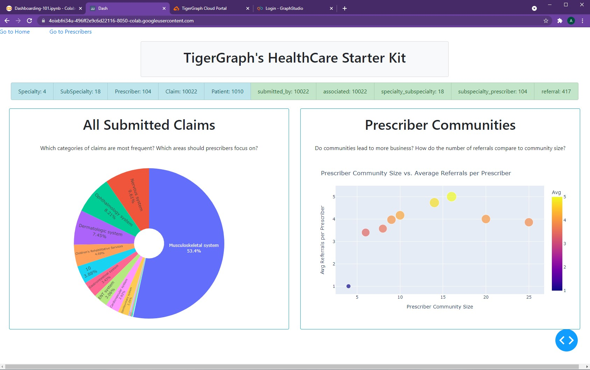
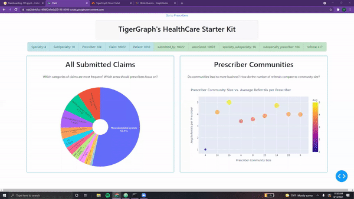

# The Multi-Page Monsters 🦖

<center> {width=800} </center>

After waving goodbye to our mysterious friend, we trudge onwards through the TigerGraph tundra, hoping to find the <font color='#DD6E0F'> *elusive elysium of elements* </font> described by the <font color='#DD6E0F'>TigerGraph protector</font>.

As we make our way in the harsh winds, we hear a roar echoing throughout the valley. Loud stomps grow closer and we clutch our laptop, trembling with panic.

A booming voice pierces through the bitter cold:

***“Ahh, we hear you’re on a quest! Well lucky for you, we can help!”***

Turning around, we see two strange figures beaming at us.

<font color='#DD6E0F'>*“We’re the Multi-Page monsters, and we have a way to* ***organize your cluttered dashboards!*** *”*</font>

In an attempt to reassure our quizzical expressions, they laughed.

*“Don’t worry! It’s <font color='#DD6E0F'>quite easy to clean up your dashboard by organizing it into multiple pages…</font>”*  


???+ info "Multi-Page Monster Notes 01"

    ## A Simple Multi-Page App

    The first step in creating **multiple pages for our Dash app** is to separate our content into *multiple distinct variables or elements*. For example, if we wish to create three pages, we can perform this by create <font color='#DD6E0F'>three content variables</font>:

    ```python
    page1_content = html.Div(html.H1("This is Pg. 1!"))
    page2_content = html.Div(html.H1(html.B("This is Pg. 2!")))
    page3_content = html.Div(html.H1(html.I("This is Pg. 3!")))
    ```

    Next, we must change our app layout to reflect this:

    ```python
    app = JupyterDash(__name__)

    app.layout = html.Div([
        dcc.Location(id='url', refresh=False),
        html.Div(id='page-content')
    ])

    @app.callback(dash.dependencies.Output('page-content', 'children'),
                  [dash.dependencies.Input('url', 'pathname')])

    def display_page(pathname):
      if pathname == "/":
        return page1_content
      elif pathname == "/page2":
        return page2_content
      elif pathname == "/page3":
        return page3_content

    app.run_server(mode='external')
    ```

    And now, running the app will only show us the first page!

    <center> {width=800} </center>

    However, entering the proper link will take us to pages 2 and 3.

    <center> {width=800} </center>

    <center> {width=800} </center>

    &nbsp; &nbsp;

    How are we doing this? Well, using a simple callback...

    As defined below the app layout, the <font color='#DD6E0F'>input is simply the pathname of the current page</font>. The output is the page-content, an `html.Div` element that we've defined in our app layout. This is where the **importance of element id's** comes into play! *For any element that will be updated via a callback, an id is needed.*

    ```python
    @app.callback(dash.dependencies.Output('page-content', 'children'),
              [dash.dependencies.Input('url', 'pathname')])
    ```

    Breaking down the function `display_page()`, we simply compare the pathname to several predefined, valid pages. Then, the respective content is returned. This content is stored and displayed in `html.Div(id='page-content')`.

    > NOTE: We will **cover callbacks in the next chapter!** This is merely an <font color='#DD6E0F'>intro used to navigate through pages</font>.

    &nbsp; &nbsp;

    Yet entering any other link will lead to a blank page... uh oh!

    <center> {width=800} </center>

    We need to make sure that the user **doesn't accidentally access any unauthorized or unbuilt pages**. They should only be able to access the extension links that we've provided. In order to secure this,
    we can use <font color='#DD6E0F'>Dash Bootstrap...</font>

    ### Dash Jumbotron

    The Dash Jumbotron is a Bootstrap component that is used to **showcase important messages**. In this case, we'll use it to display a <font color='#DD6E0F'>"404 error message" whenever the user reaches an unauthorized page</font>.

    Adding this jumbotron is quite simple.

    ```python
    app = JupyterDash(__name__, external_stylesheets=[dbc.themes.BOOTSTRAP])

    app.layout = html.Div([
        dcc.Location(id='url', refresh=False),
        html.Div(id='page-content')
    ])

    @app.callback(dash.dependencies.Output('page-content', 'children'),
                  [dash.dependencies.Input('url', 'pathname')])

    def display_page(pathname):
      if pathname == "/":
        return page1_content
      elif pathname == "/page2":
        return page2_content
      elif pathname == "/page3":
        return page3_content

      return dbc.Jumbotron(
            [
                html.H1("404: Not found", className="text-danger"),
                html.Hr(),
                html.P("Uh oh! Unfortunately, the pathname {} was unable to be recognised...".format(pathname)),
            ]
        )

    app.run_server(mode='external')
    ```

    <center> {width=800} </center>

    And just like that, we've put together a **simple multi-page app!**

    In order to modify each page, we can simply change the `html.Div()` element to contain our page's components. To add pages, we can extend our if/else. Yet as of now, users can *only navigate by entering each page's link.*

*"This isn't the best way to navigate across pages... Users <font color='#DD6E0F'>shouldn't have to manually enter the link</font> for each page they wish to reach. Let's take this example one step further..."*

&nbsp; &nbsp;

???+ info "Multi-Page Monster Notes 02"

    ## Comprehensive Multi-Page App  

    Let's use our <font color='#DD6E0F'>Healthcare Dashboard</font> and partition it into **two pages**.

    * <font color='#DD6E0F'>General Page</font> - Contains our **title**, **listgroups**, **pie**, and **scatter plot**
    * <font color='#DD6E0F'>Prescriber Page</font> - contains our **table**, **bar chart**, and **network graph**  

    &nbsp; &nbsp;

    ### Global Styles and Variables

    In order to create a better multi-page app, we must first *determine what content is shared across our multiple pages*. We can declare these as **global variables** and have them unchanged upon navigating across pages. This way, our dashboard is <font color='#DD6E0F'>more responsive as there is less to recompute upon each refresh</font>.

    > NOTE: At the moment, we **don't have any shared content**. However, this will <font color='#DD6E0F'>change in future chapters!</font>

    &nbsp; &nbsp;

    ### The Two Pages

    Now, we can create **content variables** for each of the two pages, stored below:

    ```python
    generalPage = html.Div([
                    dbc.Row(titleCard, justify="center"),
                    dbc.Row(statsListGroup, justify="center"),
                    html.Br(),

                    dbc.Row([
                      pieChartCard,
                      scatterChartCard,
                      ],
                      justify="center"
                    ),

                  ])

    prescriberPage = html.Div([
                      dbc.Row([
                        dbc.Col(tableCard),
                        dbc.Col([
                                barCard,
                                networkCard
                                ],
                            )
                          ],
                          justify='center'
                      ),
                  ])
    ```

    As seen, we just *split the two pages* where our original `html.Hr()` used to be!

    Now, we can add in the simple callback to load the correct page.

    ```python
    app = JupyterDash(__name__, external_stylesheets=[dbc.themes.BOOTSTRAP])

    app.layout = html.Div([
        dcc.Location(id='url', refresh=False),
        html.Div(id='page-content')
    ])

    @app.callback(dash.dependencies.Output('page-content', 'children'),
                  [dash.dependencies.Input('url', 'pathname')])

    def display_page(pathname):
      if pathname == "/":
        return generalPage
      elif pathname == "/pre":
        return prescriberPage

      return dbc.Jumbotron(
            [
                html.H1("404: Not found", className="text-danger"),
                html.Hr(),
                html.P("Uh oh! Unfortunately, the pathname {} was unable to be recognised...".format(pathname)),
            ]
        )

    app.run_server(mode='external')
    ```

    &nbsp; &nbsp;

    And here's our dashboard, now with multiple pages!

    <center> {width=800} </center>

    <center> {width=800} </center>

    &nbsp; &nbsp;

    ### Dash Links

    However, having to <font color='#DD6E0F'>manually enter the url for each specific page is **not a good practice**.</font>

    Luckily, Dash provides several methods for navigating through pages. One of the most common
    components used for navigation is the **Dash Link**, which allows users to select which page
    they wish to reach. Let's take a look!

    We simply modify our `app.layout` to include two `dcc.Link()`'s. These are essentially
    *Dash's equivalent of hyperlinks*. No additional callbacks needed, these links function perfectly by themselves!

    ```python
    app.layout = html.Div([
        dcc.Location(id='url', refresh=False),
        dbc.Row([
                 dbc.Col(dcc.Link("Go to Home", href='/'), width=1),
                 dbc.Col(dcc.Link('Go to Prescribers', href='/pre'), width=2),
                ],
                justify="start",
        ),
        html.Div(id='page-content')
    ])
    ```

    <center> {width=800} </center>

    &nbsp; &nbsp;

    By including the `dbc.Row()` with our two links outside of `html.Div(id='page-content')`,
    it remains <font color='#DD6E0F'>static and present in the same location on all pages</font>. However, this may not
    always be needed. For example, we don't need to the *"Go to Prescribers"* hyperlink when
    we are already on that page. To overcome this, we turn to our **layout variables**.

    By adding one `dcc.Link` in each of our pages, we can *remove any unnecessary overlap*.

    ```python
    generalPage = html.Center(html.Div([
                    dbc.Col(dcc.Link("Go to Prescribers", href='/pre'), width=2),
                    dbc.Row(titleCard, justify="center"),
                    dbc.Row(statsListGroup, justify="center"),
                    html.Br(),

                    dbc.Row([
                      pieChartCard,
                      scatterChartCard,
                      ],
                      justify="center"
                    ),

                  ]))

    prescriberPage = html.Center(html.Div([
                      dbc.Col(dcc.Link("Go to Home", href='/'), width=1),
                      prescriberTitleCard,         

                      dbc.Row([
                        dbc.Col(tableCard),
                        dbc.Col([
                                barCard,
                                networkCard
                                ],
                            )
                          ],
                          justify='center'
                      ),
                  ]))
    ```

    <center> {width=800} </center>

    Once again, no callbacks needed! This functions perfectly using the `app.layout` from before.

The first monster paused,

***"This is how one can may <font color='#DD6E0F'>piece together a multi-page app</font>. However, it is essential to learn
more about callbacks before being able to continue adding intricate functionalities to our dashboard."***

The second monster started jumping up and down,

***"Oooh! Oooh! Is it my turn to explain now? I love callbacks!!"***

The first monster sighed, and beckoned at its companion to begin...

&nbsp; &nbsp;

[^1]: All code segments from this chapter can be found in this
[Colab Notebook](https://colab.research.google.com/drive/1RRirZeUi_zSBEDS9lDJw1dsxth_V0f-9#scrollTo=SoCB15_Q_XWD).
Feel free to follow along!

[^2]: Everything we've installed so far (prerequistes for next section):
```python
!pip install -q pyTigerGraph
import pyTigerGraph as tg

TG_SUBDOMAIN = 'healthcare-dash'
TG_HOST = "https://" + TG_SUBDOMAIN + ".i.tgcloud.io" # GraphStudio Link

TG_USERNAME = "tigergraph" # This should remain the same...
TG_PASSWORD = "tigergraph" # Shh, it's our password!
TG_GRAPHNAME = "MyGraph" # The name of the graph

conn = tg.TigerGraphConnection(host=TG_HOST, graphname=TG_GRAPHNAME, username=TG_USERNAME, password=TG_PASSWORD, beta=True)
conn.apiToken = conn.getToken(conn.createSecret())

!pip install -q jupyter-dash

import dash
import dash_html_components as html
from jupyter_dash import JupyterDash

import plotly.express as px
import pandas as pd
import plotly.graph_objects as go

import dash_core_components as dcc

!pip install dash-bootstrap-components
import dash_bootstrap_components as dbc

!pip install dash-cytoscape
import dash_cytoscape as cyto
```
