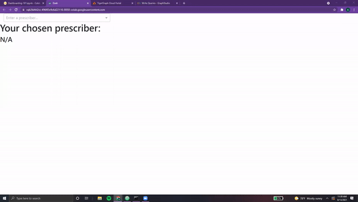

---
template: overrides/main.html
---

# Confronted by Callbacks 🦕

<center> {width=800} </center>

The second monster grinned,

***"Callbacks are essential to make one's dashboard dynamic! They allow the user to interact with one's page. Luckily for you travelers, I'm quite the expert when it comes to this area."***

The first monster groaned and rolled his eyes,

***"Yes yes, quite the professional. Can you just get on with it?"***

The second monster laughed. Tracing words into the snow, he began to explain...

???+ info "Callback Notes 01"

    ## A Simple Callback

    Callbacks are <font color='#DD6E0F'>functions that are **called automatically** by Dash everytime a **component's property changes**</font>. They allow for dynamic pages. We had taken a look at a simple callback in the last chapter, but let's *flesh it out further*.

    For reference, here's the code segment from before.

    ```python
    app = JupyterDash(__name__, external_stylesheets=[dbc.themes.BOOTSTRAP])

    app.layout = html.Div([
        dcc.Location(id='url', refresh=False),
        html.Div(id='page-content')
    ])

    @app.callback(dash.dependencies.Output('page-content', 'children'),
                  [dash.dependencies.Input('url', 'pathname')])

    def display_page(pathname):
      if pathname == "/":
        return generalPage
      elif pathname == "/pre":
        return prescriberPage

      return dbc.Jumbotron(
            [
                html.H1("404: Not found", className="text-danger"),
                html.Hr(),
                html.P("Uh oh! Unfortunately, the pathname {} was unable to be recognised...".format(pathname)),
            ]
        )

    app.run_server(mode='external')
    ```

    * As seen, our callback is **introduced with the `@` symbol**
    * It can take a **list of Output** elements as well as a **list of Input** elements
    * In our example, it takes in the input with the ID `'url'`. This component is `dcc.Location(id=url, refresh=False)`, which is a Dash element that <font color='#DD6E0F'>simply keeps track of the url of the current page</font>.
    * In our example, the output element is `html.Div(id='page-content')`, which is just an *empty placeholder*. It's contents are currently empty, but replaced by the callback **upon each url change**

    &nbsp; &nbsp;

    That wasn't too bad to explain! As seen above, callbacks consist of:

    * **Header** - specified by `@app.callback()`, followed immediately by a...
    * **Function** - can be *titled anything*, takes in the <font color='#DD6E0F'>callback input as a parameter</font>.

    Let's take a look at a more complicated input!

    &nbsp; &nbsp;

    ### Introducing dbc.Button()

    Instead of just the url, what if we wanted to add *more aesthetic functionality* directly onto our dash page. One way to do this is with `dbc.Button()` element, which allows for <font color='#DD6E0F'>cleaner clickability</font>.

    This bootstrap component is quite easy to set up.

    ```python
    generalPage = html.Center(html.Div([
                    dbc.Col(dbc.Button(
                          "Switch Pages", id="switch-button",
                          className="mr-2", n_clicks=0, color="info", href="/pre"
                        ),
                        width=2
                    ),
                    dbc.Row(titleCard, justify="center"),
                    dbc.Row(statsListGroup, justify="center"),
                    html.Br(),

                    dbc.Row([
                      pieChartCard,
                      scatterChartCard,
                      ],
                      justify="center"
                    ),

                  ]))

    prescriberPage = html.Center(html.Div([
                      dbc.Col(dbc.Button(
                            "Switch Pages", id="switch-button",
                            className="mr-2", n_clicks=0, color="info", href="/"
                          ),
                          width=2
                      ),
                      prescriberTitleCard,         

                      dbc.Row([
                        dbc.Col(tableCard),
                        dbc.Col([
                                barCard,
                                networkCard
                                ],
                            )
                          ],
                          justify='center'
                      ),
                  ]))
    ```

    <center> {width=800} </center>

    And that's it. <font color='#DD6E0F'>No callbacks needed, at least for now</font>.

    However, the button does have *several other functionalities* beyond serving
    as a glorified hyperlink. It can keep track of the **number of clicks**,
    serve as a method to **download files**, and be customized to **change on click**.

    > NOTE: For more information on Buttons, feel free to check out the following resources:
    [`dbc.Button()`](https://dash-bootstrap-components.opensource.faculty.ai/docs/components/button/)

    &nbsp; &nbsp;

    ### Introducing dcc.Input()

    For more intricate input, we turn to `dcc.Input()`.

    This Dash Core Component supports <font color='#DD6E0F'>several types of text entry</font>, including:

    * **"text"** - regular text, any character goes!
    * **"number"** - numbers and hyphens (for negative) signs only
    * **"password"** - each entered character will be shown as a black dot
    * **"email"** - will ensure that entered text is a valid email format
    * **"tel"** - will ensure that entered text is a valid telephone format

    This element is quite powerful, and can easily be incorporated as shown in this example:

    ```python
    app = JupyterDash(__name__, external_stylesheets=[dbc.themes.BOOTSTRAP])

    app.layout = html.Div([
        dcc.Input(
          id="example-input",
          type="number",
          placeholder="Please enter a number."  
        ),
        html.H1("Your number squared is:"),
        html.Div(id='page-content')
    ])

    @app.callback(dash.dependencies.Output('page-content', 'children'),
                  [dash.dependencies.Input('example-input', 'value')])

    def display_page(value):
      if value is None:
        return html.H3("N/A")
      return html.H3(value*value)


    app.run_server(mode='external')
    ```

    <center> {width=800} </center>

    &nbsp; &nbsp;

    Taking a closer look, we see that the id of the `dcc.Input()` is used in our callback.
    It's `value` attribute is passed in as the <font color='#DD6E0F'>sole parameter of our callback function</font>. Additionally,
    the input type has been specified to be a number.

    Additionally, it's good practice to ensure that <font color='#DD6E0F'>regardless of the input, the callback returns **some**
    **acceptable value**!</font> Even if it's an empty `html.Div()` element, it's good practice to
    make sure that there are no edge cases.

    &nbsp; &nbsp;

    > NOTE: Fore more information on input, feel free to check out the following resources:
    [`dcc.Input`](https://dash.plotly.com/dash-core-components/input)


*"Now, it's time to take these callbacks and <font color='#DD6E0F'>apply them to your dashboard</font>!"*

???+ info "Callback Notes 02"

    Currently, the Prescribers page is *static, fixed with the value "pre-78"*. Let's change this so that users
    may able to <font color='#DD6E0F'>search for any valid prescriber within the Graph</font>. First, we need a list of all valid options...

    ## Acceptible Prescribers (Query)

    Using our knowledge from the <font color='#DD6E0F'>**TigerGraph Tundra**</font>, we can write a query that returns all Prescriber IDs.

    ```python
    AllPrescribers = '''USE GRAPH MyGraph
    CREATE QUERY AllPrescribers() FOR GRAPH MyGraph {
      ListAccum<Vertex<Prescriber>> @@allPrescribers;

      start = {Prescriber.*};

      allPres = SELECT p
                  FROM start:p
                  ACCUM @@allPrescribers += p;

      PRINT @@allPrescribers as allPrescribers;
    }
    INSTALL QUERY AllPrescribers'''

    print(conn.gsql(AllPrescribers, options=[]))
    ```

    Running this query gives us the following output,

    <center> {width=800} </center>

    &nbsp; &nbsp;

    Now, we can package it into the appropriate format as follows.

    ```python
    def getPresList():
      pres = conn.runInstalledQuery("AllPrescribers")[0]['allPrescribers']
      return [{'label':x, 'value':x} for x in pres]
    ```

    Awesome! The question remains, <font color='#DD6E0F'>*how do we incorporate this list into our search?*</font>

    Although `dcc.Input()` can support this sort of wordbank in searches, for a simpler implementation
    we will utilize its close relative, `dcc.Dropdown()`. Let's take a closer look...

    &nbsp; &nbsp;

    ## Using dcc.Dropdown()

    Dash's Dropdown allows users to <font color='#DD6E0F'>select values **from a given list of possible options**</font>.

    This component is very powerful, allowing for **multi-value selection**, the ability to **disable certain options**,
    the ability to **clear certain options**, and the
    real-time **updating of options** based on the user's search terms.

    &nbsp; &nbsp;

    For this example, we will be using a basic implementation.

    ```python
    app = JupyterDash(__name__, external_stylesheets=[dbc.themes.BOOTSTRAP])

    presList = getPresList()

    app.layout = html.Div([
        dbc.Col(
            dcc.Dropdown(
              id="example-input",
              placeholder="Enter a prescriber..." ,
              options=presList
            ),
            width=3
        ),
        html.H1("Your chosen prescriber:"),
        html.Div(id='page-content')
    ])

    @app.callback(dash.dependencies.Output('page-content', 'children'),
                  [dash.dependencies.Input('example-input', 'value')])

    def display_page(value):
      if value is None:
        return html.H3("N/A")
      return html.H3(value + " is valid!")


    app.run_server(mode='external')
    ```

    &nbsp; &nbsp;

    Breaking it down, we specify the **id**, **placeholder text**, and **list of options**
    for our Dropdown element. Then, within our callback, we simply display the
    chosen value as well as some accompanying text. Here's the result.

    <center> {width=800} </center>

    &nbsp; &nbsp;

    See, that wasn't so bad! Simple, yet quite powerful.

    > NOTE: For more information on Dropdown, feel free to check out the following resources:
    [`dcc.Dropdown()`](https://dash.plotly.com/dash-core-components/dropdown)

    &nbsp; &nbsp;

    ## Putting it Together

    Let's incorporate this search into our Prescribers Page.

    ```python
    dropdown = dbc.Col(
                        dcc.Dropdown(
                          id="pres-dropdown",
                          placeholder="Enter a prescriber..." ,
                          options=getPresList()
                        ),
                        width=3
                      )

    def prescriberPage(pres):
      prescriberTitleCard, tableCard, barCard, networkCard = getPrescriberInfo(pres)

      page = html.Center(html.Div([
                dbc.Row([
                    dropdown,
                    dbc.Col(dbc.Button(
                          "Switch Pages", id="switch-button",
                          className="mr-2", n_clicks=0, color="info", href="/"
                        ),
                        width=2
                      ),     
                  ],
                  justify='center'
                ),
                prescriberTitleCard,         

                dbc.Row([
                  dbc.Col(tableCard),
                  dbc.Col([
                          barCard,
                          networkCard
                          ],
                      )
                    ],
                    justify='center'
                ),
            ]))

      return page
    ```

    First, we create our dropdown component.

    Next, we create a **parameterized function** that returns the <font color='#DD6E0F'>prescriber page for a given prescriber</font>.
    Within this function, we incorporate the dropdown component (in the first `dbc.Row()`).

    Now, we need to create our app and its callbacks.

    ```python
    app = JupyterDash(__name__, external_stylesheets=[dbc.themes.BOOTSTRAP], suppress_callback_exceptions=True)

    presPage = html.Div(prescriberPage("pre78"), id='pres-content')

    app.layout = html.Div([
        dcc.Location(id='url', refresh=False),
        html.Div(id='page-content')
    ])

    @app.callback(dash.dependencies.Output('page-content', 'children'),
                  [dash.dependencies.Input('url', 'pathname')])

    def display_page(pathname):
      if pathname == "/":
        return generalPage
      elif pathname == "/pre":
        return presPage

      return dbc.Jumbotron(
            [
                html.H1("404: Not found", className="text-danger"),
                html.Hr(),
                html.P("Uh oh! Unfortunately, the pathname {} was unable to be recognised...".format(pathname)),
            ]
        )

    @app.callback(dash.dependencies.Output('pres-content', 'children'),
                  [dash.dependencies.Input('pres-dropdown', 'value')])

    def update_pres(value):
      if value is not None:
        return prescriberPage(value)

      return prescriberPage("pre78") # Our default value


    app.run_server(mode='external')
    ```

    Several changes from before, so let's take a closer look!

    * First, we create a **new variable** to hold the contents of our prescriber page. Named `presPage`, this element
    contains a <font color='#DD6E0F'>unique id and is set to store the default prescriber page</font> value using Prescriber #78.

    * Next, we leave our `app.layout()` and first callback untouched. These allow for navigation.

    * In order to utilize the value of the dropdown, we write a **new callback**. This time, it's input is the
    `pres-dropdown` component. This callback function simply <font color='#DD6E0F'>returns the Prescriber Page with the given prescriber</font>.

    * Note that we've had to add `suppress_callback_exceptions=True` in order to prevent warning pop-ups. This is because when we are on the general page, the dropdown element has not been loaded yet. Although this is not an issue, Dash registers this as a warning!

    > NOTE: **Dashboards can have as many callbacks as desired.** Although each callback can take unlimited inputs, <font color='#DD6E0F'>each
    output can only be utilized once in a callback</font>. For example, one cannot have two callbacks that both output `page-content`.
    This will return an error when loading the Dash app. ***This is why `dash.dependencies.Output()` is simply one
    element, while `dash.dependencies.Input()` is within a list.***

    &nbsp; &nbsp;

    <center> {width=800} </center>

    And with that, we have the first verison of our dynamic dashboard!


The second monster grins,

***"Yay! See, I told you I knew a lot about callbacks!***

***If you want to learn more, continue onwards past the Tundra. I've heard tales of a great
<font color='#DD6E0F'>Elysium of Elements</font> in that direction. Maybe you can learn more about dashboards there?"***

Beaming with pride, we wave goodbye and head off into the horizon.

&nbsp; &nbsp;

[^1]: All code segments from this chapter can be found in this
[Colab Notebook](https://colab.research.google.com/drive/1RRirZeUi_zSBEDS9lDJw1dsxth_V0f-9#scrollTo=O9mqWSCLCA9C).
Feel free to follow along!

[^2]: Everything we've installed so far (prerequistes for next section):
```python
!pip install -q pyTigerGraph
import pyTigerGraph as tg

TG_SUBDOMAIN = 'healthcare-dash'
TG_HOST = "https://" + TG_SUBDOMAIN + ".i.tgcloud.io" # GraphStudio Link

TG_USERNAME = "tigergraph" # This should remain the same...
TG_PASSWORD = "tigergraph" # Shh, it's our password!
TG_GRAPHNAME = "MyGraph" # The name of the graph

conn = tg.TigerGraphConnection(host=TG_HOST, graphname=TG_GRAPHNAME, username=TG_USERNAME, password=TG_PASSWORD, beta=True)
conn.apiToken = conn.getToken(conn.createSecret())

!pip install -q jupyter-dash

import dash
import dash_html_components as html
from jupyter_dash import JupyterDash

import plotly.express as px
import pandas as pd
import plotly.graph_objects as go

import dash_core_components as dcc

!pip install dash-bootstrap-components
import dash_bootstrap_components as dbc

!pip install dash-cytoscape
import dash_cytoscape as cyto
```
