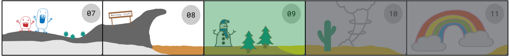
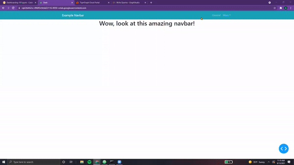
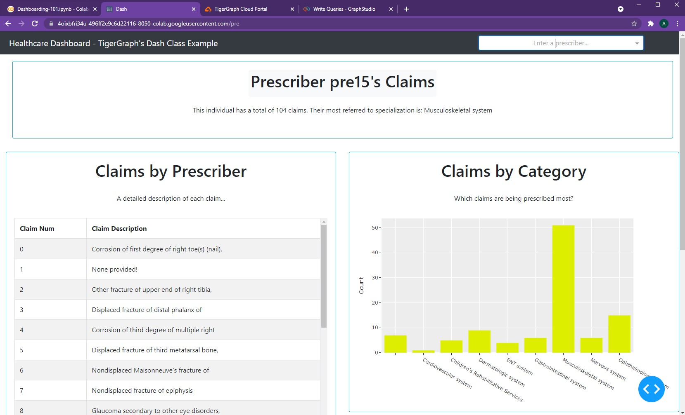
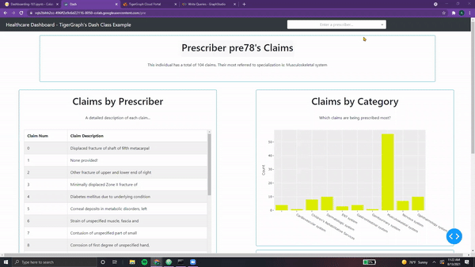

# Northern Navbars ⛄️

<center> {width=800} </center>

As we cross the Tundra, the snow begins to melt, leaving behind vast expanses of dirt and vegetation.
Soon, a strange sight crosses our eye. In the distance, there appears to be a *snowman meandering slowly*
*through the pine trees*.

Upon seeing us, it turns and waves.

*"Welcome, I'm here to <font color='#DD6E0F'>guide you along your quest!</font>*
*Follow me, and I'll teach you what you need to know. As your navigator, it's only fitting that we discuss the <font color='#DD6E0F'>importance of navbars!</font>"*

&nbsp; &nbsp;

Stranger and stranger! Pulling out our laptop, we began to listen...

???+ info "Navbar Notes 01"

    In the last two chapters, we learned how to navigate across the multiple pages of our dashboard.
    However, our current system is a little bit clunky. One possible way to fix this is by utilizing a nabvar...

    ## Creating Navbar Layout

    Adding a **navbar** to our dashboard allows for <font color='#DD6E0F'>easier navigation, providing a
    fixed, non-changing area of our app</font> which can be used to access other pages.
    In the previous chapter, we implemented a **dropdown** to navigate across pages.
    A navbar is as simple as <font color='#DD6E0F'>*wrapping this dropdown element into a* `dbc.Navbar()` *component*!</font>

    Let's start with a simple example using  `dbc.Navbarsimple()`:

    ```python
    navbar = dbc.NavbarSimple([
          dbc.NavItem(dbc.NavLink("General", href="/")),
          dbc.DropdownMenu(
              children=[
                  dbc.DropdownMenuItem("More pages", header=True),
                  dbc.DropdownMenuItem("Prescribers", href="/pre"),
                  dbc.DropdownMenuItem("TigerGraph Cloud", href="https://tgcloud.io/"),
              ],
              nav=True,
              in_navbar=True,
              label="More",
          ),
      ],
      brand="Example Navbar",
      brand_href="/",
      color="info",
      dark=True,
    )

    app = JupyterDash(__name__, external_stylesheets=[dbc.themes.BOOTSTRAP], suppress_callback_exceptions=True)

    app.layout = html.Div([
        dcc.Location(id='url', refresh=False),
        navbar,
        html.Center(html.H1("Wow, look at this amazing navbar!"))
    ])

    app.run_server(mode='external')
    ```

    Let's break it down!

    * First, we add a  `dbc.NavItem()` which contains a **link to the homepage**. As a
    result, the `href` tag is simply a `/`.
    * After this, we add our `dbc.DropdownMenu()`, very similar to `dbc.Dropdown()` from earlier. This dropdown
    contains a <font color='#DD6E0F'>header, titled "More Pages"</font>. Next, it contains a
    <font color='#DD6E0F'>link to our Prescribers page</font> as well as a link to the
    <font color='#DD6E0F'>TigerGraph Cloud Portal</font>. These links are added via `dbc.DropdownMenuItem()`.
    * With the `brand` attribute, we can **title our navbar** and change its home link.
    * Finally, we can modify the colors and styling of the navbar.

    Although we haven't included the pages themselves in this example, <font color='#DD6E0F'>clicking the menu items will update the url.</font>

    <center> {width=800} </center>

    &nbsp; &nbsp;

    Let's try another example using navbars!

The snowman excitedly exclaimed,

*"That <font color='#DD6E0F'>dropdown you created for your Prescribers page</font>... let's create a Navbar for that!"*

&nbsp; &nbsp;

???+ info "Navbar Notes 02"

    ## Adding Navbar Elements

    Let's add our dropdown to our navbar, and our navbar to our Prescriber Page.

    ```python
    dropdown = dbc.Row(dbc.Col(
                        dcc.Dropdown(
                          id="pres-dropdown",
                          placeholder="Enter a prescriber..." ,
                          options=getPresList(),
                          style={'width':'400px'}
                        ),
                       width=12, align="end"
                      ), style={"margin-left":"600px"})

    navbar = dbc.Navbar(
        [
            html.A(
                # Use row and col to control vertical alignment of logo / brand
                dbc.Row(
                    [
                        dbc.Col(dbc.NavbarBrand("Healthcare Dashboard - TigerGraph's Dash Class Example", className="ml-2")),
                    ],
                    align="center",
                    no_gutters=True,
                ),
                href="/",
            ),
            dropdown,
        ],
        color="dark",
        dark=True,
    )

    def prescriberPage(pres):
      prescriberTitleCard, tableCard, barCard, networkCard = getPrescriberInfo(pres)

      page = html.Center(html.Div([
                navbar,
                prescriberTitleCard,         

                dbc.Row([
                  dbc.Col(tableCard),
                  dbc.Col([
                          barCard,
                          networkCard
                          ],
                      )
                    ],
                    justify='center'
                ),
            ]))

      return page
    ```

    <center> {width=800} </center>

    &nbsp; &nbsp;

    As seen, the navbar simply contains a <font color='#DD6E0F'>hyperlinked header</font> (that takes one back the main page) and a <font color='#DD6E0F'>dropdown to enter prescriber information</font>. No additional changes need to be made to the callback function. Here's the result!

    <center> {width=800} </center>

    That helps make the Prescriber Page look a lot better!

    &nbsp; &nbsp;

    There's a few other options for Navbars as well, although we won't implement them for now:

    * **NavbarSimple** - according to Dash, *<font color='#DD6E0F'>"simpler, but less flexible"</font>*
    * **Navbar** - more <font color='#DD6E0F'>customizability</font>, but more intricate to set up
    * **NavbarBrand** - contains a <font color='#DD6E0F'>brand name</font> (meant essentially for text)
    * **NavbarToggler** - essentially a <font color='#DD6E0F'>button</font> (tracks clicks, times)

    > NOTE: For more information on navbars, feel free to check out the following resources:
    [`dbc.Navbar()`](https://dash-bootstrap-components.opensource.faculty.ai/docs/components/navbar/)

As the snowman finishes explaining to us, the dirt under our feet begins to slowly turn into sand.

*"This is it, the <font color='#DD6E0F'>end of the Tundra and the beginning of the Desert.</font> Continue through here, and you'll find the Elysium of Elements. Beyond that should lie your* **final destination, the last chapter.** *"*

&nbsp; &nbsp;

Before wandering away, the snowman reaches into his pocket and pulls out a sleeping gecko.

*"This is Geronimo. Keep him in your pocket and he will help you."*

As we cradle the gecko in our palms, he stirs and begins to slowly awaken.

&nbsp; &nbsp;

[^1]: All code segments from this chapter can be found in this
[Colab Notebook](https://colab.research.google.com/drive/1RRirZeUi_zSBEDS9lDJw1dsxth_V0f-9#scrollTo=CmtYn4u2Cpr9).
Feel free to follow along!

[^2]: Everything we've installed so far (prerequistes for next section):
```python
!pip install -q pyTigerGraph
import pyTigerGraph as tg

TG_SUBDOMAIN = 'healthcare-dash'
TG_HOST = "https://" + TG_SUBDOMAIN + ".i.tgcloud.io" # GraphStudio Link

TG_USERNAME = "tigergraph" # This should remain the same...
TG_PASSWORD = "tigergraph" # Shh, it's our password!
TG_GRAPHNAME = "MyGraph" # The name of the graph

conn = tg.TigerGraphConnection(host=TG_HOST, graphname=TG_GRAPHNAME, username=TG_USERNAME, password=TG_PASSWORD, beta=True)
conn.apiToken = conn.getToken(conn.createSecret())

!pip install -q jupyter-dash

import dash
import dash_html_components as html
from jupyter_dash import JupyterDash

import plotly.express as px
import pandas as pd
import plotly.graph_objects as go

import dash_core_components as dcc

!pip install dash-bootstrap-components
import dash_bootstrap_components as dbc

!pip install dash-cytoscape
import dash_cytoscape as cyto
```
