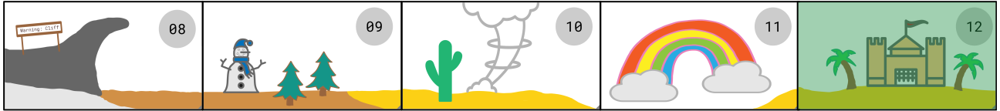

# Destination Deployment ✨

 {width=800} 

The figure examined our laptop and smiled,

***"I am the user. It is I who tasked you with this quest.***

***I couldn't be more proud of what you've learned and built in such a short time. But there's still
one last step left before the completion of your adventure: sharing your work with others.***

***Listen closely, and I'll show you two ways to deploy your dashboard..."***

***

???+ info "Destination Deployment 01"

    ## Heroku, Dash Enterprise

    According to the Plotly Website,

    > "Heroku is one of the easiest platforms for deploying and managing public Flask applications."

    &nbsp; &nbsp;

    Plotly Dash documents the step-by-step procedure needed to deploy one's app on **Heroku**.

    * Additional Resource: [Medium Guide 1](https://towardsdatascience.com/deploying-your-dash-app-to-heroku-the-magical-guide-39bd6a0c586c)
    * Additional Resource: [Medium Guide 2](https://towardsdatascience.com/how-to-deploy-your-dash-app-with-heroku-a4ecd25a6205)

    Another option is via the **paid Dash Enterprise** platform. Both options are doucmented by Plotly below.

    <iframe src="https://dash.plotly.com/deployment" id='heroku' width="100%" height=800></iframe>

    

***"And after the deployment, I only have one thing left to say..."***  

&nbsp; &nbsp;

???+ info "Destination Deployment 02"

    ## The Fantastic Finale

    Congratulations! You've **put together (and maybe even deployed)** your dashboard with TigerGraph + Plotly.

    
 {width=800} 

    &nbsp; &nbsp;

    
    It's time to celebrate now! 🥳🥳🥳

    Feel free to continue adding, maybe with a few queries and some of the elements from ***"Elysium of Elements"***.

    Additionally, there are quite a few examples of other Starter Kits under the ***"Examples"*** tab!.

    Finally, make sure to connect with the TigerGraph + Plotly community (found under the ***"Community"*** tab).

    &nbsp; &nbsp;

    Best of luck, and remember to share your cool work with others in the developer world!

    

      
      Congratulations, you've completed TigerGraph's Dash Adventure! 

    

&nbsp; &nbsp;
