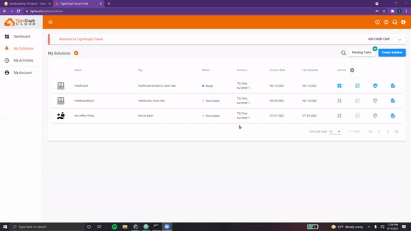
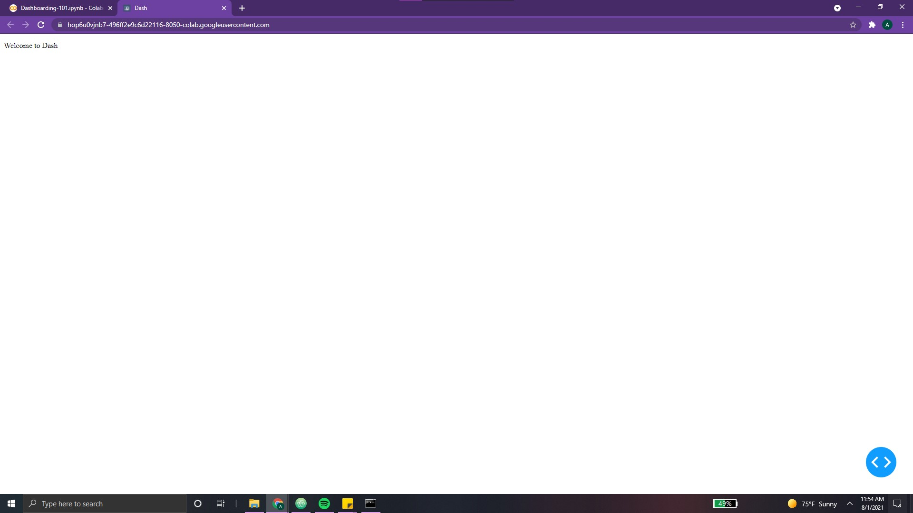
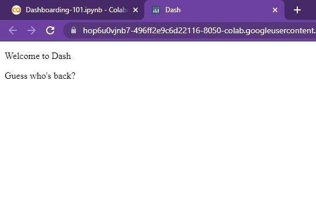

# Installation, First Dash App

## Ch 01 - Installation

??? info "Creating our Solution"

    ### Creating our Solution

    **Welcome to Step 1 of the Beginner’s Guide to Dashboarding!**

    In order to load and store the data for our dashboard, we must create a new TigerGraph solution.

    To do this, we can:

    1. Navigate to [**TigerGraph’s Cloud Portal**](https://tgcloud.io/)
    2. **Login/Register** for free using our email address
    3. Click on the blue **“Create Solution”** button
    4. Nagvigate to the Healthcare tab
    5. Select **“Healthcare Engine”** Starter Kit

    > NOTE: For the purposes of learning dashboarding, we will be using TigerGraph’s
    Healthcare Engine Starter Kit. This Starter Kit comes with over # vertices, # edges,
    and [still need to finish researching this] data attributes.

    &nbsp;
    &nbsp;

    <center> {width=800} </center>

    &nbsp;
    &nbsp;


    Next, we must enter the details for our solution.

    1. <font color='#DD6E0F'> Name </font> - This we can simply keep as **"Healthcare Engine"**
    2. <font color='#DD6E0F'> Tags </font> - We can add "Dashboard", **"Healthcare"**
    3. <font color='#DD6E0F'> Password </font> - By default, it's **"tigergraph"**
    4. <font color='#DD6E0F'> Subdomain </font> - This can be **"healthcare-dash"**

    > NOTE: Make sure that your subdomain name is unique! (two solutions cannot have the same subdomain at the same time.
    This subdomain name is used to access your solution (via GraphStudio, for example)

    &nbsp;
    &nbsp;

    <center> {width=800} </center>

    &nbsp;
    &nbsp;

    Once this has been completed, click **“Next”** and then **“Submit”**.

    And voila, in a few seconds, our <font color='#DD6E0F'> solution should go from “Uninitialized” to “Ready”! </font>

??? info "Loading our Data"

    ### Loading our Data

    **Ahh, you've reached Step 2 of the Beginner’s Guide to Dashboarding!**

    Next up, it’s time to load in our data. To do this, we need to:

    1. Open <font color='#DD6E0F'> GraphStudio </font> by selecting it from the **Applications tab**
    2. Click on **MyGraph**. This is the graph we’ll be using

    > NOTE: Additional graphs can be added, deleted, and modified as desired by
    the user. For the purposes of this dashboard, we will be using the default
    graph the Healthcare Engine Starter Kit comes with.

    &nbsp;
    &nbsp;

    Time to take a look at our schema! Navigate over to the **“Design Schema”** tab on the right.

    <font color='#DD6E0F'> This is our schema, the blueprint of our graph. </font> It consists of vertices connected to one
    another via edges. Each vertex can be of a different type and contain different attributes.
    Similarly, edges can be directional, undirected, and even reversed. Each edge can contain
    different attributes as well, each with multiple datatypes.

    Hovering over each component, we see that our schema in this Starter Kit consists of:

    &nbsp; &nbsp;

    <center> {width=800} </center>

    &nbsp; &nbsp;


    > NOTE: This schema can be modified by switching to “Global View” and editing
    the properties of each vertex and edge. Additionally, vertices and edges may
    be added and deleted. For a comprehensive guide on creating your own schemas,
    make sure to check out these resources:
    [TigerGraph Docs](https://docs.tigergraph.com/start/gsql-101/define-a-schema),
    [YouTube GSQL 101](https://www.youtube.com/watch?v=him2Uy3Nn7Y)


    Next, we can navigate to the <font color='#DD6E0F'> “Map Data to Graph” </font> tab. This section ensures that the raw CSV data files are imported correctly into our graph. Each column is mapped to the appropriate attribute in the appropriate vertex/edge.

    In order to modify this mapping, we can simply click the <font color='#DD6E0F'> “Edit Data Mapping” </font> icon at the top and select the file and component(s) we wish to map. Next, we click on the source column in the CSV file and match it to the corresponding attribute. When we’re all finished, we can click the <font color='#DD6E0F'> “Publish Data Mapping” </font> icon at the top left corner.

    &nbsp;
    &nbsp;

    <center> {width=800} </center>

    &nbsp;
    &nbsp;

    Everything here looks good!

    Next up, we can navigate to the <font color='#DD6E0F'> “Load Data” </font> tab. Simply press on the white play icon at the top left corner and the loading job should begin automatically. The graph on the right-side displays the progress with respect to time.

    When the loading has finished, **all CSV files should say “finished”**.

??? info "Connecting wtih pyTG"

    ### Connecting with pyTG

    **Surprised you made this far, eh? Step 3 of the Beginner’s Guide to Dashboarding!**

    In order to interface with our Graph, we will utilize <font color='#DD6E0F'> **pyTigerGraph** </font>.

    To begin, we can simply install this package by running the following command.

    ```python
    !pip install -q pyTigerGraph

    import pyTigerGraph as tg
    ```

    &nbsp; &nbsp;

    Next, we need to use our solution information from before.

    ```python
    TG_SUBDOMAIN = "healthcare-dash"
    TG_HOST = "https://" + TG_SUBDOMAIN + ".i.tgcloud.io" # GraphStudio link

    TG_USERNAME = "tigergraph" # This should remain the same...
    TG_PASSWORD = "tigergraph"  # Shh, it's our password!
    TG_GRAPHNAME = "MyGraph" # The name of the graph
    ```

    >NOTE: As mentioned in the previous document, **subdomain names should be unique!**

    &nbsp;
    &nbsp;

    Now, we can run the following lines to <font color='#DD6E0F'> establish a connection with our solution. </font>

    ```python
    conn = tg.TigerGraphConnection(host=TG_HOST, username=TG_USERNAME, password=TG_PASSWORD, graphname=TG_GRAPHNAME)
    conn.apiToken = conn.getToken(conn.createSecret())

    print("Connected!")
    ```
    &nbsp;
    &nbsp;

    Voila, we’re in!

> NOTE: All code segments from this chapter can be found in this
[Colab Notebook](https://colab.research.google.com/drive/1RRirZeUi_zSBEDS9lDJw1dsxth_V0f-9#scrollTo=6DlebXT4DMCf).

## Ch 02 - Setting up (First App)

??? info "Proper Prerequisites"

    ## Proper Prerequisites   

    While <font color='#DD6E0F'>TigerGraph’s Cloud Portal</font> provides the solution, data, and queries
    needed to analyze our graph, we need the help of another tool to create our
    dashboard. With **Plotly**, the task of doing so is made simple, intuitive, and easy.

    To begin, we must first install the proper packages.

    When running Plotly via a *Google Colab*, we will first need to use the following command:

    ```python
    !pip install -q jupyter-dash
    ```

    Jupyter-dash allows the dashboard to be configured for **modification via a**
    **Python Notebook**. This way, the dashboard is updated in real-time with the
    modification of any cells. Without using the `jupyter-dash` package, every
    change made to the dashboard would have to be followed by a recompilation
    of the app *(quite tedious)*.

    Now, we can import our Python libraries with the following line:

    ```python
    import dash
    from jupyter_dash import JupyterDash
    import dash_html_components as html
    ```

    The library `dash_html_components` allows for access to Plotly Dash’s HTML
    components, allowing us to display HTML elements such as text and linebreaks.
    We'll cover more of these in the ensuing sections!

??? info "Functioning First App"

    ## Functioning First App

    In order to create our first app, we can simply run the following lines:

    ```python
    app = JupyterDash(__name__)

    app.layout = html.Div(children=[
        html.P(children='Hello Dash'),

    ])

    app.run_server(mode='external')
    ```

    Running the following produces the following output:

    ```python
    Dash App running on:
    http://127.0.0.1:8050/
    ```

    Clicking on the link takes us to our first dashboard!

    <center>  </center>

    Great! Albeit, quite simple 😅.

    Breaking it down, we can see that our first line initialized the dash app.
    Since we are running from the Google Colab Notebook, we will use the
    JupyterDash() constructor instead of the standard `app=dash.Dash()` constructor.

    Next, we define the app’s layout.

    Using an HTML .Div() element, we can **divide our content** into different
    sections. It is simply a <font color='#DD6E0F'>container used to hold other components and
    establish a structure in our dashboard.</font> For example, our Div element
    currently contains one element, represented by the attribute `children
    = [...]`. Any components contained in the attribute “children” will
    belong to this `html.Div()` element. Each
    children component must be separated by a comma.

    &nbsp; &nbsp;


    We can try adding another `html.P` (a simple paragraph) to our app:

    {width=300, align=right}

    ```python                             
        app.layout = html.Div(children=[
            html.P(children='Hello Dash'),
            html.P(‘Guess who’s back?’),
        ])
    ```      

    Running this will produce the following output to the right:

    Ahh, you might have noticed that we’ve omitted the children attribute in
    the second html.P() statement. This is because ‘children’ is optional and
    does not to be specified. For example,

    &nbsp; &nbsp;

    {width=300, align=right}

    ```python
    app.layout = html.Div([
        html.P('Hello Dash'),
        html.P(‘Guess who’s back?’),
    ])
    ```

    Running this will produce the following output to the right:

    See, same result as above!

    > NOTE: For more information on .Div(), make sure to check out the following resources:
    [`html.Div()`](https://dash.plotly.com/dash-html-components/div)

??? info "Using Layout Functions"

    ## Using Layout Functions  

    We can create a <font color='#DD6E0F'>function to return information</font> to be displayed in our app.
    This will help make our layout **cleaner, more readable, and easier to scale**.
    All content can simply be wrapped in an `html.Div()` element.

    To begin, we can add the following functions and change our layout:

    ```python
    def setup_TG():
      row = html.Div([
                  html.P("Connected to TigerGraph Solution Subdomain:", TG_SUBDOMAIN)
                  html.P("Currently working on Graph title:", TG_GRAPHNAME)
      ])
      return row


    app.layout = html.Div([
    	html.P(“Welcome to Dash”)
    	setup_TG()
    ])
    ```

    And voila, as seen, our app now looks like the following:

    <center> {width=700} </center>

    These functions can come in quite handy when creating complicated layouts.

??? info "Transforming Text"

    ## Transforming Text

    Dash’s text elements are **quite powerful**. Here are a few simple ways to spice it up!

    We can modify our simple app as follows:

    ```python linenums="1"
    TITLE_STYLE = {
        "background-color": "#abc7ed",
        "margin-bottom": "20px",
        "padding":"5px"
    }

    def setup_TG():
      row = html.Div([
                      html.P(html.B("Connected to Solution: " + TG_SUBDOMAIN), style={'color':'green'}),
                      html.P(html.I("Currently working on Graph title: " + TG_GRAPHNAME), style={'color':'blue'})
                    ])
      return row


    app = JupyterDash(__name__)

    app.layout = html.Div([
        html.Div(html.H1("Welcome to Dash"), style=TITLE_STYLE), # Adding style, header
        setup_TG() # Adding style, bold, italics
    ])

    app.run_server(mode='external')
    ```
    Here's the resulting output:

    <center> {width=800} </center>

    Let's break it down, component by component!

    &nbsp; &nbsp;

    ### **HTML Headers**

    One of the easiest ways to spice up one's dashboard is to <font color='#DD6E0F'>vary the text styles</font>.
    This can be done using simple HTML header elements **(H1, H2, H3, H4, H5, H6)**.
    A table showing each one's output can be found below.

    <center>

    | Header 1  | Headers 4 - 6 | Header 3 | Header 4| Header 5 | Header 6 |
    |:----------------:|:-------------:|:--------:|:------:|:---:|:----:|
    |    <h1> What's Up? </h1> | <h2> Good Day. </h2> | <h3> Bless You! </h3> | <h4> Well done. </h4> | <h5> Happy Birthday! </h5>  | <h6> Goodbye? </h6>  |

    </center>

    The specific style of each will change based on the font. However, the *relative sizes* can be seen above.

    > NOTE: For more information on HTML, feel free to check out the following resources:
    [Dash Headers](https://dash.plotly.com/dash-html-components/header),
    [Dash HTML](https://dash.plotly.com/dash-html-components)

    &nbsp; &nbsp;

    In line 18 of our code snippet, we see that our `html.P()` element is now `html.H1()`.
    ```python linenums="18"
        html.Div(html.H1("Welcome to Dash"), style=TITLE_STYLE), # Adding style, header
    ```

    Pretty simple and effective! Ahh, you may have noticed the <font color='#DD6E0F'>`html.Div()` element that
    the header is wrapped in</font>. Let's take a closer look at the reason for this...

    &nbsp; &nbsp;


    ### **Style Dictionary**

    One of the <font color='#DD6E0F'>best ways to style a dashboard is to use a **style dictionary**</font>. In these dictionaries,
    one can specify attributes such as *background color, padding, margins, font style, font color, etc*.

    In lines 1- 5, we explicitly create a style dictionary titled `TITLE_STYLE`.

    ```python linenums="1"
    TITLE_STYLE = {
        "background-color": "#abc7ed",
        "margin-bottom": "20px",
        "padding":"5px"
    }
    ```

    This dictionary is then passed into the `html.Div()` element which contains our header. As a result,
    the header is given <font color='#DD6E0F'>extra padding, margin, and a light-blue background</font>. Pretty straightforward!

    This style dictionary *doesn't have to be stored in a variable*.

    In lines 9 and 10, we explicitly change the colors of each `html.P()` using the keyword `style`.

    ```python linenums="9"
    html.P(html.B("Connected to Solution: " + TG_SUBDOMAIN), style={'color':'green'}),
    html.P(html.I("Currently working on Graph title: " + TG_GRAPHNAME), style={'color':'blue'})
    ```

    >NOTE: Color can take both keywords (ex. common colors like red, orange) as well as hex values (ex. 'DD659F')


    This brings us to our next point, the `html.B()` and `html.I()` used in lines 9 and 10.

    &nbsp; &nbsp;

    ### **Html.B(), Html.I()**

    In order to bold or italicize sections of text, we can simply use `html.B()` and `html.I()`


    These elements can stand on their own without being wrapped in `html.P()` elements. However, this **removes**
    **the division between two lines**. For example, the following two lines produce the following output:

    ```python linenums="9"
    html.B("Connected to Solution: " + TG_SUBDOMAIN, style={'color':'green'}),
    html.I("Currently working on Graph title: " + TG_GRAPHNAME, style={'color':'blue'})
    ```


    <center> {width=800} </center>


    > NOTE: For more information on these two elements, feel free to check out the following:
    [html.B()](https://dash.plotly.com/dash-html-components/b),
    [html.I()](https://dash.plotly.com/dash-html-components/i)

    &nbsp; &nbsp;

    There are so many more ways to transform text! We'll cover other methods in *Chapter 05 - Sheriff Styles*!

> NOTE: All code segments from this chapter can be found in this
[Colab Notebook](https://colab.research.google.com/drive/1RRirZeUi_zSBEDS9lDJw1dsxth_V0f-9#scrollTo=UbjNoo58DQP9).
