# Plotly, Dash, Style Comps

## Ch 03 - Plotly

??? info "Plotly Express and Pandas"

    ## Plotly Express and Pandas

    Before beginning to graph with Plotly, we need to **import Plotly Express!**

    Plotly Express is a <font color='#DD6E0F'>high-level wrapper that allows for the creation of
    simple visualizations</font> with minimal lines of code. It has numerous features,
    yet is still **intuitive and consistent** in terms of the
    syntax used across multiple chart types.

    To import the library, we run the following line:

    ```python
    import plotly.express as px
    ```

    Next, we need to import the **Pandas** library.

    Pandas allows for the creation of dataframes, structured storage systems
    that integrate easily with Plotly Express. These dataframes can be
    thought of as *data tables or spreadsheets*.

    To import the library, we run the following line:

    ```python
    import pandas as pd
    ```

    And that's it!

??? info "Bar Charts"

    ## Bar Charts

    There are a few options to create a bar chart!

    ### Loading Data
    **With DataFrame**

    When creating a bar chart, we can use a *Pandas Dataframe*:

    ```python
    raw_data = {
        'Animals' : ['Chicken', 'Buffalo', 'Octopus', 'Duck', 'Lion'],
        'Counts'  : [2, 4, 8, 4, 2]
    }
    df = pd.DataFrame.from_dict(raw_data)

    bar = px.bar(raw_data, x='Animals', y='Counts')
    bar.show()  
    ```

    As seen, we <font color='#DD6E0F'>pass in the dataframe and specify the x and y column titles</font>.

    &nbsp; &nbsp;

    **Without DataFrame**

    Here, we can simply pass in two arrays, one for each of x and y.

    ```python
    animals = ['Chicken', 'Buffalo', 'Octopus', 'Duck', 'Lion']
    counts =  [2, 4, 8, 4, 2]

    bar = px.bar(x=animals, y=counts)
    bar.show()
    ```

    Even if we don't create a dataframe, Plotly will *perform this*
    *action under-the-hood* when generating the bar chart.

    &nbsp; &nbsp;

    In both cases, we get the same result. And voila, here are our two bar charts!

    <center> {width=800} </center>

    <center> {width=800} </center>

    Ahh, you may have noticed a small difference: **the axis labels!**

    When we passed in two arrays, we <font color='#DD6E0F'>never specified what the axes were to be
    titled</font>. How do we fix this and further style our charts? To that, we turn
    to *Plotly's myriad ways of customizing charts*.

    &nbsp; &nbsp;

    ### Styling Figure

    There are many ways to style a bar chart. Here are some of the most
    important ones!

    &nbsp; &nbsp;

    **Adding a Title, Axis Labels**

    We can add a title with the following function, `bar.update_layout()`:

    ```python
    animals = ['Chicken', 'Buffalo', 'Octopus', 'Duck', 'Lion']
    counts =  [2, 4, 8, 2, 4]

    bar = px.bar(x=animals, y=counts)

    bar.update_layout(
        title="Animals vs. Appendages", # Adding a title
        xaxis_title="The Amazing Animals", # Changing x-axis label
        yaxis_title="How many appendages?", # Changing y-axis label
        font=dict(
            family="Courier New, monospace", # The font style
            color="RebeccaPurple", # The font color
            size=18 # The font size
        )
    )

    bar.show()
    ```

    <center> {width=800} </center>

    &nbsp; &nbsp;

    **Adding Color**

    In order to individually select colors for our bar chart, we can use the following:

    ```python
    animals = ['Chicken', 'Buffalo', 'Octopus', 'Duck', 'Lion']
    counts =  [2, 4, 8, 2, 4]

    # As seen, each bar segment that hasn't had a discrete color entered will be shown in black
    bar = px.bar(x=animals, y=counts, color_discrete_sequence=[['#65ff31', '#4a4aff', '#aa00aa']])

    bar.show()
    ```

    <center> {width=800} </center>

    &nbsp; &nbsp;

    We can also use the following argument to make <font color='#DD6E0F'>each column visually represent its value</font>.

    ```python
    raw_data = {
        'Animals' : ['Chicken', 'Buffalo', 'Octopus', 'Duck', 'Lion'],
        'Counts'  : [2, 4, 8, 2, 4]
    }
    df = pd.DataFrame.from_dict(raw_data)

    # Creates a side color chart --> each color represents count
    bar = px.bar(df, x='Animals', y='Counts', color='Counts')
    bar.show()
    ```

    <center> {width=800} </center>


    As seen, it's just a matter of adding the **"color"** argument!

    &nbsp; &nbsp;

    **Changing Orientation**

    In order to make the bar chart horizontal, we can simply add the `orientation='h'` argument.

    ```python
    animals = ['Chicken', 'Buffalo', 'Octopus', 'Duck', 'Lion']
    counts =  [2, 4, 8, 2, 4]

    # Notice that we've had to switch the axes!
    bar = px.bar(x=counts, y=animals, orientation='h')

    bar.show()
    ```

    <center> 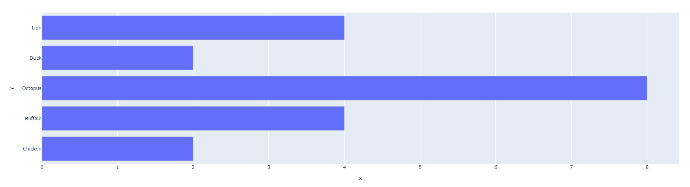{width=800} </center>

    > NOTE: As mentioned in the above comments, we've had to <font color='#DD6E0F'>switch the axes in this horizontal layout!</font>

    &nbsp; &nbsp;

    **Width and Height**

    These can be easily changed via the `width` and `height` keywords.

    ```python
    animals = ['Chicken', 'Buffalo', 'Octopus', 'Duck', 'Lion']
    counts =  [2, 4, 8, 2, 4]

    bar = px.bar(x=animals, y=counts, width=800, height=400)

    bar.show()
    ```

    <center> 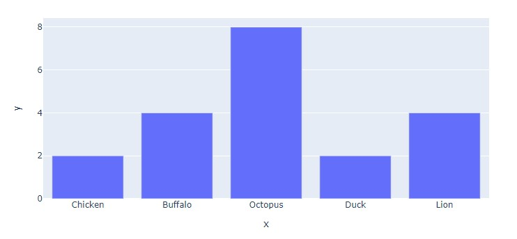{width=800} </center>

    &nbsp; &nbsp;

    **All Put Together**

    Using these elements, we can create the following bar chart:

    ```python
    raw_data = {
        'Animals' : ['Chicken', 'Buffalo', 'Octopus', 'Duck', 'Lion'],
        'Counts'  : [2, 4, 8, 2, 4]
    }

    df = pd.DataFrame.from_dict(raw_data)
    bar = px.bar(df, x='Counts', y='Animals', orientation='h', color='Counts', width=800, height=400)

    bar.update_layout(
        title="Animals vs. Appendages", # Adding a title
        yaxis_title="The Amazing Animals", # Changing x-axis label
        xaxis_title="How many appendages?", # Changing y-axis label
        font=dict(
            family="Courier New, monospace", # The font style
            color="RebeccaPurple", # The font color
            size=18 # The font size
        )
    )

    bar.show()
    ```

    <center> {width=800} </center>

    > NOTE: For more information, make sure to check out the following:
    [Plotly Bar Charts](https://plotly.com/python/bar-charts/),
    [px.Bar()](https://plotly.com/python-api-reference/generated/plotly.express.bar)

??? info "Line Charts"

    ## Line Charts

    There are a few options to create a line chart!

    ### Loading Data

    Once again, we can either use a Pandas Dataframe or just proceed with arrays!

    **With DataFrame**

    ```python
    raw_data = {
        'Year' : [1980, 1985, 1990, 1995, 2000, 2008, 2009, 2010, 2011, 2012, 2013, 2014, 2015, 2018],
        'Carbon per Capita' : [20.8,	18.9,	19.3,	19.3,	20.2,	18.5,	17.2,	17.4,	17.0,	16.3,	16.3,	16.5,	16.3,	16.1]
    }

    df = pd.DataFrame.from_dict(raw_data)

    line = px.line(df, x='Year', y='Carbon per Capita')
    line.show()
    ```

    As seen, we <font color='#DD6E0F'>pass in the dataframe and specify the x and y column titles</font>.

    &nbsp; &nbsp;

    **Without DataFrame**

    Here, we can simply pass in two arrays, one for each of x and y.

    ```python
    year =  [1980, 1985, 1990, 1995, 2000, 2008, 2009, 2010, 2011, 2012, 2013, 2014, 2015, 2018]
    carbon = [20.8,	18.9,	19.3,	19.3,	20.2,	18.5,	17.2,	17.4,	17.0,	16.3,	16.3,	16.5,	16.3,	16.1]

    line = px.line(x=year, y=carbon)
    line.show()
    ```

    Even if we don't create a dataframe, Plotly will *perform this*
    *action under-the-hood* when generating the line chart.

    &nbsp; &nbsp;

    In both cases, we get the same result. And voila, here are our two line charts!

    <center> {width=800} </center>

    <center> 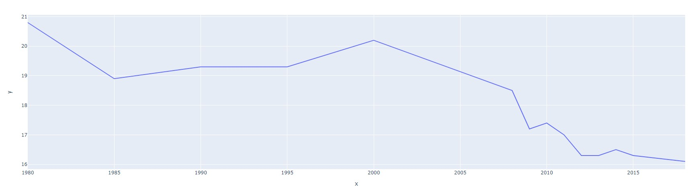{width=800} </center>

    ### Styling Figure

    The methods to style a line chart are very similar to styling a bar chart!
    However, one neat feature we haven't covered yet is traces. These are quite
    effective at visualizing multiple sets of data on the same set of axes.

    Let's take a closer look!

    &nbsp; &nbsp;

    **Multiple Traces**

    In order to add multiple traces, we turn to the Plotly Graph Objects library.

    To import this library, we use the following line:

    ```Python
    import plotly.graph_objects as go
    ```

    Next, we can create our traces with the `.add_trace()` function.

    ```python
    year =  [1980, 1985, 1990, 1995, 2000, 2008, 2009, 2010, 2011, 2012, 2013, 2014, 2015, 2018]
    carbon_USA = [20.8,	18.9,	19.3,	19.3,	20.2,	18.5,	17.2,	17.4,	17.0,	16.3,	16.3,	16.5,	16.3,	16.1]
    carbon_AUS = [15.0,	15.3,	15.5,	15.6,	17.2,	18.2,	18.2,	17.7,	17.5,	17.1,	16.1,	15.4,	16.9,	16.8]

    line = go.Figure()

    line.add_trace(go.Scatter(x=year, y=carbon_USA))
    line.add_trace(go.Scatter(x=year, y=carbon_AUS))

    line.show()
    ```
    Each trace adds a new line (the name `go.Scatter()` is a bit misleading!)

    <center> {width=800} </center>

    &nbsp; &nbsp;

    **Styling Traces**

    In order to style these traces and change their legend names from 't', we can add the following:

    ```python
    year =  [1980, 1985, 1990, 1995, 2000, 2008, 2009, 2010, 2011, 2012, 2013, 2014, 2015, 2018]
    carbon_USA = [20.8,	18.9,	19.3,	19.3,	20.2,	18.5,	17.2,	17.4,	17.0,	16.3,	16.3,	16.5,	16.3,	16.1]
    carbon_AUS = [15.0,	15.3,	15.5,	15.6,	17.2,	18.2,	18.2,	17.7,	17.5,	17.1,	16.1,	15.4,	16.9,	16.8]

    line = go.Figure()

    line.add_trace(go.Scatter(x=year, y=carbon_USA, marker = dict(color='MediumPurple'), name="USA Carbon Emissions (per capita)"))
    line.add_trace(go.Scatter(x=year, y=carbon_AUS, marker = dict(color='LightSeaGreen'), name="AUS Carbon Emissions (per capita)"))

    line.show()
    ```

    Adding the `marker=dict(color='MediumPurple')` dictionary allows us to change the color of the two traces.
    Additionally, the `name` argument lets us distinguish and label the two traces. Here's the result!

    <center> {width=800} </center>

    &nbsp; &nbsp;

    We can further style these traces by exploring the `marker` dictionary:

    ```python
    year =  [1980, 1985, 1990, 1995, 2000, 2008, 2009, 2010, 2011, 2012, 2013, 2014, 2015, 2018]
    carbon_USA = [20.8,	18.9,	19.3,	19.3,	20.2,	18.5,	17.2,	17.4,	17.0,	16.3,	16.3,	16.5,	16.3,	16.1]
    carbon_AUS = [15.0,	15.3,	15.5,	15.6,	17.2,	18.2,	18.2,	17.7,	17.5,	17.1,	16.1,	15.4,	16.9,	16.8]

    line = go.Figure()

    line.add_trace(go.Scatter(x=year, y=carbon_USA,
                              marker = dict(size=25, color='MediumPurple'),
                              name="USA Carbon Emissions (per capita)"))

    line.add_trace(go.Scatter(x=year, y=carbon_AUS,
                              marker = dict(size=25, color='LightSeaGreen', symbol='square'),
                              name="AUS Carbon Emissions (per capita)"))

    line.show()
    ```

    As seen below, the size and symbols for each trace can be customized as well!

    <center> {width=800} </center>

    &nbsp; &nbsp;

    **All Put Together**

    Using these elements and our stylings from the previous section, we can create the following:

    ```python
    year =  [1980, 1985, 1990, 1995, 2000, 2008, 2009, 2010, 2011, 2012, 2013, 2014, 2015, 2018]
    carbon_USA = [20.8,	18.9,	19.3,	19.3,	20.2,	18.5,	17.2,	17.4,	17.0,	16.3,	16.3,	16.5,	16.3,	16.1]
    carbon_AUS = [15.0,	15.3,	15.5,	15.6,	17.2,	18.2,	18.2,	17.7,	17.5,	17.1,	16.1,	15.4,	16.9,	16.8]

    line = go.Figure()

    line.add_trace(go.Scatter(x=year, y=carbon_USA,
                              marker = dict(size=25, color='MediumPurple'),
                              name="USA Carbon Emissions (per capita)"))

    line.add_trace(go.Scatter(x=year, y=carbon_AUS,
                              marker = dict(size=25, color='LightSeaGreen', symbol='square'),
                              name="AUS Carbon Emissions (per capita)"))

    line.update_layout(
        title = "Carbon Emissions since 1980 (per capita)",
        xaxis_title = "Year",
        yaxis_title = "Annual Emissions in Tons (per capita)",
        plot_bgcolor = 'DarkGrey',
        width=1600
    )

    line.show()
    ```

    <center> {width=800} </center>

    &nbsp; &nbsp;

    > NOTE: For more information, make sure to check out the following:
    [Plotly Line Charts](https://plotly.com/python/line-charts/),
    [px.line()](https://plotly.com/python-api-reference/generated/plotly.express.line)

??? info "Pie Charts"

    ## Pie Charts

    There are a few options to create a pie chart!

    ### Loading Data

    When creating a bar chart, we can use a *Pandas Dataframe*:

    ```python
    raw_data = {
        'Animals' : ['Chicken', 'Buffalo', 'Octopus', 'Duck', 'Lion', 'Horse', 'Pig'],
        'Counts'  : [9, 3, 1, 5, 4, 8, 8]
    }

    df = pd.DataFrame.from_dict(raw_data)

    pie = px.pie(raw_data, values='Counts', names='Animals')
    pie.show()
    ```

    As seen, we <font color='#DD6E0F'>pass in the dataframe and specify the x and y column titles</font>.

    &nbsp; &nbsp;

    **Without DataFrame**

    Here, we can simply pass in two arrays, one for each of x and y.

    ```python
    animals = ['Chicken', 'Buffalo', 'Octopus', 'Duck', 'Lion', 'Horse', 'Pig']
    counts =  [9, 3, 1, 5, 4, 8, 8]

    pie = px.pie(values=counts, names=animals)
    pie.show()
    ```

    Even if we don't create a dataframe, Plotly will *perform this*
    *action under-the-hood* when generating the pie chart.

    &nbsp; &nbsp;

    In both cases, we get the same result. And voila, here are our two bar charts!

    <center> 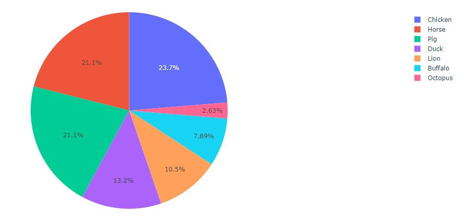{width=800} </center>

    <center> {width=800} </center>

    Unlike with bar charts and line charts, there are truly no differences between
    each!

    This is mainly because there are no axes which need labelling 😅.

    &nbsp; &nbsp;

    ### Styling Figure

    There are many ways to style a bar chart. Here are some of the most
    important ones!

    &nbsp; &nbsp;

    **Adding Title, Labels**

    In order to add a title, we can simply pass in the `title` argument. To change the
    percentages in each slice into labels, we can use the `.update_traces()` method. The
    width of the plot is simply changed via the `.update_layouts()` method, as done previously.

    ```python
    animals = ['Chicken', 'Buffalo', 'Octopus', 'Duck', 'Lion', 'Horse', 'Pig']
    counts =  [9, 3, 1, 5, 4, 8, 8]

    pie = px.pie(values=counts,
                 names=animals,
                 title="The Animals of Old McDonald's Farm",
                 )

    pie.update_traces(textposition='inside', textinfo='label')
    pie.update_layout(width=1000)
    pie.show()
    ```

    <center> 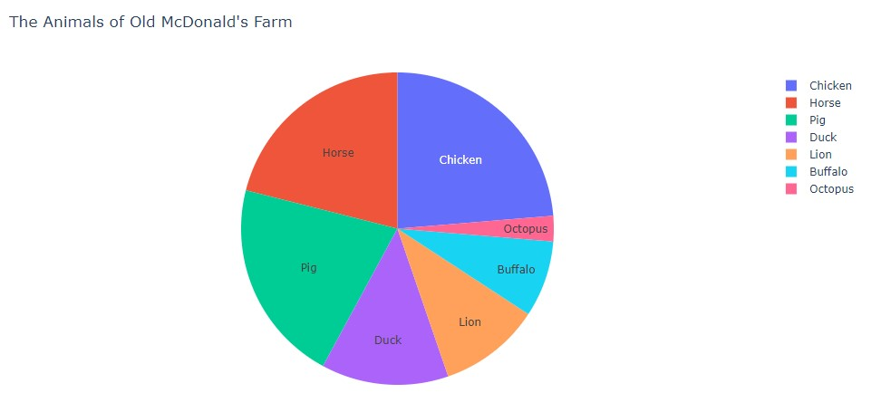{width=800} </center>

    The title can be centered with the `title_x` argument, which ranges from 0 to 1.
    Therefore, setting its value to 0.5 will result in a centered title. Additionally,
    the `.update_traces()` method can be modified to include percentages.

    ```python
    animals = ['Chicken', 'Buffalo', 'Octopus', 'Duck', 'Lion', 'Horse', 'Pig']
    counts =  [9, 3, 1, 5, 4, 8, 8]

    pie = px.pie(values=counts,
                 names=animals,
                 title="The Animals of Old McDonald's Farm",
                 )

    pie.update_traces(textposition='inside', textinfo='label+percent')
    pie.update_layout(width=1000)
    pie.update_layout(title_x=0.5)
    pie.show()
    ```

    And here's our centered title (relative to the pie chart).

    <center> 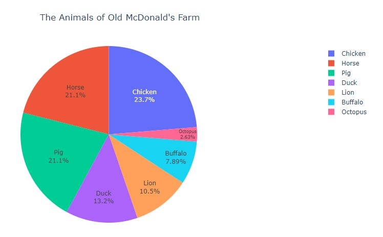{width=800} </center>

    &nbsp; &nbsp;

    ### Donuts, Slices

    Some neat extensions of pie charts includes donuts and slices!

    In order to create a donut chart, we simply need to add the `hole=0.2` argument.

    ```python
    animals = ['Chicken', 'Buffalo', 'Octopus', 'Duck', 'Lion', 'Horse', 'Pig']
    counts =  [9, 3, 1, 5, 4, 8, 8]

    pie = px.pie(values=counts,
                 names=animals,
                 title="The Animals of Old McDonald's Farm",
                 hole=0.2,
                 )

    pie.update_traces(textposition='inside', textinfo='label+percent')
    pie.update_layout(width=1000)
    pie.update_layout(title_x=0.5)
    pie.show()
    ```

    <center> {width=800} </center>

    &nbsp; &nbsp;

    In order to highlight specific slices or data values, we can use the `pull` argument.

    Here's an example highlighting the Pig slice!

    ```python
    animals = ['Chicken', 'Buffalo', 'Octopus', 'Duck', 'Lion', 'Horse', 'Pig']
    counts =  [9, 3, 1, 5, 4, 8, 8]

    pie = px.pie(values=counts,
                 names=animals,
                 title="The Animals of Old McDonald's Farm",
                 hole=0.2,
                 )

    pie.update_traces(textposition='inside',
                      textinfo='label+percent',
                      pull=[0,0,0,0,0,0,0.1],
                      )
    pie.update_layout(width=1000)
    pie.update_layout(title_x=0.5)
    pie.show()
    ```

    <center> {width=800} </center>

    The length of `pull` matches the length of `animals`.

    Similarly, each value corresponds to a
    specific animal, in matching result. For example, the last element of `pull` is 0.1, meaning
    that the last element of `animals`, 'Pig', will be pulled out by a factor of 0.1.

    Let's try applying this knowledge to pull out 'Chicken' and 'Buffalo' as well!

    ```python

    animals = ['Chicken', 'Buffalo', 'Octopus', 'Duck', 'Lion', 'Horse', 'Pig']
    counts =  [9, 3, 1, 5, 4, 8, 8]

    pie = px.pie(values=counts,
                 names=animals,
                 title="The Animals of Old McDonald's Farm",
                 hole=0.2,
                 )

    pie.update_traces(textposition='inside',
                      textinfo='label+percent',
                      opacity=0.9,
                      pull=[0.2,0.3,0,0,0,0,0.1],
                      )
    pie.update_layout(width=1000)
    pie.update_layout(title_x=0.5)
    pie.show()  
    ```

    <center> 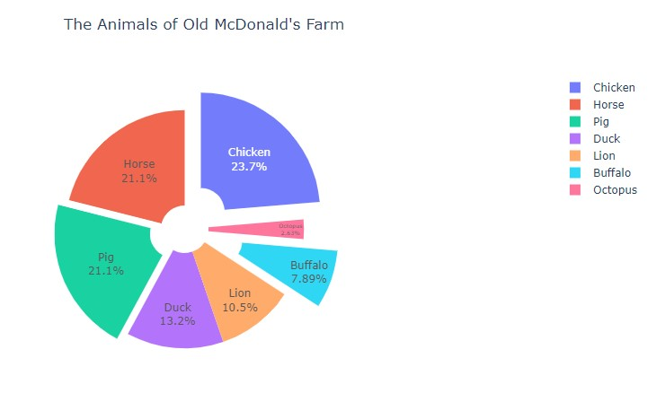{width=800} </center>

    Neat! And with that, we have a rather fancy pie chart put together in less than a dozen lines of code!

    > NOTE: For more information, make sure to check out the following:
    [Plotly Pie Charts](https://plotly.com/python/pie-charts/),
    [px.Pie()](https://plotly.com/python-api-reference/generated/plotly.express.pie)

??? info "Scatter Plots"

    ## Scatter Plots

    As with most other plots, there are a few options to create a scatter plot!

    ### Loading Data

    Here, we'll explore a less-common method with several Star Wars Lego Sets. Each
    Lego Set is stored as an array of three values: price, piece count, and VIP points.
    These arrays are added to a list of all eight sets.

    Using two iterators, we can create a list of prices and pieces (ordered correctly).

    ```python
    rep_gunship = [349.99, 3292, 2275]; light_cruiser = [159.99, 1336, 1040]
    bad_batch_shuttle = [99.99, 969, 650]; meditation_chamber = [69.99, 663, 455]
    imperial_maurader = [39.99, 478, 260]; mandalorian_forge = [29.99, 258, 195]
    a_wing = [199.99, 1672, 1300]; razor_crest = [129.99, 1023, 845]

    sets = [rep_gunship, light_cruiser, bad_batch_shuttle, meditation_chamber, imperial_maurader, mandalorian_forge, a_wing, razor_crest]

    price = [sets[i][0] for i in range(len(sets))]
    pieces = [sets[i][1] for i in range(len(sets))]

    scatter = px.scatter(x=price, y=pieces)
    scatter.show()
    ```

    <center> {width=800} </center>

    Looking good, but let's add some style!

    &nbsp; &nbsp;

    ### Styling Figure

    &nbsp; &nbsp;

    **Size Attribute**

    One neat way to flavor our scatter plots is to modify the `size` attribute. Here,
    we can set the size of each datapoint to match a third attribute. In this case, the
    third dimension of data will be the number of VIP points earned per set.

    ```python
    # Lego Sets from 2021 (Price, Pieces, VIP Points)

    rep_gunship = [349.99, 3292, 2275]; light_cruiser = [159.99, 1336, 1040]
    bad_batch_shuttle = [99.99, 969, 650]; meditation_chamber = [69.99, 663, 455]
    imperial_maurader = [39.99, 478, 260]; mandalorian_forge = [29.99, 258, 195]
    a_wing = [199.99, 1672, 1300]; razor_crest = [129.99, 1023, 845]

    sets = [rep_gunship, light_cruiser, bad_batch_shuttle, meditation_chamber, imperial_maurader, mandalorian_forge, a_wing, razor_crest]

    price = [sets[i][0] for i in range(len(sets))]
    pieces = [sets[i][1] for i in range(len(sets))]
    points = [sets[i][2] for i in range(len(sets))]

    scatter = px.scatter(x=price, y=pieces, size=points)
    scatter.show()
    ```

    <center> {width=800} </center>

    And ta-da, we can easily visualize that larger sets give the most points!

    &nbsp; &nbsp;

    **Adding Color**

    As well as representing VIP points by size, we can also represent this data with color. We simply
    need to add the `color` argument inside of our `px.scatter()` function.

    ```python
    # Lego Sets from 2021 (Price, Pieces, VIP Points)

    rep_gunship = [349.99, 3292, 2275]; light_cruiser = [159.99, 1336, 1040]
    bad_batch_shuttle = [99.99, 969, 650]; meditation_chamber = [69.99, 663, 455]
    imperial_maurader = [39.99, 478, 260]; mandalorian_forge = [29.99, 258, 195]
    a_wing = [199.99, 1672, 1300]; razor_crest = [129.99, 1023, 845]

    sets = [rep_gunship, light_cruiser, bad_batch_shuttle, meditation_chamber, imperial_maurader, mandalorian_forge, a_wing, razor_crest]

    price = [sets[i][0] for i in range(len(sets))]
    pieces = [sets[i][1] for i in range(len(sets))]
    points = [sets[i][2] for i in range(len(sets))]

    scatter = px.scatter(x=price, y=pieces, size=points, color=points)
    scatter.update_coloraxes(colorbar_title="VIP Points")
    scatter.update_layout(width=1000) # For better view!
    scatter.show()
    ```

    <center> {width=800} </center>

    &nbsp; &nbsp;

    **Adding Trendline**

    Finally, one useful feature of `px.Scatter()` is the ability to add trendlines! All it takes
    is a simple `trendline="ols"`, where "ols" stands for Ordinary Least Squares regression.

    ```python
    # Lego Sets from 2021 (Price, Pieces, VIP Points)

    rep_gunship = [349.99, 3292, 2275]; light_cruiser = [159.99, 1336, 1040]
    bad_batch_shuttle = [99.99, 969, 650]; meditation_chamber = [69.99, 663, 455]
    imperial_maurader = [39.99, 478, 260]; mandalorian_forge = [29.99, 258, 195]
    a_wing = [199.99, 1672, 1300]; razor_crest = [129.99, 1023, 845]

    sets = [rep_gunship, light_cruiser, bad_batch_shuttle, meditation_chamber, imperial_maurader, mandalorian_forge, a_wing, razor_crest]

    price = [sets[i][0] for i in range(len(sets))]
    pieces = [sets[i][1] for i in range(len(sets))]
    points = [sets[i][2] for i in range(len(sets))]

    scatter = px.scatter(x=price, y=pieces, size=points, color=points, trendline="ols")
    scatter.update_coloraxes(colorbar_title="VIP Points")
    scatter.update_layout(width=1000) # For better view!
    scatter.show()
    ```

    <center> {width=800} </center>

    > NOTE: Non-linear regression lines can be added as well! For more information, check out:
    [Plotly Trendlines](https://plotly.com/python/linear-fits/)

    &nbsp; &nbsp;

    **All Put Together**

    Using these elements and our stylings from the previous section, we can create the following:

    ```python
    # Lego Sets from 2021 (Price, Pieces, VIP Points)

    rep_gunship = [349.99, 3292, 2275]; light_cruiser = [159.99, 1336, 1040]
    bad_batch_shuttle = [99.99, 969, 650]; meditation_chamber = [69.99, 663, 455]
    imperial_maurader = [39.99, 478, 260]; mandalorian_forge = [29.99, 258, 195]
    a_wing = [199.99, 1672, 1300]; razor_crest = [129.99, 1023, 845]

    sets = [rep_gunship, light_cruiser, bad_batch_shuttle, meditation_chamber, imperial_maurader, mandalorian_forge, a_wing, razor_crest]

    price = [sets[i][0] for i in range(len(sets))]
    pieces = [sets[i][1] for i in range(len(sets))]
    points = [sets[i][2] for i in range(len(sets))]

    scatter = px.scatter(x=price, y=pieces, size=points, color=points, trendline="ols")
    scatter.update_coloraxes(colorbar_title="VIP Points")

    scatter.update_layout(
       title = "Lego Star Wars Sets (2021)",
       xaxis_title = "Price (USD)",
       yaxis_title = "Total Piece Count",
       width=1000
    )

    scatter.show()
    ```

    <center> {width=800} </center>

    > NOTE: For more information, make sure to check out the following:
    [Plotly Scatter](https://plotly.com/python/line-and-scatter/)
    [px.Scatter()](https://plotly.com/python-api-reference/generated/plotly.express.scatter)

> NOTE: All code segments from this chapter can be found in this
[Colab Notebook](https://colab.research.google.com/drive/1RRirZeUi_zSBEDS9lDJw1dsxth_V0f-9#scrollTo=RIac6-HeDS1V).

## Ch 04 - Dash

??? info "Dash's Libraries"

    ## Dash's Libraries

    To begin harnessing the power of Dash, we must import the necessary libraries

    ### Dash Core

    Dash's core components are a library of higher-level elements such as **tables, graphs,**
    **dropdowns, inputs, and links**. To use these components, we add the following line:

    ```python
    import dash_core_components as dcc
    ```
    > NOTE: For a full list of components, feel free to check out the following:
    [Dash Core Documentation](https://dash.plotly.com/dash-core-components)

    &nbsp; &nbsp;

    ### Bootstrap

    Dash allows for the inclusion of native Boostrap components via its Dash Boostrap
    library. These elements include **cards, lists, badges, and more**. To use these elements, we install and import the library via the following lines:

    ```python
    !pip install dash-bootstrap-components
    import dash_bootstrap_components as dbc
    ```

    > NOTE: For a full list of components, feel free to check out the following:
    [Dash Boostrap Documentation](https://dash-bootstrap-components.opensource.faculty.ai/)

    &nbsp; &nbsp;

    And voila, we're good to go!

??? info "Dash Graph"

    ## Dash Graph

    The figures made from Plotly are dazzling, but *still need to be added into the dashboard!*

    In order to add these charts, we can utilize the `dcc.Graph()` element. First, we create a function:

    ```python
    def getAnimalChart():
      raw_data = {
      'Animals' : ['Chicken', 'Buffalo', 'Octopus', 'Duck', 'Lion'],
      'Counts'  : [2, 4, 8, 2, 4]
      }

      df = pd.DataFrame.from_dict(raw_data)
      bar = px.bar(df, x='Counts', y='Animals', orientation='h', color='Counts', width=800, height=400)

      bar.update_layout(
          title="Animals vs. Appendages", # Adding a title
          yaxis_title="The Amazing Animals", # Changing x-axis label
          xaxis_title="How many appendages?", # Changing y-axis label
          font=dict(
              family="Courier New, monospace", # The font style
              color="RebeccaPurple", # The font color
              size=18 # The font size
          )
      )
      return bar
    ```

    This function simply <font color='#DD6E0F'>returns our finalized bar chart</font> from the last chapter instead of displaying it.

    Now, we can add a `dcc.Graph()` component in our app via the following lines. And here's the result!

    ```python
    app = JupyterDash(__name__)

    app.layout = html.Div(children=[
        html.P(children="Welcome to Dash"),
        dcc.Graph(id='Animal Chart', figure=getAnimalChart())
    ])

    app.run_server(mode='external')
    ```

    <center> {width=800} </center>

    >NOTE: The `id` attribute is <font color='#DD6E0F'>optional, but it's a good practice to include a unique ID</font> for each component.
    This is especially true for updating figures, which will be covered in a later chapter, *"Confronted by Callbacks"*

    &nbsp; &nbsp;

    Pretty straightforward! Now, we can add our Plotly figures to our dashboard 😄 .

??? info "Dash Cards"

    ## Dash Cards

    These graphs we have created are amazing! But not the prettiest...

    With cards, <font color='#DD6E0F'>any component (especially text, images, and figures) can neatly be displayed within a bounded area.</font>
    These cards can be customized in **terms of style, size, color, outline, and more!**

    ### Basic Elements

    To get started, we'll create a simple card around our graph from earlier.

    ```python
    app = JupyterDash(__name__, external_stylesheets=[dbc.themes.BOOTSTRAP])

    app.layout = html.Div(children=[
        html.P(children="Welcome to Dash"),
        dbc.Card([
            dbc.CardBody([
                          html.H1("Animal Chart", className='card-title'),
                          html.P("This is an example graph displaying some statistics", className='card-body'),  
                          dcc.Graph(id='Animal Chart', figure=getAnimalChart())
                        ])
          ],
          style={
              "width":"55rem",
              "margin-left":"1rem"
              }
        )
    ])

    app.run_server(mode='external')
    ```

    Alright, let's break it down!

    At the very top, we must add the **Bootstrap external stylesheet** in order to utilize the Card component. This
    stylesheet *comes installed with the library* and is accessed with  `external_stylesheets=[dbc.themes.BOOTSTRAP]`

    > NOTE: We can add our own <font color='#DD6E0F'>custom external stylesheets!</font> We'll dive into this in *"Sheriff Styles"*

    &nbsp; &nbsp;

    With our `dbc.Card()`, we have a Card Body. this `dbc.CardBody()` contains a header, paragraph, and our graph.
    You may notice the `className` attribute. This is a custom CSS styling that was imported from the Bootstrap stylesheet.

    After this, the `dbc.Card()` itself contains a style dictionary. In here, we find two attributes:

    * **Width** - this is simply the width of the card. `rem` <font color='#DD6E0F'>is simply the percentage dimension of the screen.</font> As a result, `55rem` means
    that the card will span 55% of the screen's width.
    * **Margin** - in particular, the left-most margin has been set to 1% of the screen's width. `margin-bottom`, `margin-top`, and `margin-right`
    are all valid keywords that can be utilized as well to further adjust our card.

    &nbsp; &nbsp;

    And voila, here's our result:

    <center> 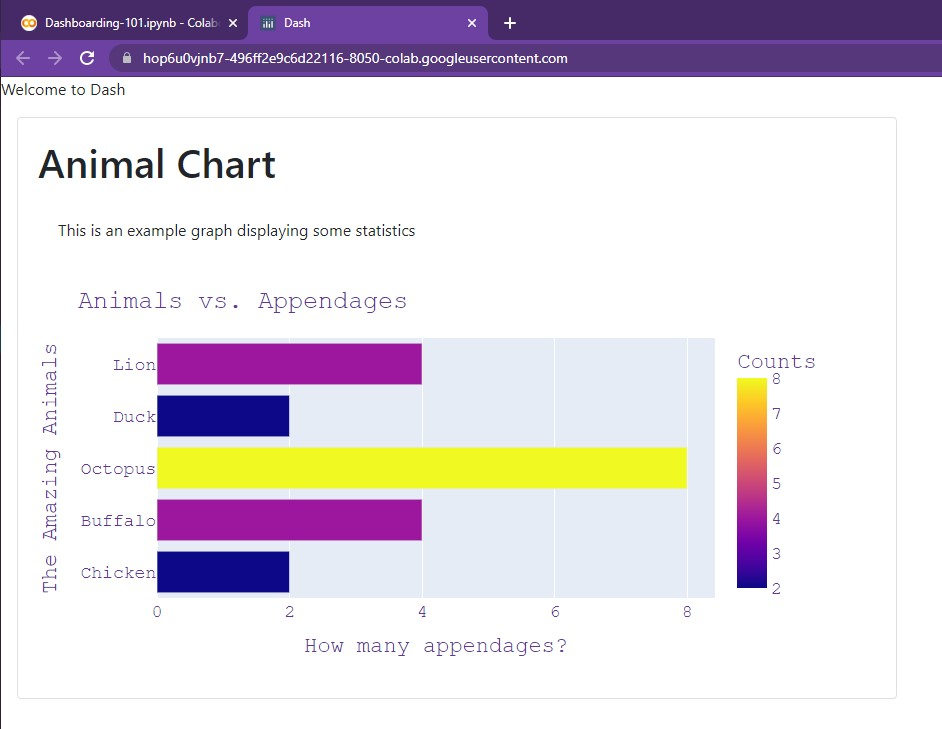{width=800} </center>

    Let's try changing some of the colors!

    &nbsp; &nbsp;

    ### Colors, Outlines

    In order to modify the visual appearance of our cards, we can use the `color` and
    `outline` attributes. `color` allows for several pre-built options:
    `primary`, `secondary`, `info`, `success`, `warning`, `danger`, `light`, and `dark`.

    For example, here's what `info` looks like (a light blue):

    ```python
    app = JupyterDash(__name__, external_stylesheets=[dbc.themes.BOOTSTRAP])

    app.layout = html.Div(children=[
        html.P(children="Welcome to Dash"),
        dbc.Card([
            dbc.CardBody([
                          html.H1("Animal Chart", className='card-title'),
                          html.P("This is an example graph displaying some statistics", className='card-body'),  
                          dcc.Graph(id='Animal Chart', figure=getAnimalChart())
                        ])
          ],
          outline=True,
          color='info', # Options include: primary, secondary, info, success, warning, danger, light, dark  
          style={
              "width":"55rem",
              "margin-left":"1rem"
              }
        )
    ])

    app.run_server(mode='external')
    ```

    <center> {width=800} </center>

    &nbsp; &nbsp;

    We can also create a card to hold our title (looks kind of strange by itself in the top corner 😅)

    ```python
    app = JupyterDash(__name__, external_stylesheets=[dbc.themes.BOOTSTRAP])

    app.layout = html.Div(children=[
        dbc.Card([
            dbc.CardBody([
                          html.H1("Welcome to Dash!", className='card-title'),
                        ])
          ],
          color='dark', # Options include: primary, secondary, info, success, warning, danger, light, dark
          inverse=True,   
          style={
              "width":"55rem",
              "margin-left":"1rem",
              "margin-top":"1rem",
              "margin-bottom":"1rem"
              }
        ),

        dbc.Card([
            dbc.CardBody([
                          html.H1("Animal Chart", className='card-title'),
                          html.P("This is an example graph displaying some statistics", className='card-body'),  
                          dcc.Graph(id='Animal Chart', figure=getAnimalChart())
                        ])
          ],
          outline=True,
          color='info', # Options include: primary, secondary, info, success, warning, danger, light, dark  
          style={
              "width":"55rem",
              "margin-left":"1rem"
              }
        )
    ])

    app.run_server(mode='external')
    ```

    <center> 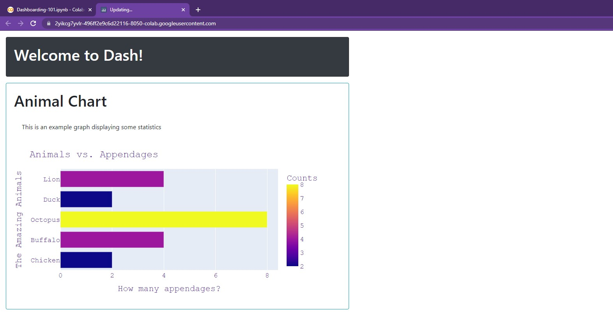{width=800} </center>

    There we go, much better now!

    Ahh, you may have noticed the `inverse` argument! Setting this to `True` is
    helpful when dealing with dark backgrounds as it inverts all text color to white.
    As a result, we don't have to manually change the title color.

    > NOTE: For more information on dbc.Card(), feel free to check out the following:
    [dbc.Card()](https://dash-bootstrap-components.opensource.faculty.ai/docs/components/card/)

    &nbsp; &nbsp;

    Now, what if we want to add multiple cards, but not just continue to vertically stack them?

    For that, we must turn to rows and columns!

??? info "Dash Layout"

    ## Dash Layout

    The best way to arrange components in our dashboard is via `dbc.Row()` and `dbc.Col()`.

    Let's take a closer look at their power!

    ### Creating Cards

    Before beginning, let's create a few cards for better readability:

    === "titleCard"

        ```python
        titleCard =  dbc.Card([
                        dbc.CardBody([
                                      html.H1("Welcome to Dash!", className='card-title'),
                                    ])
                      ],
                      color='dark', # Options include: primary, secondary, info, success, warning, danger, light, dark
                      inverse=True,   
                      style={
                          "width":"55rem",
                          "margin-left":"1rem",
                          "margin-top":"1rem",
                          "margin-bottom":"1rem"
                          }
                    )
        ```

    === "animalBarCard"

        ```python
        def getAnimalBarChart():
            raw_data = {
            'Animals' : ['Chicken', 'Buffalo', 'Octopus', 'Duck', 'Lion'],
            'Counts'  : [2, 4, 8, 2, 4]
            }

            df = pd.DataFrame.from_dict(raw_data)
            bar = px.bar(df, x='Counts', y='Animals', orientation='h', color='Counts', width=800, height=400)

            bar.update_layout(
                title="Animals vs. Appendages", # Adding a title
                yaxis_title="The Amazing Animals", # Changing x-axis label
                xaxis_title="How many appendages?", # Changing y-axis label
                font=dict(
                    family="Courier New, monospace", # The font style
                    color="RebeccaPurple", # The font color
                    size=18 # The font size
                )
            )
            return bar


        animalBarCard =  dbc.Card([
                          dbc.CardBody([
                                        html.H1("Animal Chart", className='card-title'),
                                        html.P("This is an example graph displaying some statistics", className='card-body'),  
                                        dcc.Graph(id='Animal Chart', figure=getAnimalBarChart())
                                      ])
                        ],
                        outline=True,
                        color='info', # Options include: primary, secondary, info, success, warning, danger, light, dark  
                        style={
                            "width":"55rem",
                            "margin-left":"1rem",
                            "margin-bottom":"1rem"
                            }
                      )
        ```

    === "carbonLineCard"

        ```python
        def getCarbonLineChart():
            year =  [1980, 1985, 1990, 1995, 2000, 2008, 2009, 2010, 2011, 2012, 2013, 2014, 2015, 2018]
            carbon_USA = [20.8, 18.9,   19.3,   19.3,   20.2,   18.5,   17.2,   17.4,   17.0,   16.3,   16.3,   16.5,   16.3,   16.1]
            carbon_AUS = [15.0, 15.3,   15.5,   15.6,   17.2,   18.2,   18.2,   17.7,   17.5,   17.1,   16.1,   15.4,   16.9,   16.8]

            line = go.Figure()

            line.add_trace(go.Scatter(x=year, y=carbon_USA,
                                      marker = dict(size=25, color='MediumPurple'),
                                      name="USA Carbon Emissions (per capita)"))

            line.add_trace(go.Scatter(x=year, y=carbon_AUS,
                                      marker = dict(size=25, color='LightSeaGreen', symbol='square'),
                                      name="AUS Carbon Emissions (per capita)"))

            line.update_layout(
                title = "Carbon Emissions since 1980 (per capita)",
                xaxis_title = "Year",
                yaxis_title = "Annual Emissions in Tons (per capita)",
                plot_bgcolor = 'DarkGrey',
                width=1600
            )

            return line


        carbonLineCard =  dbc.Card([
                            dbc.CardBody([
                                          html.H1("Carbon Chart", className='card-title'),
                                          html.P("This is an example graph displaying some statistics", className='card-body'),  
                                          dcc.Graph(id='Carbon Chart', figure=getCarbonLineChart())
                                        ])
                          ],
                          outline=True,
                          color='info', # Options include: primary, secondary, info, success, warning, danger, light, dark  
                          style={
                              "width":"55rem",
                              "margin-left":"1rem",
                              "margin-bottom":"1rem"
                              }
                        )
        ```

    === "animalPieCard"

        ```python
        def getAnimalPieChart():
            animals = ['Chicken', 'Buffalo', 'Octopus', 'Duck', 'Lion', 'Horse', 'Pig']
            counts =  [9, 3, 1, 5, 4, 8, 8]

            pie = px.pie(values=counts,
                        names=animals,
                        title="The Animals of Old McDonald's Farm",
                        hole=0.2,
                        )

            pie.update_traces(textposition='inside',
                              textinfo='label+percent',
                              opacity=0.9,
                              pull=[0.2,0.3,0,0,0,0,0.1],
                              )
            pie.update_layout(width=1000)
            pie.update_layout(title_x=0.5)

            return pie


        animalPieCard =  dbc.Card([
                            dbc.CardBody([
                                          html.H1("Animal Pie Chart", className='card-title'),
                                          html.P("This is an example graph displaying some statistics", className='card-body'),  
                                          dcc.Graph(id='Animal Pie Chart', figure=getAnimalPieChart())
                                        ])
                          ],
                          outline=True,
                          color='info', # Options include: primary, secondary, info, success, warning, danger, light, dark  
                          style={
                              "width":"55rem",
                              "margin-left":"1rem",
                              "margin-bottom":"1rem"
                              }
                        )
        ```

    === "legoScatterCard"

        ```python
        def getLegoScatterChart():
            rep_gunship = [349.99, 3292, 2275]; light_cruiser = [159.99, 1336, 1040]
            bad_batch_shuttle = [99.99, 969, 650]; meditation_chamber = [69.99, 663, 455]
            imperial_maurader = [39.99, 478, 260]; mandalorian_forge = [29.99, 258, 195]
            a_wing = [199.99, 1672, 1300]; razor_crest = [129.99, 1023, 845]

            sets = [rep_gunship, light_cruiser, bad_batch_shuttle, meditation_chamber, imperial_maurader, mandalorian_forge, a_wing, razor_crest]

            price = [sets[i][0] for i in range(len(sets))]
            pieces = [sets[i][1] for i in range(len(sets))]
            points = [sets[i][2] for i in range(len(sets))]

            scatter = px.scatter(x=price, y=pieces, size=points, color=points, trendline="ols")
            scatter.update_coloraxes(colorbar_title="VIP Points")

            scatter.update_layout(
              title = "Lego Star Wars Sets (2021)",
              xaxis_title = "Price (USD)",
              yaxis_title = "Total Piece Count",
              width=1000
            )

            return scatter


        legoScatterCard =  dbc.Card([
                            dbc.CardBody([
                                          html.H1("Lego Scatter Chart", className='card-title'),
                                          html.P("This is an example graph displaying some statistics", className='card-body'),  
                                          dcc.Graph(id='Lego Chart', figure=getLegoScatterChart())
                                        ])
                          ],
                          outline=True,
                          color='info', # Options include: primary, secondary, info, success, warning, danger, light, dark  
                          style={
                              "width":"55rem",
                              "margin-left":"1rem",
                              "margin-bottom":"1rem"
                              }
                        )
        ```

    There we go! Now we have five variables we can use:

    `titleCard`, `animalBarCard`, `carbonLineCard`, `animalPieCard`, `legoScatterCard`.

    Let's see what we can do using them!

    &nbsp; &nbsp;

    ### dbc.Row()

    The function `dbc.Row()` allows for the creation of rows, enabling horizontal arrangement of elements.

    For example, we can create two rows: one to hold our title, another to hold two charts.

    ```python

    app = JupyterDash(__name__, external_stylesheets=[dbc.themes.BOOTSTRAP])

    app.layout = html.Div(children=[
       dbc.Row([
                titleCard,
               ],
               style = {
                   "margin-left": "0.5rem"
               }
       ),
       dbc.Row([
                animalBarCard,
                carbonLineCard
               ],
               style = {
                   "margin-left": "0.5rem"
               }
      )
    ])

    app.run_server(mode='external')  
    ```
    <center> 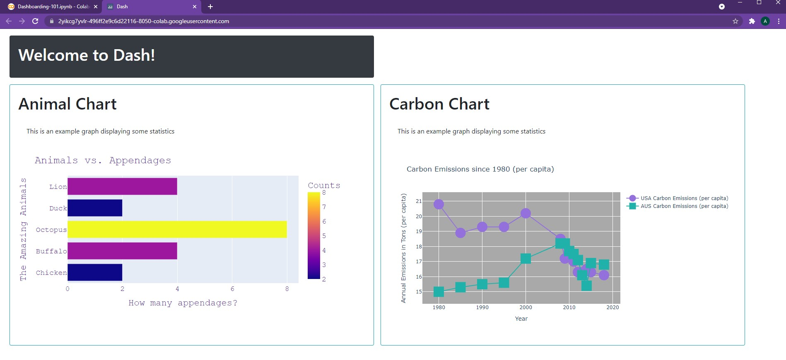{width=800} </center>

    &nbsp; &nbsp;

    Woah, that looks pretty good!

    In order to adjust the elements of rows, we can use the `justify` argument.
    Possible options include: `start`, `center`, `end`, `between`, and `around`. For example, here we'll
    use `center` for the title card and `around` for the body cards.

    ```python
    app = JupyterDash(__name__, external_stylesheets=[dbc.themes.BOOTSTRAP])

    app.layout = html.Div(children=[
       dbc.Row([
                titleCard,
               ],
               justify = "center",
               style = {
                   "margin-left": "0.5rem"
               }
       ),
       dbc.Row([
                animalBarCard,
                carbonLineCard
               ],
               justify = "around",
               style = {
                   "margin-left": "0.5rem",
                   "margin-right":"0.5rem"
               }
      )
    ])

    app.run_server(mode='external')
    ```

    <center> 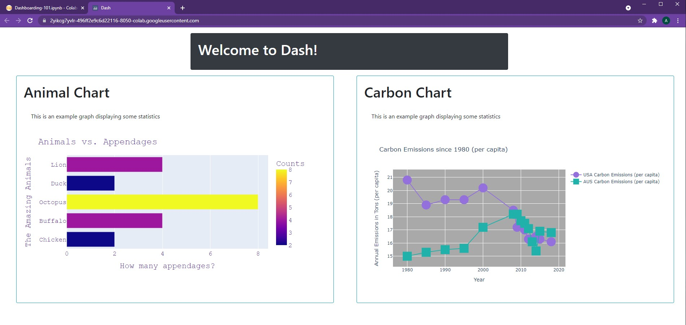{width=800} </center>

    Alright! That looks pretty good so far! Now, let's take a look at adding columns...

    &nbsp; &nbsp;

    ### dbc.Col()

    Let's say we want to add our Pie chart underneath our "Carbon Chart". In order to do this,
    we can simply use `dbc.Col`. To begin, we wrap our "Carbon Chart" in a column and
    include our Pie chart as part of that column:

    ```python
    app = JupyterDash(__name__, external_stylesheets=[dbc.themes.BOOTSTRAP])

    app.layout = html.Div(children=[
       dbc.Row([
                titleCard,
               ],
               justify = "center",
               style = {
                   "margin-left": "0.5rem"
               }
       ),
       dbc.Row([
                animalBarCard,
                dbc.Col([
                         carbonLineCard,
                         animalPieCard
                        ])
               ],
               justify = "around",
               style = {
                   "margin-left": "0.5rem",
                   "margin-right":"0.5rem"
               }
      )
    ])

    app.run_server(mode='external')
    ```

    <center> 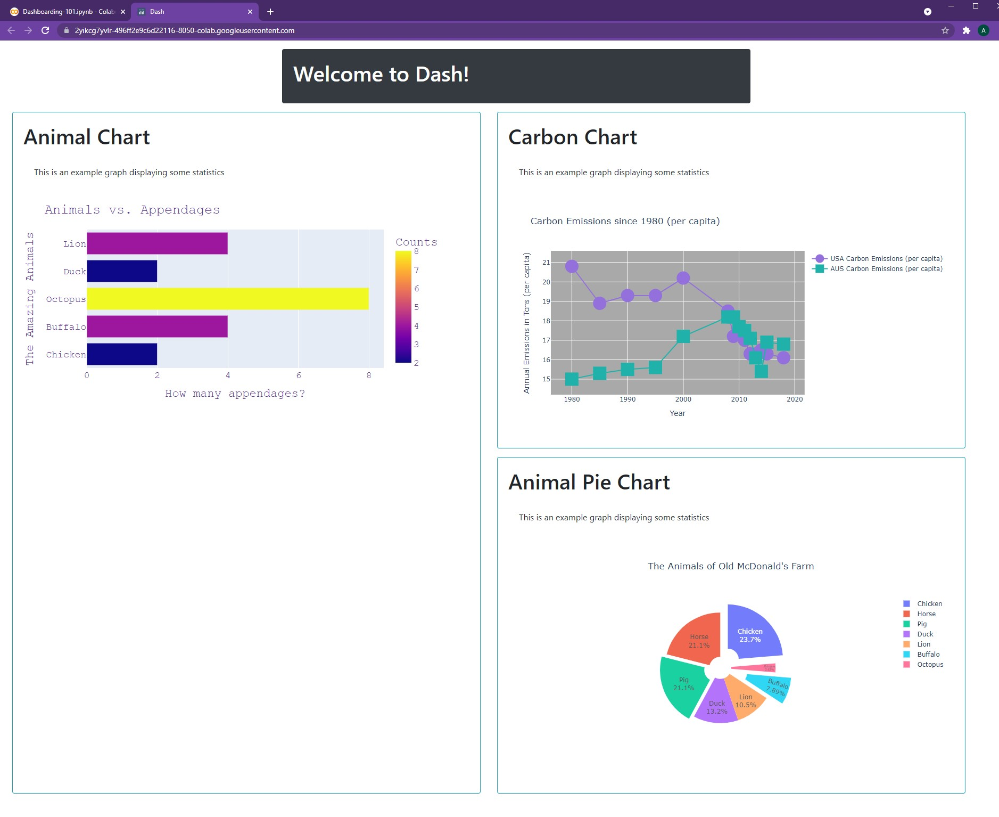{width=800} </center>

    As seen, the row automatically expands in length in order to accommodate for the column's
    vertical height. In order to adjust the column's width, we can use the `width` argument.
    This is a value that **ranges between 0 and 12**.

    As a result, `width=4` would lead to a column approximately 1/3 of the width of its parent element.
    However, we will deal with this keyword and implement it into our dashboard in future chapters!

    For now, we can create another column to store our Lego Scatter Plot.

    ```python
    app = JupyterDash(__name__, external_stylesheets=[dbc.themes.BOOTSTRAP])

    app.layout = html.Div(children=[
       dbc.Row([
                titleCard,
               ],
               justify = "center",
               style = {
                   "margin-left": "0.5rem"
               }
       ),
       dbc.Row([
                dbc.Col([
                         animalBarCard,
                         legoScatterCard,
                        ]),
                dbc.Col([
                         carbonLineCard,
                         animalPieCard
                        ])
               ],
               justify = "around",
               style = {
                   "margin-left": "0.5rem",
                   "margin-right":"0.5rem"
               }
      )
    ])

    app.run_server(mode='external')
    ```

    <center> {width=800} </center>


    Our dashboard already looks quite stunning. All this, in just four quick chapters 🤩😄.

    Next up, a little more tidying...

    &nbsp; &nbsp;

    > NOTE: For more information on rows and columns, feel free to check out:
    [dbc.Layout()](https://dash-bootstrap-components.opensource.faculty.ai/docs/components/layout/)

> NOTE: All code segments from this chapter can be found in this
[Colab Notebook](https://colab.research.google.com/drive/1RRirZeUi_zSBEDS9lDJw1dsxth_V0f-9#scrollTo=bgzFFMkaMm-m).

## Ch 05 - Styling

??? info "Badges"

    ## Badges

    Badges are an excellent way to better **display important information, especially numbers**. These elements can be accessed via the Dash Bootstrap components library and can easily be integrated into our dashboard.

    ### Basic Badge

    They can be used in conjunction with text, as shown below.

    ```python
    app = JupyterDash(__name__, external_stylesheets=[dbc.themes.BOOTSTRAP])

    app.layout = html.Div(children=[
        html.H1(["Number of Animals: ", dbc.Badge("4", className="ml-1")]),
        html.H3(["Number of Countries: ", dbc.Badge("19", className="ml-1")]),
        html.H5(["Number of Lego Sets: ", dbc.Badge("None Yet!", className="ml-1")])
    ])

    app.run_server(mode='external')
    ```

    <center> {width=800} </center>

    As seen, they match the size of the preceding text automatically. Additionally,
    they can include both numbers and words. When used by
    themselves, they default to the normal text size of `html.P()`, as shown below:

    ```python
    app = JupyterDash(__name__, external_stylesheets=[dbc.themes.BOOTSTRAP])

    app.layout = html.Div([
        dbc.Badge("Number of Animals: 4", className="ml-1")
    ])

    app.run_server(mode='external')
    ```

    <center> {width=800} </center>

    &nbsp; &nbsp;

    ### Coloring

    These badges can be colored as well. They come in a total of eight different pre-built
    color options, outlined here: `primary`, `secondary`, `success`, `warning`, `danger`, `info`, `light`.
    In this example, they've all been wrapped into a row (placed side-by-side) so that the differences in colors
    can easily be visualized.  

    ```python
    app = JupyterDash(__name__, external_stylesheets=[dbc.themes.BOOTSTRAP])

    colors = ['primary', 'secondary', 'success', 'warning', 'danger', 'info', 'light']

    app.layout = html.Div(
                      dbc.Row(
                            [html.H1(["", dbc.Badge(value, color=value, className="ml-1")]) for value in colors] ,

                      style = {
                          "margin-left":"1rem"
                      }
                )
    )

    app.run_server(mode='external')
    ```

    <center> 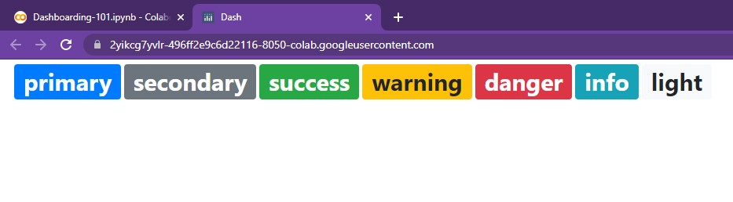{width=800} </center>

    By wrapping each in an empty `html.H1()`, the size of
    each badge can be easily increased (a nice little trick 😄).


    &nbsp; &nbsp;

    ### Pills, Links

    Badges can also be reshaped into pills (with ovalish corners) and have embedded links. The
    pills can be set simply via `pill=True` and the embedded link can be
    changed via the `href` argument.

    ```python
    app = JupyterDash(__name__, external_stylesheets=[dbc.themes.BOOTSTRAP])

    app.layout = html.Div(
                      dbc.Row([
                                html.H1(["", dbc.Badge("Click Me!", color='info', pill=True, href="https://google.com", className="ml-1")])
                              ],
                      style = {
                          "margin-left":"1rem"
                      }
                )
    )

    app.run_server(mode='external')
    ```

    <center> {width=800} </center>

    And those are the core functionalities of badges! As we'll see in the ensuing chapter (TigerGraph Tundra), they
    can come in quite handy when calling attention to text-based information...

    > NOTE: For more information, feel free to check out the following resources:
    [dbc.Badge()](https://dash-bootstrap-components.opensource.faculty.ai/docs/components/badge/)

??? info "HTML Elements"

    ## HTML Elements

    We can further modify the layout of our dashboard, especially text, by using Dash’s HTML elements.

    ### Centering

    Going back to our title card from ***Dash's Delta***, we can easily center text using `html.Center()`.

    ```python
    titleCard =  dbc.Card([
                    dbc.CardBody([
                                  html.H1("Welcome to Dash!", className='card-title'),
                                ])
                  ],
                  color='dark', # Options include: primary, secondary, info, success, warning, danger, light, dark
                  inverse=True,   
                  style={
                      "width":"55rem",
                      "margin-left":"1rem",
                      "margin-top":"1rem",
                      "margin-bottom":"1rem"
                      }
                )

    app = JupyterDash(__name__, external_stylesheets=[dbc.themes.BOOTSTRAP])

    app.layout = html.Div([
       dbc.Row([
                html.Center(titleCard),
               ],
               justify="center",
               style = {
                   "margin-left": "0.5rem"
               }
       ),
    ])

    app.run_server(mode='external')
    ```

    <center> 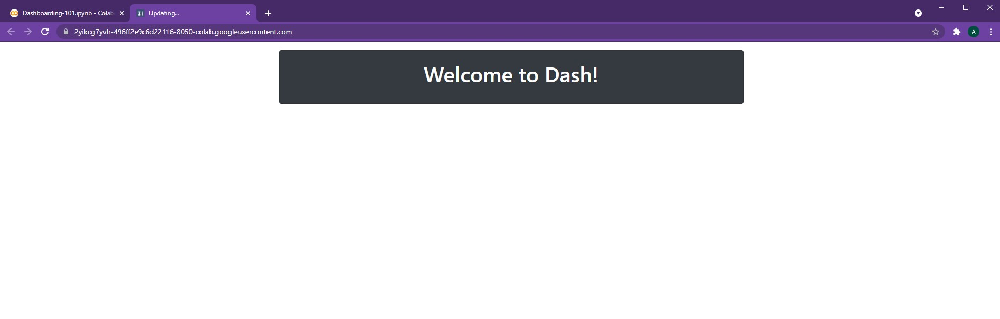{width=800} </center>

    This can be used to center any component, beyond just text and cards!

    &nbsp; &nbsp;

    ### Horizontal Rule (Hr)

    The `html.Hr()` function creates a thin horizontal line that stretches across the page. This
    can be used to separate distinct sections from one another or for easy aesthetic design.

    For example,

    ```python
    app = JupyterDash(__name__, external_stylesheets=[dbc.themes.BOOTSTRAP])

    app.layout = html.Div([
                  html.Center(titleCard),
                  html.Hr(),
                  html.Center(html.P("Now, we can dive further into this topic...", style={'fontSize':20}))
    ])

    app.run_server(mode='external')
    ```

    <center> {width=800} </center>

    &nbsp; &nbsp;

    ### Line Break (Br)

    The `html.Br()` function creates a small line break that can be used to separate text,
    paragraphs, or components. The size of the line break can be seen below:

    ```python
    app = JupyterDash(__name__, external_stylesheets=[dbc.themes.BOOTSTRAP])

    app.layout = html.Div([
                  html.Center(titleCard),
                  html.Hr(),
                  html.Center(html.P("Now, we can dive further into this topic...", style={'fontSize':20})),
                  html.Br(),
                  html.Center(html.P("Before we begin, we need to put on our thinking caps!", style={'fontSize':20}))
    ])

    app.run_server(mode='external')
    ```

    <center> {width=350} {width=350}</center>

    And those are the core HTML components to help with style!

??? info "dcc.Markdown()"

    ## dcc.Markdown()

    Markdown allows for the insert of Markdown into Dash (pretty intuitive naming 😅). It's quite straightforward!

    ```python
    app = JupyterDash(__name__, external_stylesheets=[dbc.themes.BOOTSTRAP])

    app.layout = html.Div([dbc.Col(
                  dcc.Markdown("""
                                # This is a title!
                                Hello There! This is in **bold** while this is in *italics*
                                * Neat, it's a list :)
                                * Woah, possible foreshadowing?

                                Check out [Google](https://google.com)
                               """
                              )
                  )
    ])

    app.run_server(mode='external')
    ```

    <center> {width=800} </center>    

    In order to create a title, we can simply use the `#`. **Bolded text** is performed using
    the `**` symbols, while *italics* are added via the `*` symbol. In order to create lists,
    we can use the `* ` symbol (asterisk with a space). Links are as simple as
    adding the visible text in square brackets and placing the link itself in parenthesis.

    > NOTE: For more information, feel free to check out the following resources:
    [dcc.Markdown()](https://dash.plotly.com/dash-core-components/markdown)

??? info "List Group"

    ## List Group

    Dash Bootstrap's List Groups allow for the creation of **stylish lists** with ease. These lists
    can be used to store information, serve as embedded links, and help <font color='#DD6E0F'>users better
    navigate and understand the layout</font> of one's dashboard.

    To create a basic list, we use the following:

    ```python
    app = JupyterDash(__name__, external_stylesheets=[dbc.themes.BOOTSTRAP])

    app.layout = html.Div([
                   dbc.ListGroup([
                      dbc.ListGroupItem("First is the worst!"),
                      dbc.ListGroupItem("Second is the best!"),
                      dbc.ListGroupItem("Third is the one with the Treasure Chest!")
                   ]),
    ])

    app.run_server(mode='external')
    ```

    <center> 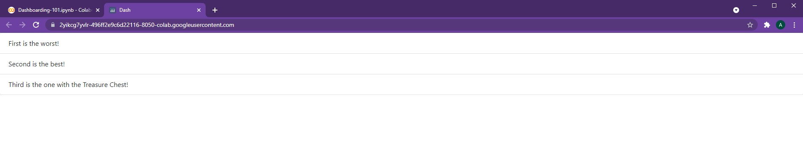{width=800} </center>   

    The `dbc.ListGroup()` element simply holds different list group items.

    However, this list
    spans the entire width of the page (or its parent component) by default. In order to adjust
    its width, we can wrap the List Group within a `dbc.Col()` element from earlier.

    ```python
    app = JupyterDash(__name__, external_stylesheets=[dbc.themes.BOOTSTRAP])

    app.layout = html.Div([dbc.Col(
                   dbc.ListGroup([
                      dbc.ListGroupItem("First is the worst!"),
                      dbc.ListGroupItem("Second is the best!"),
                      dbc.ListGroupItem("Third is the one with the Treasure Chest!")
                   ]),
                   width=4
              )
    ])

    app.run_server(mode='external')
    ```

    <center> {width=800} </center>   

    There we go, much better! Now let's add some style...

    &nbsp; &nbsp;

    ### Coloring Cells

    In order to add color to each list item, we can simply use the `color` argument:

    ```python
    app = JupyterDash(__name__, external_stylesheets=[dbc.themes.BOOTSTRAP])

    app.layout = html.Div([dbc.Col(
                   dbc.ListGroup([
                      dbc.ListGroupItem("First is the worst!", color='danger'),
                      dbc.ListGroupItem("Second is the best!", color="success"),
                      dbc.ListGroupItem("Third is the one with the Treasure Chest!", color="info")
                   ]),
                   width=4
              )
    ])

    app.run_server(mode='external')
    ```

    <center> {width=800} </center>   

    As with other bootstrap components, the pre-built color options carry over in name and hue.

    &nbsp; &nbsp;

    ### Horizontal List

    Instead of keeping each list item stacked vertically, we can also arrange them horizontally.

    ```python
    app = JupyterDash(__name__, external_stylesheets=[dbc.themes.BOOTSTRAP])

    app.layout = html.Div([dbc.Col(
                   dbc.ListGroup([
                      dbc.ListGroupItem("First is the worst!", color='danger'),
                      dbc.ListGroupItem("Second is the best!", color="success"),
                      dbc.ListGroupItem("Third is the one with the Treasure Chest!", color="info")
                    ],
                   horizontal=True
                   ),
                   width=6
              )
    ])

    app.run_server(mode='external')
    ```

    <center> {width=800} </center>   

    As seen, it's just a matter of adding the `horizontal` argument to our `dbc.ListGroup()`.

    > NOTE: For more information, feel free to check out the following resources:
    [dbc.ListGroup()](https://dash-bootstrap-components.opensource.faculty.ai/docs/components/list_group/)

> NOTE: All code segments from this chapter can be found in this
[Colab Notebook](https://colab.research.google.com/drive/1RRirZeUi_zSBEDS9lDJw1dsxth_V0f-9#scrollTo=NOgXSQOpM2mc).
