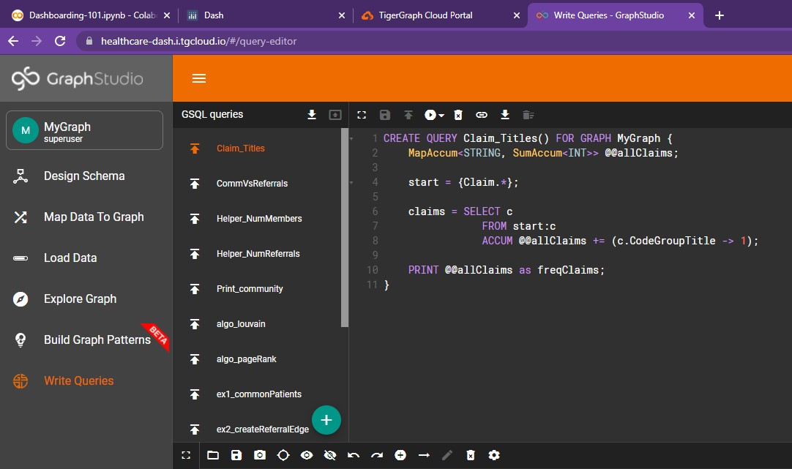
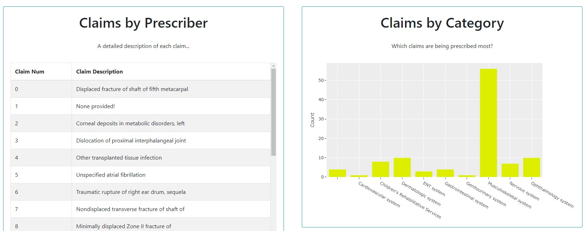

# TigerGraph (pyTG, queries)

## Ch 06 - TigerGraph

??? info "Basic pyTigerGraph"

    ## Basic pyTigerGraph

    In Chapter 01 - Installation Island, we had connected to our <font color='#DD6E0F'>Healthcare Starter Kit
    solution</font> using pyTigerGraph. This connection has **several existing functions** that we
    can use to access general information about our graph.

    ### Running Queries

    Before beginning, we must execute two queries which will help populate portions of
    our Graph. More specifically, running the `ex2_main_query` followed by the `algo_louvain`
    query <font color='#DD6E0F'>creates referral edges</font> used to link prescribers together. These edges are then
    used to **detect communities of prescribers**, which are useful in analyzing the relationships
    among healthcare providers, claims, and referrals.

    To run these queries, we simply execute the following:

    ```python
    conn.runInstalledQuery("ex2_main_query")
    conn.runInstalledQuery("algo_louvain")
    ```

    And voila, it's as simple as that! Now, we can begin to analyze the vertices and edges of our Graph...

    ### Getting Vertices and Edges

    In order to get all vertex types, we run `conn.getVertexTypes()`. Thes types can then
    be iterated through and the number of vertices belonging to each type can be determined
    via  `conn.getVertexCount()`. Here's an example!

    {align=right}

    ```python
    print("Vertices \n")

    for vertex in conn.getVertexTypes():
      print(" " + vertex + ": " + repr(conn.getVertexCount(vertex)))
    ```


    A **similar methodology** can be used for edges. Simply replace "Vertex" with "Edge",
    giving us `conn.getEdgeTypes()` and `conn.getEdgeCount()`:

    {align=right}

    ```python
    print("Edges \n")

    for edge in conn.getEdgeTypes():
      print(" " + edge + ": " + repr(conn.getEdgeCount(edge)))
    ```

    > NOTE: For a comprehensive list, feel
    free to check out: [pyTG functions](https://pytigergraph.github.io/pyTigerGraph/Functions/)

    &nbsp; &nbsp;

??? info "Built-in Queries"

    ## Built-in Queries

    Our Healthcare Starter Kit comes with <font color='#DD6E0F'>several pre-built queries.</font> Each of them
    and their accompanying GSQL can be found in GraphStudio under the **"Write Queries"**
    tab. Here's a small snippet of what that page looks like:

    <center> {width=800} </center>

    As seen on the left, there are a lot of options to explore!

    However, in this section we will dive into `getClaims()` and `Print_community()`

    &nbsp; &nbsp;

    ### getClaims

    The `getClaims()` query simply returns a <font color='#DD6E0F'>list of all claims of a given prescriber.</font>

    Here's a screenshot of the GSQL code (via GraphStudio)

    <center> {width=800} </center>

    In order to access this query from Python, we can use the same `conn.runInstalledQuery()` as before:

    ```python
    person_num = "pre78"

    claims = conn.runInstalledQuery("getClaims", params={"inputPrescriber": person_num})[0]['claims']
    print(claims)
    ```

    <center> {width=800} </center>

    As seen, the result is a list of claim vertices (established by `'v_type':'Claim'`). Using
    each claim's `attributes` dictionary, we can create a few neat visualizations. First, let's process this data...

    ```python
    claims = conn.runInstalledQuery("getClaims", params={"inputPrescriber": person_num})[0]['claims']
    title_map = {}; count_list = []; description_list = []

    for number, claim in enumerate(claims):

      title = claim['attributes']['CodeGroupTitle']
      desc = claim['attributes']['ICD10CodeDescription']

      if desc is "":
        desc = "None provided!"

      if title in title_map:
        title_map[title] = title_map[title] + 1
      else:
        title_map[title] = 1

      count_list.append(number)
      description_list.append(desc)
    ```

    Here, `title_map` simply keeps track of the **frequency of each category of claim**. `count_list`
    is simply a list of all the claim numbers while `description_list` holds the description of
    each claim (ex. "Displaced fracture").

    &nbsp; &nbsp;

    #### Bar Chart

    Using this data, we can create a bar chart:

    ```python
    titleList = []
    countList = []

    for entry in title_map:
      titleList.append(entry)
      countList.append(title_map[entry])

    # Next, we create a bar chart using a DataFrame

    countData = pd.DataFrame(data=(zip(titleList, countList)), columns=['Claim Title', 'Count'])
    bar = px.bar(countData, x='Claim Title', y='Count', title='', color_discrete_sequence =["#DDEE00"]*len(countData))

    bar.update_xaxes(type='category', categoryorder='category ascending')
    bar.update_layout(margin=dict(l=1, r=1, t=1, b=1), template='ggplot2', xaxis_title=None)

    bar.show()
    ```

    <center> {width=800} </center>

    Pretty straightforward now that we've processed our query results!

    &nbsp; &nbsp;

    #### Dash Table

    Additionally, we can create a table of each claim. <font color='#DD6E0F'>Using Dash Bootstrap Components</font>, this becomes an easy task:

    ```python
    descriptionData = pd.DataFrame(data=(zip(count_list, description_list)), columns=['Claim Num', 'Claim Description'])
    header = [html.Thead(html.Tr([html.Th("Claim Number"), html.Th("Claim Description")]))]

    table = html.Div(
        dbc.Table.from_dataframe(descriptionData, striped=True, bordered=True),
        style={'overflowY':'scroll', 'height':'450px'}
    )
    ```

    Although this won't show until we add the `table` element to our dashboard, here's a sneak peek of the result!

    <center> {width=800} </center>

    &nbsp; &nbsp;

    ### Print_Community

    Next up, we have `Print_Community`, which <font color='#DD6E0F'>outputs the prescriber network</font> that the
    inputted prescriber belongs to. For example, this is the following result given in
    **GraphStudio** when run with the input of "pre78" (Prescriber 78):

    <center> {width=800} </center>

    In order to replicate this in Dash, we can utilize `dash_cytoscape`. This package
    allows for the <font color='#DD6E0F'>creation of interactive graphs</font> which can be easily modified and
    embedded into our dashboard.

    ```python
    !pip install dash-cytoscape
    import dash_cytoscape as cyto
    ```

    &nbsp; &nbsp;

    Now, we can begin impleninging the network.

    ```python
    def getNetwork(person_num):
      comms = conn.runInstalledQuery("Print_community", params={"inputPrescriber": person_num})[1]['@@edgeList']

      vertices = {}
      els = []

      for entry in comms:
        source = entry['from_id']
        target = entry['to_id']
        if source not in vertices:
          if source == person_num:
            els.append({'data': {'id': source, 'label': source}, 'classes':'red'})
          else:
            els.append({'data': {'id': source, 'label': source}})
        if target not in vertices:
          els.append({'data': {'id': target, 'label': target}})

        els.append({'data': {'source': source, 'target': target}})


      network = cyto.Cytoscape(
                      id='cytoscape',
                      elements=els,
                      layout={'name': 'breadthfirst', 'padding':0, 'x1':-1000},
                      stylesheet= [
                          {
                              'selector': 'node',
                              'style': {
                                  'content': 'data(label)'
                              }
                          },
                          {
                              'selector': '.red',
                              'style': {
                                  'background-color': 'red',
                                }
                          }
                      ],

                    style={'width': '100%', 'height': '500px', 'margin-left':0}
                  )

      return network
    ```

    At the start, we run our query and parse through the results (each vertex/edge)
    in the prescriber community to create a list of elements, called `els`. These
    elements are in the **appropriate format needed** for Cytoscape.

    Vertex information is stored as `{'data': {'id': source, 'label': source}}` while
    edge information is stored as `{'data': {'id': target, 'label': target}}`. In both
    cases, source/target are simply vertex IDs.

    &nbsp; &nbsp;

    Although this won't show until we add the `network` element to our dashboard, here's another sneak peek!

    <center> {width=800} </center>

    &nbsp; &nbsp;

    > NOTE: For more information, feel free to check out the following resources:
    [Dash Cytoscape](https://dash.plotly.com/cytoscape/reference)

??? info "Custom Queries"

    ## Custom Queries

    We can create custom queries in two ways:

    * <font color='#DD6E0F'>Via GSQL in GraphStudio</font> under the "Write Queries" tab
    * <font color='#DD6E0F'>In our Python Script</font> via the function `conn.gsql()`

    ### Claim_Titles

    Let's take a look at a GSQL query that **returns a frequency map** of all the claims
    within the Graph.

    ```python
    Claim_Titles = '''USE GRAPH MyGraph
    CREATE QUERY Claim_Titles() FOR GRAPH MyGraph {
        MapAccum<STRING, SumAccum<INT>> @@allClaims;

        start = {Claim.*};

        claims = SELECT c
                    FROM start:c
                    ACCUM @@allClaims += (c.CodeGroupTitle -> 1);

        PRINT @@allClaims as freqClaims;
    }
    INSTALL QUERY Claim_Titles'''

    print(conn.gsql(Claim_Titles, options=[]))
    ```

    * First, our GSQL is all stored in **one variable**, a string.
    * The first line of our GSQL statement establishes which graph we're using
    * The next line is our <font color='#DD6E0F'>query header</font>, which establishes the name of the query as well as
    any parameters or return values. In this case, there are no parameters (indicated by the empty paranthesis after
    the query name) and we are simply
    **printing the results** into a variable rather than returning any values.

    &nbsp; &nbsp;

    Now, we can dive into our query logic.

    * With the line `MapAccum<STRING, SumAccum<INT>> @@allClaims;`, we create an accumulator
    that maps strings to a sum accumulator. Each string holds the claim title while the sum
    accumulator simply counts the number of instances of each claim title
    * After this, we start with the entire set of vertices of type "Claim".
    * Within our `SELECT` statement, we iterate across this entire set of claims and
    **update our accumulator** via `ACCUM @@allClaims += (c.CodeGroupTitle -> 1);`
    * Finally, we print our map accumulator so that we may <font color='#DD6E0F'>access it via Python</font>
    * The last line simply installs the query

    After writing this query, we run `print(conn.gsql(Claim_Titles, options=[]))`
    in order to install it.

    > NOTE: If a query is already installed, trying to **re-install it will result in an error!**

    &nbsp; &nbsp;

    And voila, now we can access this query in GraphStudio as well.

    <center> {width=800} </center>

    <center> *Ahh, you may have noticed the three additional queries on the left. Don't worry, that's part of the next section!* </center>

    &nbsp; &nbsp;

    Let's create a Pie Chart using this data!

    ```python
    def getClaimsPieChart():
      res = conn.runInstalledQuery("Claim_Titles")[0]['freqClaims']

      claims = list(res.keys())
      counts = list(res.values())

      pie = px.pie(values=counts,
                  names=claims,
                  hole=0.2,
                  )

      pie.update_layout(width=2000, title_x=0.5, showlegend=False, margin=dict(l=10, r=10, t=10, b=10))
      pie.update_traces(textposition='inside',
                        textinfo='label+percent',
                        )
      return pie
    ```

    As the outputted result is a map, we can simply use the `.keys()` and `.values()` functions
    in Python in order to access the results. The rest is standard pie chart creation via Plotly Express.
    And ta-da, here's our fantastic figure:

    <center> {width=800} </center>

    &nbsp; &nbsp;

    ### CommVsReferrals

    Next up, we can create a query to <font color='#DD6E0F'>determine if having a larger prescriber network</font> corresponds
    to an increase in average referrals received. In other words, does **being in a prescriber community lead to more business?**

    Before we can tackle this question, we need to create two helper queries in GSQL...

    &nbsp; &nbsp;

    #### Helper_NumMembers

    First, we need to be able to find the number of community members for a given prescriber.

    ```python
    Helper_NumMembers = '''USE GRAPH MyGraph
    CREATE QUERY Helper_NumMembers(vertex<Prescriber> inputPrescriber) FOR GRAPH MyGraph
    RETURNS (INT) {
      SumAccum<INT> @@numMembers;
    	SumAccum<int> @@cid;

    	Start={inputPrescriber};
    	Start=Select s from Start:s post-accum @@cid += s.communityId;

    	Start = {Prescriber.*};

    	Start = select s from Start:s-(referral:e)-:t
    	        where s.communityId == @@cid and s.communityId == t.communityId
    	        accum @@numMembers += 1;

      RETURN @@numMembers;
    }
    INSTALL QUERY Helper_NumMembers'''

    print(conn.gsql(Helper_NumMembers, options=[]))
    ```

    Let's break it down!

    * First, this helper query takes a **Prescriber vertex** as its input. Additionally, it returns
    a type `INT`, the number of members in the prescriber's community.
    * We create <font color='#DD6E0F'>two accumulators</font>, one to store the number of members in the community, and another
    to simply store the inputted prescriber's community ID.
    * The inputted prescriber's community ID is stored in the **first SELECT statement**
    * In the second SELECT statment, we iterate through every prescriber and increment our counter
    only if the community <font color='#DD6E0F'>IDs of two connected prescribers match.</font>
    * This value (the sum accumulator) is returned, not printed!

    That wasn't so bad to flesh out! Next up, a similar helper function...

    &nbsp; &nbsp;

    #### Helper_NumReferrals

    Now, we need to be able to find the number of referrals for a given prescriber.

    ```python
    Helper_NumReferrals = '''USE GRAPH MyGraph
    CREATE QUERY Helper_NumReferrals(vertex<Prescriber> inputPrescriber) FOR GRAPH MyGraph
    RETURNS (INT) {

      SumAccum<INT> @@numReferrals;

    	Start={inputPrescriber};

      referrals = SELECT p1
                    FROM Start:p1 -(referral:r) -Prescriber:p2
                    ACCUM @@numReferrals += 1;

      RETURN @@numReferrals;
    }
    INSTALL QUERY Helper_NumReferrals'''

    print(conn.gsql(Helper_NumReferrals, options=[]))
    ```

    This is quite similar to our previous helper function:

    * In our first and second line, we <font color='#DD6E0F'>specify the input parameter</font> and return type respectively
    * Next, we create a **sum accumulator** to store the number of referrals for the inputted prescriber
    * In our select statement, we <font color='#DD6E0F'>iterate through every referral given</font> and increment the counter by 1.
    * The results are returned, not printed!

    Using these two helper functions, we can write our main query.

    &nbsp; &nbsp;

    #### Main Query

    In order to write our main query, we can simply reference our two helper functions:

    ```python
    CommVsReferrals = '''USE GRAPH MyGraph
    CREATE QUERY CommVsReferrals() FOR GRAPH MyGraph {
      MapAccum<INT, AvgAccum> @@commReferrals;

      start = {Prescriber.*};

      allPres = SELECT p
                  FROM start:p
                  ACCUM @@commReferrals += (Helper_NumMembers(p) -> Helper_NumReferrals(p));

      PRINT @@commReferrals as commReferrals;
    }
    INSTALL QUERY CommVsReferrals'''

    print(conn.gsql(CommVsReferrals, options=[]))
    ```

    * First, we create a <font color='#DD6E0F'>Map Accumulator</font> for each community size and the average number of referrals
    that each member in that community received.
    * Next, we **iterate across all prescribers** in our SELECT statement and add the number of members as
    well as the number of referrals. Because of our `AvgAccum`, we don't have to do any other work!

    > NOTE: As you may have noticed, `AvgAccum` does not take a datatype as a parameter!

    &nbsp; &nbsp;

    With this query installed, we can reference and visualize the results.

    ```python
    def getScatterChart():
      referrals = conn.runInstalledQuery("CommVsReferrals")[0]['commReferrals']

      sizes = list(referrals.keys())
      avgs = list(referrals.values())

      scatter = px.scatter(x=sizes, y=avgs, size=avgs, color=avgs)
      scatter.update_coloraxes(colorbar_title="Avg")

      scatter.update_layout(
          title = "Prescriber Community Size vs. Average Referrals per Prescriber",
          xaxis_title = "Prescriber Community Size",
          yaxis_title = "Avg Referrals per Prescriber",
          width=1000
      )
      return scatter
    ```

    Once again, as the outputted result is a map, we can simply use the `.keys()`
    and `.values()` functions in Python in order to access the results. And here's
    the resulting scatter plot.

    <center> {width=800} </center>

    Hmm, a spike around 15 members. A coincidence? Maybe. We'll need more data to find out 😄!

??? info "Putting it Together"

    ## Putting it Together

    In order to piece everything together, we'll start by storing several components in variables.

    &nbsp; &nbsp;

    **Titles and ListGroups**

    First, we'll create a title card as well as a list group to hold all the vertices and edge counts.

    ```python
      titleCard =  dbc.Card([
                    dbc.CardBody([
                                  html.Center(html.H1("TigerGraph's HealthCare Starter Kit", className='card-title')),
                                ])
                  ],
                  color='light', # Options include: primary, secondary, info, success, warning, danger, light, dark
                  style={
                      "width":"55rem",
                      #"margin-left":"1rem",
                      "margin-top":"1rem",
                      "margin-bottom":"1rem"
                      }
                )

    vItems = [dbc.ListGroupItem(vertex + ": " + repr(conn.getVertexCount(vertex)), color='info') for vertex in conn.getVertexTypes()]
    eItems = [dbc.ListGroupItem(edge + ": " + repr(conn.getEdgeCount(edge)), color='success') for edge in conn.getEdgeTypes()]

    listItems = vItems + eItems

    statsListGroup = dbc.ListGroup(
                          listItems,
                          horizontal=True
                      )
    ```

    <center> {width=800} </center>

    &nbsp; &nbsp;

    **Pie, Scatter Chart**

    Next up, we'll use our `getClaimsPieChart()` and `getScatterChart()` functions from before
    to create two cards.

    ```python
    pieChart = getClaimsPieChart()
    scatterChart = getScatterChart()

    pieChartCard = dbc.Card([
                      dbc.CardBody([
                                    html.H1("All Submitted Claims", className='card-title'),
                                    html.P("Which categories of claims are most frequent?\n Which areas should prescribers focus on?", className='card-body'),  
                                    dcc.Graph(id='Pie Chart', figure=pieChart)
                                  ])
                    ],
                    outline=True,
                    color='info', # Options include: primary, secondary, info, success, warning, danger, light, dark  
                    style={
                        "width":"50rem",
                        "margin-right":"1rem",
                        "margin-bottom":"1rem"
                        }
                  )

    scatterChartCard = dbc.Card([
                      dbc.CardBody([
                                    html.H1("Prescriber Communities", className='card-title'),
                                    html.P("Do communities lead to more business? How do the number of referrals compare to community size?", className='card-body'),  
                                    dcc.Graph(id='Scatter Chart', figure=scatterChart)
                                  ])
                    ],
                    outline=True,
                    color='info', # Options include: primary, secondary, info, success, warning, danger, light, dark  
                    style={
                        "width":"50rem",
                        "margin-left":"1rem",
                        "margin-bottom":"1rem"
                        }
                  )
    ```

    <center> {width=800} </center>

    &nbsp; &nbsp;

    **Table, Bar**

    We can piece together a function `getClaims()` that generates our table and bar chart.

    ```python
    def getClaims(person_num):

      claims = conn.runInstalledQuery("getClaims", params={"inputPrescriber": person_num})[0]['claims']
      title_map = {}; count_list = []; description_list = []

      for number, claim in enumerate(claims):

        title = claim['attributes']['CodeGroupTitle']
        desc = claim['attributes']['ICD10CodeDescription']

        if desc is "":
          desc = "None provided!"

        if title in title_map:
          title_map[title] = title_map[title] + 1
        else:
          title_map[title] = 1

        count_list.append(number)
        description_list.append(desc)


      # We'll create a table w/ the Descriptions!

      descriptionData = pd.DataFrame(data=(zip(count_list, description_list)), columns=['Claim Num', 'Claim Description'])
      header = [html.Thead(html.Tr([html.Th("Claim Number"), html.Th("Claim Description")]))]

      table = html.Div(
          dbc.Table.from_dataframe(descriptionData, striped=True, bordered=True),
          style={'overflowY':'scroll', 'height':'450px'}
      )

      # We'll create a bar chart w/ the Claim Titles

      titleList = []
      countList = []

      for entry in title_map:
        titleList.append(entry)
        countList.append(title_map[entry])

      countData = pd.DataFrame(data=(zip(titleList, countList)), columns=['Claim Title', 'Count'])
      bar = px.bar(countData, x='Claim Title', y='Count', title='', color_discrete_sequence =["#DDEE00"]*len(countData))

      bar.update_xaxes(type='category', categoryorder='category ascending')
      bar.update_layout(margin=dict(l=1, r=1, t=1, b=1), template='ggplot2', xaxis_title=None)

      max_key = max(title_map, key=title_map. get)

      return len(claims), table, bar, max_key
    ```

    This function will also return the number of claims as well as the highest claim category (`max_key`).

    <center> {width=800} </center>

    &nbsp; &nbsp;

    **Network Graph, Prescriber Info**

    We can use our `getNetwork()` function from the "Print_Community" section as well as `getClaims()`
    from above in order to create `getPrescriberInfo()`. This function will be inputted a prescriber
    and return the calculated statistics and figures regarding the prescriber. Although this function
    may seem long, most of it is just stylistic cards!

    ```python
    def getPrescriberInfo(person_num):
      network = getNetwork(person_num)
      number, table, bar, max_title = getClaims(person_num)

      prescriberTitleCard = dbc.Card([
              dbc.CardBody([
                            html.Center(dbc.Badge([html.H1("  Prescriber " + person_num + "'s Claims  ", className='card-title')], color="light")),
                            html.Center(html.P("This individual has a total of " + repr(number) + " claims. Their most referred to specialization is: " + max_title, className='card-body')),  
                          ])
            ],
            outline=True,
            color='info',
            style={
                "width":"98rem",
                "margin-left":"1rem",
                "margin-bottom":"1rem",
                "margin-top":"1rem"
                }
          )

      tableCard = dbc.Card([
              dbc.CardBody([
                            html.H1("Claims by Prescriber", className='card-title'),
                            html.P("A detailed description of each claim...", className='card-body'),  
                            table
                          ])
            ],
            outline=True,
            color='info',
            style={
                "width":"50rem",
                "margin-left":"1rem",
                "margin-bottom":"1rem",
                "margin-top":"1rem"
                }
          )

      barCard = dbc.Card([
              dbc.CardBody([
                            html.H1("Claims by Category", className='card-title'),
                            html.P("Which claims are being prescribed most?", className='card-body'),  
                            dcc.Graph(id='Bar Chart', figure=bar)
                          ])
            ],
            outline=True,
            color='info',
            style={
                "width":"50rem",
                "margin-left":"1rem",
                "margin-bottom":"1rem",
                "margin-top":"1rem"
                }
          )

      networkCard = dbc.Card([
              dbc.CardBody([
                            html.H1("Prescriber Network", className='card-title'),
                            html.P("Who's part of this prescriber's community?", className='card-body'),  
                            network
                          ])
            ],
            outline=True,
            color='info',
            style={
                "width":"50rem",
                "margin-left":"1rem",
                "margin-bottom":"1rem",
                "margin-top":"1rem"
                }
          )

      return prescriberTitleCard, tableCard, barCard, networkCard, network
    ```

    As seen, we store all the figures as variables at the top. Next, we create cards for each.

    <center> {width=800} </center>

    &nbsp; &nbsp;

    #### Dashboard Itself

    With all of the pieces ready to go, we can finally create our new dashboard.

    ```python
    app = JupyterDash(__name__, external_stylesheets=[dbc.themes.BOOTSTRAP])

    person_num = "pre78"
    prescriberTitleCard, tableCard, barCard, networkCard, network = getPrescriberInfo(person_num)

    app.layout = html.Center(html.Div([

                    dbc.Row(titleCard, justify="center"),
                    dbc.Row(statsListGroup, justify="center"),
                    html.Br(),

                    dbc.Row([
                      pieChartCard,
                      scatterChartCard,
                    ], justify="center"),

                    html.Hr(),

                    prescriberTitleCard,
                    dbc.Row([
                      dbc.Col([
                          tableCard,
                          network

                      ]),
                      dbc.Col([
                           barCard,
                           networkCard    
                      ])
                    ], justify="center")

                 ]))

    app.run_server(mode='external')
    ```

    Having created all those variables earlier makes the app layout far easier to read and understand.


    This is a good practice for creating dashboards, as it allows for easier modification and testing
    instead of having to scroll through hundreds of lines of card bodies, figures, and more. And now,
    our hard work pays off:

    <center> {width=800} </center>

> NOTE: All code segments from this chapter can be found in this
[Colab Notebook](https://colab.research.google.com/drive/1RRirZeUi_zSBEDS9lDJw1dsxth_V0f-9#scrollTo=7X60dI-5GZFi).
