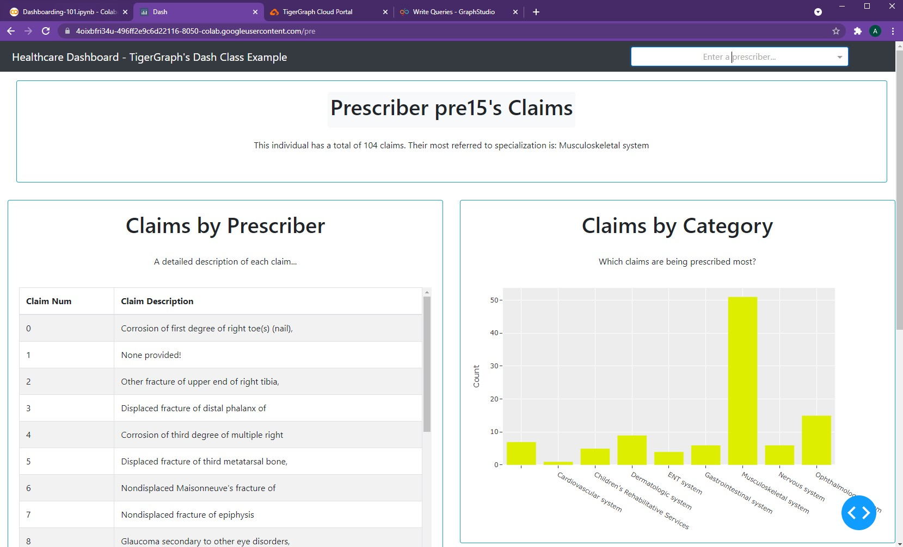
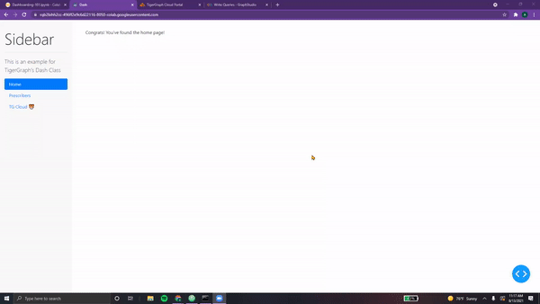
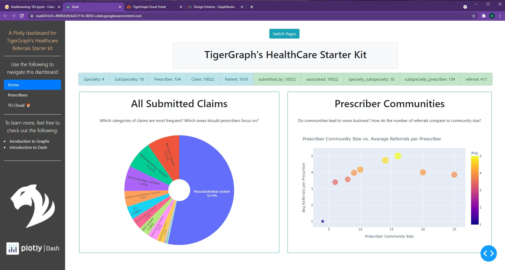
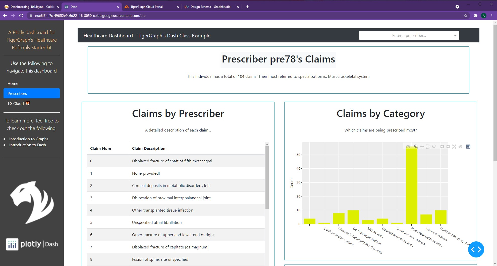

# Navbars, Sidebars

## Ch 09 - Navbars

??? info "Creating Navbar Layout"

    In the last two chapters, we learned how to navigate across the multiple pages of our dashboard.
    However, our current system is a little bit clunky. One possible way to fix this is by utilizing a nabvar...

    ## Creating Navbar Layout

    Adding a **navbar** to our dashboard allows for <font color='#DD6E0F'>easier navigation, providing a
    fixed, non-changing area of our app</font> which can be used to access other pages.
    In the previous chapter, we implemented a **dropdown** to navigate across pages.
    A navbar is as simple as <font color='#DD6E0F'>*wrapping this dropdown element into a* `dbc.Navbar()` *component*!</font>

    Let's start with a simple example using  `dbc.Navbarsimple()`:

    ```python
    navbar = dbc.NavbarSimple([
          dbc.NavItem(dbc.NavLink("General", href="/")),
          dbc.DropdownMenu(
              children=[
                  dbc.DropdownMenuItem("More pages", header=True),
                  dbc.DropdownMenuItem("Prescribers", href="/pre"),
                  dbc.DropdownMenuItem("TigerGraph Cloud", href="https://tgcloud.io/"),
              ],
              nav=True,
              in_navbar=True,
              label="More",
          ),
      ],
      brand="Example Navbar",
      brand_href="/",
      color="info",
      dark=True,
    )

    app = JupyterDash(__name__, external_stylesheets=[dbc.themes.BOOTSTRAP], suppress_callback_exceptions=True)

    app.layout = html.Div([
        dcc.Location(id='url', refresh=False),
        navbar,
        html.Center(html.H1("Wow, look at this amazing navbar!"))
    ])

    app.run_server(mode='external')
    ```

    Let's break it down!

    * First, we add a  `dbc.NavItem()` which contains a **link to the homepage**. As a
    result, the `href` tag is simply a `/`.
    * After this, we add our `dbc.DropdownMenu()`, very similar to `dbc.Dropdown()` from earlier. This dropdown
    contains a <font color='#DD6E0F'>header, titled "More Pages"</font>. Next, it contains a
    <font color='#DD6E0F'>link to our Prescribers page</font> as well as a link to the
    <font color='#DD6E0F'>TigerGraph Cloud Portal</font>. These links are added via `dbc.DropdownMenuItem()`.
    * With the `brand` attribute, we can **title our navbar** and change its home link.
    * Finally, we can modify the colors and styling of the navbar.

    Although we haven't included the pages themselves in this example, <font color='#DD6E0F'>clicking the menu items will update the url.</font>

    <center> {width=800} </center>

    &nbsp; &nbsp;

    Let's try another example using navbars!

??? info "Adding Navbar Elements"

    ## Adding Navbar Elements

    Let's add our dropdown to our navbar, and our navbar to our Prescriber Page.

    ```python
    dropdown = dbc.Row(dbc.Col(
                        dcc.Dropdown(
                          id="pres-dropdown",
                          placeholder="Enter a prescriber..." ,
                          options=getPresList(),
                          style={'width':'400px'}
                        ),
                       width=12, align="end"
                      ), style={"margin-left":"600px"})

    navbar = dbc.Navbar(
        [
            html.A(
                # Use row and col to control vertical alignment of logo / brand
                dbc.Row(
                    [
                        dbc.Col(dbc.NavbarBrand("Healthcare Dashboard - TigerGraph's Dash Class Example", className="ml-2")),
                    ],
                    align="center",
                    no_gutters=True,
                ),
                href="/",
            ),
            dropdown,
        ],
        color="dark",
        dark=True,
    )

    def prescriberPage(pres):
      prescriberTitleCard, tableCard, barCard, networkCard = getPrescriberInfo(pres)

      page = html.Center(html.Div([
                navbar,
                prescriberTitleCard,         

                dbc.Row([
                  dbc.Col(tableCard),
                  dbc.Col([
                          barCard,
                          networkCard
                          ],
                      )
                    ],
                    justify='center'
                ),
            ]))

      return page
    ```

    <center> {width=800} </center>

    &nbsp; &nbsp;

    As seen, the navbar simply contains a <font color='#DD6E0F'>hyperlinked header</font> (that takes one back the main page) and a <font color='#DD6E0F'>dropdown to enter prescriber information</font>. No additional changes need to be made to the callback function. Here's the result!

    <center> {width=800} </center>

    That helps make the Prescriber Page look a lot better!

    &nbsp; &nbsp;

    There's a few other options for Navbars as well, although we won't implement them for now:

    * **NavbarSimple** - according to Dash, *<font color='#DD6E0F'>"simpler, but less flexible"</font>*
    * **Navbar** - more <font color='#DD6E0F'>customizability</font>, but more intricate to set up
    * **NavbarBrand** - contains a <font color='#DD6E0F'>brand name</font> (meant essentially for text)
    * **NavbarToggler** - essentially a <font color='#DD6E0F'>button</font> (tracks clicks, times)

    > NOTE: For more information on navbars, feel free to check out the following resources:
    [`dbc.Navbar()`](https://dash-bootstrap-components.opensource.faculty.ai/docs/components/navbar/)

> NOTE: All code segments from this chapter can be found in this
[Colab Notebook](https://colab.research.google.com/drive/1RRirZeUi_zSBEDS9lDJw1dsxth_V0f-9#scrollTo=CmtYn4u2Cpr9).

## Ch 10 - Sidebars

??? info "Creating Sidebar Layout"

    ## Creating Sidebar Layout

    Just like navbars, sidebars allow for **easier navigation across dashboards**, especially
    ones with multiple pages. While the navbar sits on top of the app and is
    horizontal, the sidebar can *usually be found vertically on the left-side*.

    First, we must specify the styling of the sidebar, <font color='#DD6E0F'>namely width, padding, and background color</font>.

    ```python
    SIDEBAR_STYLE = {
        "position": "fixed",
        "top": 0,
        "left": 0,
        "bottom": 0,
        "width": "16rem",
        "padding": "2rem 1rem",
        "background-color": "#f8f9fa",
    }
    ```

    Using this *style dictionary*, we can create our sidebar layout.  

    ```python
    sidebar = html.Div(
        [
            html.H2("Sidebar", className="display-4"),
            html.Hr(),
            html.P(
                "This is an example for TigerGraph's Dash Class", className="lead"
            ),
            dbc.Nav(
                [
                    dbc.NavLink("Home", href="/", active="exact"),
                    dbc.NavLink("Prescribers", href="/pre", active="exact"),
                    dbc.NavLink("TG Cloud 🐯", href="https://tgcloud.io", active="exact"),
                ],
                vertical=True,
                pills=True,
            ),
        ],
        style=SIDEBAR_STYLE,
    )
    ```

    Breaking it down, we have:

    * A **header** with our sidebar title (`html.H2()`)
    * A **paragraph** with a short description (`html.P()`)
    * Three **nav links**: one to home, one to prescribers, and one to TG Cloud

    &nbsp; &nbsp;

    Now, we need to incorporate this sidebar into an example app.

    ```python
    CONTENT_STYLE = {
        "margin-left": "18rem",
        "margin-right": "2rem",
        "padding": "2rem 1rem",
    }

    content = html.Div(id="page-content", style=CONTENT_STYLE)

    app = JupyterDash(__name__, external_stylesheets=[dbc.themes.BOOTSTRAP], suppress_callback_exceptions=True)

    app.layout = html.Div([dcc.Location(id="url"), sidebar, content])


    @app.callback(dash.dependencies.Output('page-content', 'children'),
                  [dash.dependencies.Input('url', 'pathname')])

    def render_page_content(pathname):
        if pathname == "/":
            return html.P("Congrats! You've found the home page!")
        elif pathname == "/pre":
            return html.P("Woah, you've discovered the Prescribers Page!")

        return dbc.Jumbotron(
          [
              html.H1("404: Not found", className="text-danger"),
              html.Hr(),
              html.P("Uh oh! Unfortunately, the pathname {} was unable to be recognised...".format(pathname)),
          ]
        )

    app.run_server(mode='external')
    ```

    First and foremost, we must create a new `CONTENT_STYLE` dictionary.

    Note that the
    `margin-left` is 18rem, <font color='#DD6E0F'>accounting for both the sidebar's width and its padding (16rem and 2rem respectively).</font>
    Additionally, having a `margin-right` of 2rem allows for a *flush appearance* on both sides.

    We must set the **style of our content** `html.Div()` element to match this!

    Next, within our `app.layout()`, we must include *both the sidebar and content*. The rest of the app remains the
    same, with the callback to navigate across both pages not requiring any changes.

    &nbsp; &nbsp;

    And here's the simple sidebar app,

    <center> {width=800} </center>

    &nbsp; &nbsp;

    Let's customize this for our Healthcare Starter Kit Dashboard!

??? info "Adding Sidebar Elements"

    ## Adding Sidebar Elements

    Let's add some more elements to our dashboard's sidebar. First, we declare our **global variables**.

    ```python
    SIDEBAR_STYLE = {
        "position": "fixed",
        "top": 0,
        "left": 0,
        "bottom": 0,
        "width": "16rem",
        "padding": "2rem 1rem",
        "background-color": "#424242",
    }

    WHITE = "#fffff8"
    TG_LOGO = "https://i.ibb.co/gMMXcQB/Untitled-design-9.png"
    PLOTLY_LOGO = "https://dash.plotly.com/docs../assets/images/light_plotly_dash_logo.png"

    ```

    In addition to the style, we need to <font color='#DD6E0F'>store shared colors as well as images</font> we will be referencing
    as global variables for our dashboard. This allows for *easier readability and easier modification* of shared content.

    Next, we can define the sidebar layout.

    ```python
    sidebar = html.Div(
        [
            html.Center(html.P(
                "A Plotly dashboard for TigerGraph's Healthcare Referrals Starter kit", className="lead", style={'color':"#ffcf9e"}
            )),
            html.Hr(style = {'borderColor':WHITE}),
            html.Center(html.P(
                "Use the following to navigate this dashboard", className="lead", style={'color':WHITE}
            )),
            dbc.Nav(
                [
                    dbc.NavLink("Home", href="/", active="exact", style={'color':WHITE}),
                    dbc.NavLink("Prescribers", href="/pre", active="exact", style={'color':WHITE}),
                    dbc.NavLink("TG Cloud 🐯", href="https://tgcloud.io", active="exact", style={'color':WHITE}),
                ],
                vertical=True,
                pills=True,
            ),
            html.Hr(style = {'borderColor':WHITE}),
            html.Center(html.P(
                "To learn more, feel free to check out the following:", className="lead", style={'color':WHITE}
            )),
            html.Li(html.A("Inroduction to Graphs", href='https://www.tigergraph.com/blog/what-is-a-graph-database-and-why-should-you-care/', target="_blank", style={'color':WHITE}), style={'color':WHITE}),
            html.Li(html.A("Introduction to Dash", href='https://www.youtube.com/watch?v=e4ti2fCpXMI', target="_blank", style={'color':WHITE}), style={'color':WHITE}),
            html.Br(),
            html.Hr(style = {'borderColor':WHITE}),
            html.Br(),

            html.Center(dbc.Row(dbc.Col(html.Img(src=TG_LOGO, width="175px", style={"margin-bottom": "15px", "margin-top":"50px"})))),
            html.Br(),
            html.Center(dbc.Row(dbc.Col(html.Img(src=PLOTLY_LOGO, width="225px", style={"margin-bottom": "15px"})))),
        ],
        style=SIDEBAR_STYLE,
    )
    ```

    Let's dissect this new sidebar,

    * First, we have our <font color='#DD6E0F'>centered title</font>, in a different color than before. This is because the background color of our sidebar is now a darker shade of grey, meaning *all text should be lighter colors*.
    * Next, we have a <font color='#DD6E0F'>standard horizontal rule</font>, however colored white instead of the usual grey.
    * Following this is <font color='#DD6E0F'>another short description</font>, in the color white to allow for easier readability.
    * This next section hasn't changed, it simply contains our `dbc.Nav()`
    * After another white horizontal rule, we have a shot description for further resources
    * Using the `html.Li()` component, we can <font color='#DD6E0F'>include hyperlinks to external webpages</font>. Although this can be achieved using `dcc.Link()` (as we covered in a previous chapter), it **never hurts to learn multiple ways** for accomplishing a given task! Both provide similar functionality.
    * Finally, we have <font color='#DD6E0F'>two centered images</font>. Our TigerGraph and Plotly Dash logos. With `html.Img()`, we can specify **width, height, and margins**. These are stored in `dbc.Row()` and `dbc.Col()` to provide consistent borders.

    &nbsp; &nbsp;

    Now, it's time to incorporate this sidebar into our app.

    First, we need to reformat our figures and page layouts to account for the change in width.

    === "Reformatted Pie, Scatter"

        ```python
        pieChart = getClaimsPieChart()
        scatterChart = getScatterChart()

        pieChartCard = dbc.Card([
                          dbc.CardBody([
                                        html.H1("All Submitted Claims", className='card-title'),
                                        html.P("Which categories of claims are most frequent?\n Which areas should prescribers focus on?", className='card-body'),  
                                        dcc.Graph(id='Pie Chart', figure=pieChart)
                                      ])
                        ],
                        outline=True,
                        color='info', # Options include: primary, secondary, info, success, warning, danger, light, dark  
                        style={
                            "width":"49rem",
                            "margin-right":"1rem",
                            "margin-bottom":"1rem"
                            }
                      )

        scatterChartCard = dbc.Card([
                          dbc.CardBody([
                                        html.H1("Prescriber Communities", className='card-title'),
                                        html.P("Do communities lead to more business? How do the number of referrals compare to community size?", className='card-body'),  
                                        dcc.Graph(id='Scatter Chart', figure=scatterChart)
                                      ])
                        ],
                        outline=True,
                        color='info', # Options include: primary, secondary, info, success, warning, danger, light, dark  
                        style={
                            "width":"50rem",
                            "margin-left":"1rem",
                            "margin-bottom":"1rem"
                            }
                      )
        ```

    === "Reformatted getPrescriberInfo()"

        ```python
        def getPrescriberInfo(person_num):
          network = getNetwork(person_num)
          number, table, bar, max_title = getClaims(person_num)

          prescriberTitleCard = dbc.Card([
                  dbc.CardBody([
                                html.Center(dbc.Badge([html.H1("  Prescriber " + person_num + "'s Claims  ", className='card-title')], color="light")),
                                html.Center(html.P("This individual has a total of " + repr(number) + " claims. Their most referred to specialization is: " + max_title, className='card-body')),  
                              ])
                ],
                outline=True,
                color='info',
                style={
                    "width":"95rem",
                    "margin-left":"1rem",
                    "margin-bottom":"1rem",
                    "margin-top":"1rem",
                    "margin-right":"1rem"
                    }
              )

          tableCard = dbc.Card([
                  dbc.CardBody([
                                html.H1("Claims by Prescriber", className='card-title'),
                                html.P("A detailed description of each claim...", className='card-body'),  
                                table
                              ])
                ],
                outline=True,
                color='info',
                style={
                    "width":"48rem",
                    "margin-left":"1rem",
                    "margin-bottom":"1rem",
                    "margin-top":"1rem"
                    }
              )

          barCard = dbc.Card([
                  dbc.CardBody([
                                html.H1("Claims by Category", className='card-title'),
                                html.P("Which claims are being prescribed most?", className='card-body'),  
                                dcc.Graph(id='Bar Chart', figure=bar)
                              ])
                ],
                outline=True,
                color='info',
                style={
                    "width":"48rem",
                    "margin-left":"0rem",
                    "margin-bottom":"1rem",
                    "margin-top":"1rem"
                    }
              )

          networkCard = dbc.Card([
                  dbc.CardBody([
                                html.H1("Prescriber Network", className='card-title'),
                                html.P("Who's part of this prescriber's community?", className='card-body'),  
                                network
                              ])
                ],
                outline=True,
                color='info',
                style={
                    "width":"48rem",
                    "margin-left":"0rem",
                    "margin-bottom":"1rem",
                    "margin-top":"1rem"
                    }
              )

          return prescriberTitleCard, tableCard, barCard, networkCard
        ```

    === "Reformatted Pages"

        ```python
        generalPage = html.Center(html.Div([
                        dbc.Col(dbc.Button(
                              "Switch Pages", id="switch-button",
                              className="mr-2", n_clicks=0, color="info", href="/pre"
                            ),
                            width=2
                        ),
                        dbc.Row(titleCard, justify="center"),
                        dbc.Row(statsListGroup, justify="center"),
                        html.Br(),

                        dbc.Row([
                          pieChartCard,
                          scatterChartCard,
                          ],
                          justify="center"
                        ),

                      ], style={"width":"100rem"}))

        dropdown = dbc.Row(dbc.Col(
                            dcc.Dropdown(
                              id="pres-dropdown",
                              placeholder="Enter a prescriber..." ,
                              options=getPresList(),
                              style={'width':'400px'}
                            ),
                           width=12, align="end"
                          ), style={"margin-left":"35rem"})

        navbar = dbc.Navbar(
            [
                html.A(
                    # Use row and col to control vertical alignment of logo / brand
                    dbc.Row(
                        [
                            dbc.Col(dbc.NavbarBrand("Healthcare Dashboard - TigerGraph's Dash Class Example", className="ml-2")),
                        ],
                        align="center",
                        no_gutters=True,
                    ),
                    href="/",
                ),
                dropdown,
            ],
            color="dark",
            dark=True,
        )

        def prescriberPage(pres):
          prescriberTitleCard, tableCard, barCard, networkCard = getPrescriberInfo(pres)

          page = html.Center(html.Div([
                    navbar,
                    prescriberTitleCard,         

                    dbc.Row([
                      dbc.Col(tableCard),
                      dbc.Col([
                              barCard,
                              networkCard
                              ],
                          )
                        ],
                        justify='center'
                    ),
                ], style={"width":"100rem"}))

          return page
        ```

    &nbsp; &nbsp;

    Now, we can incorporate our sidebar into the `app.layout`.

    It's important
    to note that only `page-content` contains `CONTENT_STYLE`. Our `pres-content` page
    **doesn't require this styling** as it is not part of our `app.layout` directly. Instead,
    it is returned to substitute `page-content`.

    ```python
    CONTENT_STYLE = {
        "margin-left": "18rem",
        "margin-right": "2rem",
        "padding": "2rem 1rem",
    }

    app = JupyterDash(__name__, external_stylesheets=[dbc.themes.BOOTSTRAP], suppress_callback_exceptions=True)

    presPage = html.Div(prescriberPage("pre78"), id='pres-content')

    app.layout = html.Div([
        dcc.Location(id='url', refresh=False),
        sidebar,
        html.Div(id='page-content', style=CONTENT_STYLE)
    ])

    @app.callback(dash.dependencies.Output('page-content', 'children'),
                  [dash.dependencies.Input('url', 'pathname')])

    def display_page(pathname):
      if pathname == "/":
        return generalPage
      elif pathname == "/pre":
        return presPage

      return dbc.Jumbotron(
            [
                html.H1("404: Not found", className="text-danger"),
                html.Hr(),
                html.P("Uh oh! Unfortunately, the pathname {} was unable to be recognised...".format(pathname)),
            ]
        )

    @app.callback(dash.dependencies.Output('pres-content', 'children'),
                  [dash.dependencies.Input('pres-dropdown', 'value')])

    def update_pres(value):
      if value is not None:
        return prescriberPage(value)

      return prescriberPage("pre78") # Our default value


    app.run_server(mode='external')
    ```

    And here's our output, both pages complete with the sidebar!

    <center> {width=800} </center>

    <center> {width=800} </center>

    &nbsp; &nbsp;

    Awesome! And that's how to incorporate a sidebar into one's dashboard :)

    > NOTE: For more information on sidebars, feel free to check out the following resources:
    [Dash Sidebar Video](https://www.youtube.com/watch?v=ln8dyS2y4Nc)

> NOTE: All code segments from this chapter can be found in this
[Colab Notebook](https://colab.research.google.com/drive/1RRirZeUi_zSBEDS9lDJw1dsxth_V0f-9#scrollTo=yrXep4aGCsQe).
