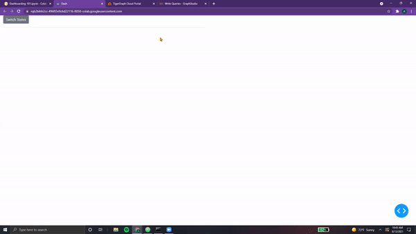
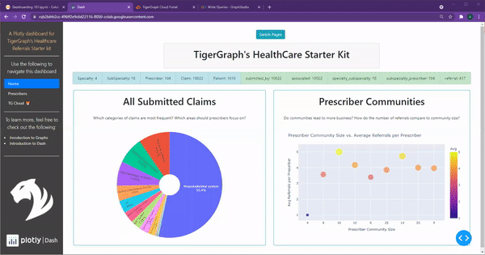

# Misc. Elements, Deployment

## Ch 11 - Miscellaneous Elements

??? info "Radar, 3D, Choropleth"

    ## Plotly Paradise

    **Although we've explored several core Plotly figures that are used extensively across dashboards, there are a myriad of other charts that can be made using Plotly. In this section, we'll explore a few of them.**

    > NOTE: Feel free to submit requests for other elements. This chapter may be updated to include them as well!

    &nbsp; &nbsp;

    ### Radar Charts

    Radar charts are used to **visualize different traces across different axes**. For example, if one wished to compare <font color='#DD6E0F'>restaurants across five different categories</font>, a radar chart would be a perfect visualization.

    Let's take a look at creating one with Plotly.

    ```python
    categories = ['Food', 'Service', 'Affordable', 'Location', 'Ambience']

    res = {
            "Pop's Pizzas" : [3, 3, 5, 4, 3],
            "Tony's Tacos" : [5, 2, 4, 1, 2],
            "Bill's Bread" : [2, 4, 1, 2, 4],
          }

    fig = go.Figure()

    for restaurant in res:
        fig.add_trace(go.Scatterpolar(
            r=res[restaurant],
            theta=categories,
            fill='toself',
            name=restaurant,
        ))

    fig.update_layout(
      polar=dict(
        radialaxis=dict(
          visible=True
        ),
      ),
      width=800
    )

    fig.show()
    ```

    As seen, we create a `go.Figure()` and add multiple traces. Each trace represents
    a distinct data entity, in this case different restaurants. Each restaurant has been
    scored across different categories, and categories are stored in `theta`, while each
    value is stored in `r`. In `fig.update_layout()`, the figure is converted into polar form to create our circular
    radar chart. It's a lot easier to visualize how each restaurant compares!

    > NOTE: This format is similar to polar axes, where each
    point is determine in r and theta instead of x and y.

    <center> {width=800} </center>

    > NOTE: For more resources on Radar Charts, feel free to check out the following resources:
    [Plotly Radar](https://plotly.com/python/radar-chart/)

    ### 3-D Figures

    In order to create 3D plots, we can use the `px.scatter_3d()` function. This simply
    requires us to enter a list value for x, y, and z. Dataframes can also be used to
    create a 3-D figure, formatted the same as with `px.scatter()`.

    Here's an example of a 3D parabolic curve:

    ```python
    import numpy as np

    t = np.linspace(-10, 10, 50)

    x = t
    y = t**2
    z = 3*x - 2*y

    fig = px.scatter_3d(x=x, y=y, z=z)
    fig.show()
    ```

    >NOTE: `np.linspace()` simply creates a list from -10 to 10, with 50 data points in between, spaced evenly.

    <center> {width=800} </center>

    > NOTE: For more information on Radar Charts, feel free to check out the following resources:
    [Scatter](https://plotly.com/python/3d-scatter-plots/),
    [3D Charts](https://plotly.com/python/3d-charts/)

    &nbsp; &nbsp;

    ### Choropleth (Maps)

    Plotly allows for the creation and insertion of geographical maps using `geojson` data. Choropleth maps
    allow for the visulization of distinct geographical zones with different colors to indicate different attributes.

    In order to use the Plotly Choropleth example, we need to install the following.

    ```python
    !pip install -U plotly
    from urllib.request import urlopen
    import json
    import pandas as pd
    import plotly.express as px
    ```

    > NOTE: We need to upgrade our version of Plotly to the latest to ensure that Choropleth works!

    &nbsp; &nbsp;

    Now, we can use the Plotly datasets in order to visualize the unemployment in the United States.

    ```python
    with urlopen('https://raw.githubusercontent.com/plotly/datasets/master/geojson-counties-fips.json') as response:
        counties = json.load(response)

    df = pd.read_csv("https://raw.githubusercontent.com/plotly/datasets/master/fips-unemp-16.csv",
                       dtype={"fips": str})

    fig = px.choropleth(df, geojson=counties, locations='fips', color='unemp',
                               color_continuous_scale="Viridis",
                               range_color=(0, 12),
                               scope="usa",
                               labels={'unemp':'unemployment rate'}
                              )

    fig.update_layout(margin={"r":0,"t":0,"l":0,"b":0})
    fig.show()
    ```

    &nbsp; &nbsp;

    <center> {width=800} </center>

    As seen, it's quite a detailed, interactive map!

    &nbsp; &nbsp;

    > NOTE: For more information on Maps, feel free to check out the following resources:
    [Choropleth](https://plotly.com/python/choropleth-maps/)

??? info "Progress, Spinners, Alerts"

    ## Bootstrap Bliss

    **As with Plotly, there are dozens of other unique Bootstrap components that can be incorporated into one's**
    **dashboard. Although we've covered the core elements, we'll explore three more in this section.**

    > NOTE: For a comprehensive list on all bootstrap components, feel free to check out:
    [Dash Bootstrap](https://dash-bootstrap-components.opensource.faculty.ai/docs/)

    &nbsp; &nbsp;

    ### Progress Bars

    Progress bars are <font color='#DD6E0F'>horizontal, rounded rectangles</font> that are quite **flexible** when it comes to displaying progress.

    Here's an example of a progress bar with three distinct sections.

    ```python
    progress = dbc.Progress(
        [
            dbc.Progress(value=20, color="success", bar=True),
            dbc.Progress(value=30, color="warning", bar=True),
            dbc.Progress(value=20, color="danger", bar=True),
        ],
        multi=True,
    )

    app = JupyterDash(__name__, external_stylesheets=[dbc.themes.BOOTSTRAP])

    app.layout = html.Div(children=[
       dbc.Col(progress, width=6)
    ])

    app.run_server(mode='external')
    ```

    <center> {width=800} </center>

    As seen, each bar section has a <font color='#DD6E0F'>different color and length</font> (`value`).

    This bar can also be **animated**, controlled via a button that toggles the bar on and off.

    ```python
    progress = html.Div(
        [
            dbc.Progress(
                value=80, id="animated-progress", animated=False, striped=True
            ),
            dbc.Button(
                "Toggle animation",
                id="animation-toggle",
                className="mt-3",
                n_clicks=0,
            ),
        ]
    )

    app = JupyterDash(__name__, external_stylesheets=[dbc.themes.BOOTSTRAP])

    app.layout = html.Div(children=[
       dbc.Col(progress, width=6)
    ])


    @app.callback(
        dash.dependencies.Output("animated-progress", "animated"),
        [dash.dependencies.Input("animation-toggle", "n_clicks")],
        [dash.dependencies.State("animated-progress", "animated")],
    )
    def toggle_animation(n, animated):
        if n:
            return not animated
        return animated


    app.run_server(mode='external')
    ```

    <center> {width=800} </center>

    &nbsp; &nbsp;

    Ah-ah, one **interesting addition** is the variable `dash.dependencies.State` as
    part of our app's callback. This simply means that the <font color='#DD6E0F'>state of the progress bar
    (whether it is currently animated or not) is also used</font> to determine the output. This
    makes sense, since our *toggle button inverts whatever the state* of the progress bar is.

    > NOTE: For more information on progress bars, feel free to check out the following resources:
    [Progress](https://dash-bootstrap-components.opensource.faculty.ai/docs/components/progress/)

    &nbsp; &nbsp;

    ### Spinners

    Next up, spinners! These components are <font color='#DD6E0F'>**small circles** that move to indicate that a process is occurring.</font>

    Here are three examples (one small, one big, and one growing).

    ```python
    spinners = html.Div(
        [
            dbc.Row([
                dbc.Col(dbc.Spinner(size="sm", color="info"), width=1),
                dbc.Col(dbc.Spinner(spinner_style={"width": "3rem", "height": "3rem"}, color="success"), width=1),
                dbc.Col(dbc.Spinner(color="danger", type="grow"), width=1),
            ])
        ]
    )

    app = JupyterDash(__name__, external_stylesheets=[dbc.themes.BOOTSTRAP])

    app.layout = html.Div(children=[
       dbc.Col(spinners, width=6)
    ])

    app.run_server(mode='external')
    ```

    <center> {width=800} </center>

    &nbsp; &nbsp;

    Each can be easily colored, resized, and toggled between traditional mode and growing mode. Spinners
    can also be used to <font color='#DD6E0F'>indicate loading, or to be displayed upon a user action</font>. For example, the following
    displays a spinner based on the number of times the button is pressed. After the
    time has elapsed, the *spinner is replaced* with the output.

    ```python
    import time

    loading_spinner = html.Div(
        [
            dbc.Button("Counter", id="loading-button", n_clicks=0),
            dbc.Spinner(html.Div(id="loading-output")),
        ]
    )

    app = JupyterDash(__name__, external_stylesheets=[dbc.themes.BOOTSTRAP])

    app.layout = html.Div(children=[
       dbc.Col(loading_spinner, width=3)
    ])

    @app.callback(
        dash.dependencies.Output("loading-output", "children"),
        [dash.dependencies.Input("loading-button", "n_clicks")]
    )
    def load_output(n):
        if n:
            time.sleep(1)
            return f"You have clicked {n} times"
        return "No clicks as of yet ;("

    app.run_server(mode='external')
    ```

    <center> {width=800} </center>

    > NOTE: For more information on spinners, feel free to check out the following resources:
    [Dash Spinners](https://dash-bootstrap-components.opensource.faculty.ai/docs/components/spinner/)

    &nbsp; &nbsp;

    ### Alerts

    Next up, Dash Alerts! These components are used to <font color='#DD6E0F'>display important information, such as messages, information the user should
    know before proceeding</font>, or any other form of alerts. Like all bootstrap, they are quite flexible.

    Here's an example with two alerts, one of them **dismissible (able to be closed)** and the other **permanent**.

    ```python
    alerts = html.Div([
            dbc.Alert("This is a success alert! Luckily, I won't leave!", color="success"),
            dbc.Alert("This is a warning alert, but you can close me!", color="warning", dismissable=True),
    ])

    app = JupyterDash(__name__, external_stylesheets=[dbc.themes.BOOTSTRAP])

    app.layout = html.Div(children=[
       dbc.Col(alerts, width=6)
    ])

    app.run_server(mode='external')
    ```

    <center> {width=800} </center>

    &nbsp; &nbsp;

    These alarms can be **easily customized** in terms of color and content. Additionally, they can be set to automatically
    <font color='#DD6E0F'>disappear after a certain amount of time</font>. This is done via the keyword `duration`, which takes in milliseconds.

    Here's an example with a disappearing alert, accompanied by a button that toggles the state of the alert.

    ```python
    alert = html.Div(
        [
            dbc.Button(
                "Switch States", id="alert-toggle-auto", className="mr-1", n_clicks=0
            ),
            html.Hr(),
            dbc.Alert(
                "I will disappear in 3 seconds...",
                id="alert-auto",
                color="danger",
                is_open=True,
                duration=3000, # In milliseconds
            ),
        ]
    )

    app = JupyterDash(__name__, external_stylesheets=[dbc.themes.BOOTSTRAP])

    app.layout = html.Div(children=[
       dbc.Col(alert, width=6)
    ])

    @app.callback(
        dash.dependencies.Output("alert-auto", "is_open"),
        [dash.dependencies.Input("alert-toggle-auto", "n_clicks")],
        [dash.dependencies.State("alert-auto", "is_open")],
    )
    def toggle_alert(n, is_open):
        if n:
            return not is_open
        return is_open

    app.run_server(mode='external')
    ```

    <center> {width=800} </center>

    &nbsp; &nbsp;

    Quite handy, especially to help users navigate a dashboard for the first time!

    > NOTE: For more information on alerts, feel free to check out the following resources:
    [Dash Alerts](https://dash-bootstrap-components.opensource.faculty.ai/docs/components/alert/)

??? info "Everything We've Covered"

    ## Dash Dreamland

    There are hundreds of more Dash elements, including <font color='#DD6E0F'>**Dash Core Components, Dash Bootstrap Components, Plotly,**
    **Ploly Express, HTML**, and more</font>. Diving into these elements is beyond the scope of this introductory journey!

    However, here's a quick summary of everything we've learned along the way, a sort of cheat-sheet...

    | Plotly Charts  | Dash/Tigergraph  | HTML       | Dash Core  | Bootstrap    |
    | :-------------:|:----------------:|:----------:|:----------:|:------------:|
    |  Bar Charts    | Layout Functions | Div        | Graphs     | Cards
    |  Line Charts   | Styling App      | Headers    | Markdown   | Row/Col
    |  Pie Charts    | Multi-Paged      | Paragraph  | Location   | Badges
    |  Scatter Plots | Callbacks        | Bold/Italic| Links      | ListGroup
    |  Cytoscape     | Navbars          | Center     | Input      | Jumbotron
    |  Radar Charts  | Sidebars         | Link       | Dropdown   | Button
    |  3-D Figures   | Create Solution  | Hr. Rule   |            | Table
    |  Choropleth    | Connect w/ pyTG  | Line Break |            | Progress
    |                | Install Queries  | Image      |            | Spinner
    |                | Run Queries      |            |            | Alert

    Feel free to utilize the **"Search" box at the top right of this webpage** to quickly reference each.

    We've learned quite a lot within the span of less than a dozen chapters 😄.

> NOTE: All code segments from this chapter can be found in this

## Ch 12 - Dash Deployment

??? info "Deploying Dash App"

    ## Heroku, Dash Enterprise

    According to the Plotly Website,

    > "Heroku is one of the <font color='#DD6E0F'>easiest platforms for deploying and managing</font> public Flask applications."

    &nbsp; &nbsp;

    Plotly Dash documents the step-by-step procedure needed to deploy one's app on **Heroku**.

    * Additional Resource: [Medium Guide 1](https://towardsdatascience.com/deploying-your-dash-app-to-heroku-the-magical-guide-39bd6a0c586c)
    * Additional Resource: [Medium Guide 2](https://towardsdatascience.com/how-to-deploy-your-dash-app-with-heroku-a4ecd25a6205)


    Another option is via the **paid Dash Enterprise** platform. Both options are doucmented by Plotly below.

    <iframe src="https://dash.plotly.com/deployment" id='heroku' width="100%" height=800></iframe>

    <script>
    	window.getElementById('heroku').scrollTo(2000, 2000);
    </script>

??? info "Congratulations!"

    ## The Fantastic Finale

    Congratulations! You've **put together (and maybe even deployed)** your dashboard with <font color='#DD6E0F'>TigerGraph + Plotly</font>.

    <center> {width=800} </center>

    &nbsp; &nbsp;


    <span style="font-family:DejaVu Sans Mono; font-size:2em;">
    It's time to celebrate now! 🥳🥳🥳

    Feel free to continue adding, maybe with a few queries and some of the elements from ***"Elysium of Elements"***.

    Additionally, there are quite a few examples of other Starter Kits under the ***"Examples"*** tab!.

    Finally, make sure to connect with the <font color='#DD6E0F'>TigerGraph + Plotly community</font> (found under the ***"Community"*** tab).

    &nbsp; &nbsp;

    Best of luck, and remember to share your cool work with others in the developer world!

    <center>

      <span style="font-family:cursive; font-size:3em;">
      Congratulations, you've completed <font color='#DD6E0F'>TigerGraph's Dash Adventure!</font> </span>

    </center>
